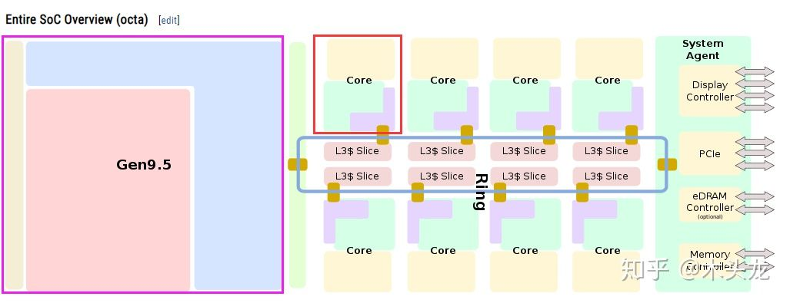

CPU 架构分解概念图

CPU 工作原理

# 缓存命中率

这个概念在很多程序设计中可能都有提及，这里的单独列出来是因为在Unity内有过实践，它依据的技术是DOTS下，entities 将GameCore 内实体的数据，根据ArcheType 划分，将相同的ComponentData 的数据紧凑的放一起，那么在从内存中读取时，会有一部分数据被读取到3级缓存器中，那么下一次的数据读取，会先从缓存器中读取，缓存命中率自然就高了，要提高缓存命中率，必须要更严谨的设置数据。

# 单指令与多指令

SIMD MIMD

---

# 冯-诺伊曼架构 与 哈佛架构

在哈佛架构下，内存被分为 指令内存和数据内存。这样的设计是为了维持某种程度下的指令连续性。

# DMA 

***DMA是一种高速的数据传输操作，DMA在DMA控制器的控制下，实现让存储器与外设、外设与外设之间直接交换数据，中间不需要经过CPU的累加器中转，并且内存地址的修改、传送完毕的结束报告都是由硬件电路（DMA控制器）实现的，CUP除了在数据传输开始和结束时进行中断处理外，在整个传输过程中CPU都可以和输入输出处于并行操作状态，一个DMA传送只需要执行一个DMA周期，相当于一个总线读写周期。***

<https://www.cnblogs.com/interpreter/p/14738361.html>

---

https://zhuanlan.zhihu.com/p/65840506

https://zhuanlan.zhihu.com/p/70281565
