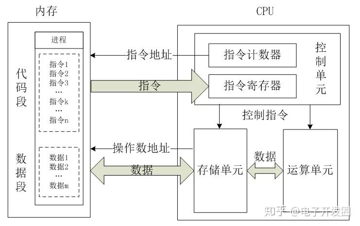

CPU 架构分解概念图

CPU 工作原理

# 缓存命中率

这个概念在很多程序设计中可能都有提及，这里的单独列出来是因为在Unity内有过实践，它依据的技术是DOTS下，entities 将GameCore 内实体的数据，根据ArcheType 划分，将相同的ComponentData 的数据紧凑的放一起，那么在从内存中读取时，会有一部分数据被读取到3级缓存器中，那么下一次的数据读取，会先从缓存器中读取，缓存命中率自然就高了，要提高缓存命中率，必须要更严谨的设置数据。

# 单指令与多指令

SIMD MIMD

---

---

https://zhuanlan.zhihu.com/p/65840506

https://zhuanlan.zhihu.com/p/70281565
