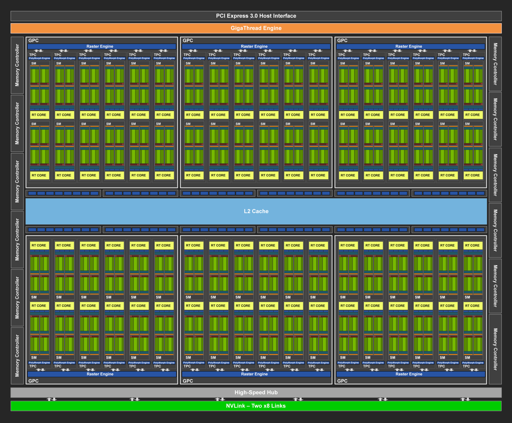
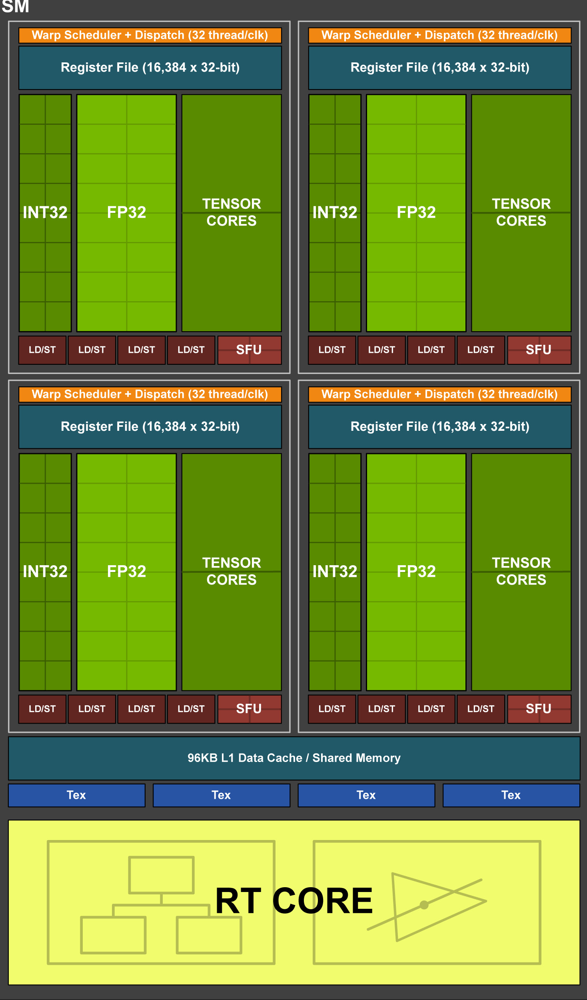
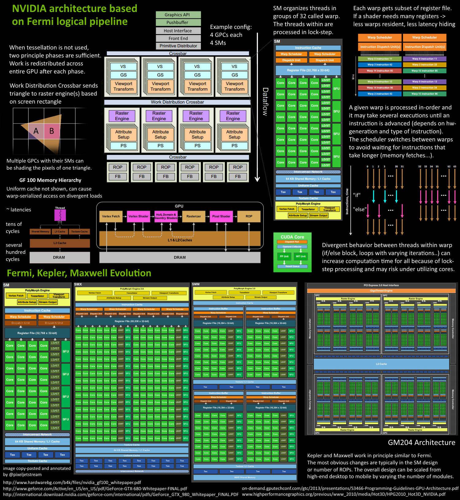
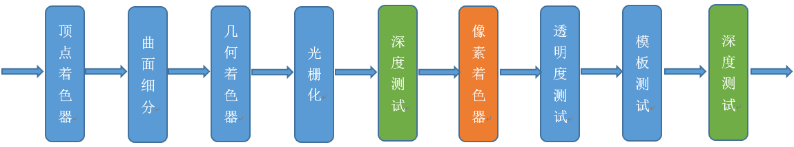
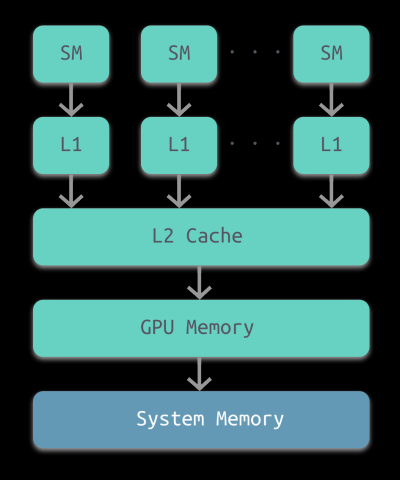

NVidia Turing 架构

SM结构图

GPU 渲染总览图

Early-Z

---

# CPU 与 GPU 的协同工作

CPU 读取到数据后，将硬盘中的数据读取到内存中，通过渲染命令，提交DrawCall 到 GPU，GPU将部分显示信息数据拷贝到显存中，接着进入几何阶段、应用阶段

# GPU 的缓存机制

GPU 和 CPU 一样，也是有多级缓存机制

  

# Early-Z 的由来

Early-Z 是发生在像素着色器之前的 深度测试，主要目的是减少 像素着色器的不必要开销。

Early-Z 的最小单位不是一个像素，而已一个像素块（如 2x2）

# 像素着色器的最小处理单位

像素着色器的最小处理单位是（2x2）的像素块

# GPU Context

# 渲染通常的瓶颈点

- CPU 的 DrawCall 过多，采取的办法：合批
- 透明度混合、透明度测试、裁剪不够造成的计算浪费。

    - 办法：
        - 减少顶点数、三角形数；
        - 视锥裁剪：
            - BVH
            - Portal
            - BSP
            - OSP
        - 避免每帧提交Buffer数据:CPU版的粒子、动画会每帧修改、提交数据，可移至GPU端。
        - 减少渲染状态设置和查询:避免每帧设置、查询渲染状态，可在初始化时缓存状态。
        - 启用GPU Instance
        - 开启 LOD
        - 避免从显存读数据

---

https://www.cnblogs.com/timlly/p/11471507.html#nvidia-turing%E6%9E%B6%E6%9E%84

https://cache.one/read/3519270#1GPUCPU_16

https://zhuanlan.zhihu.com/p/139118900