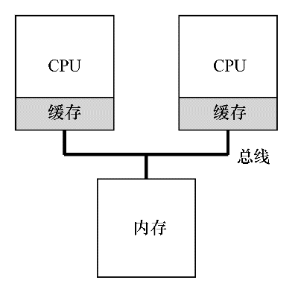
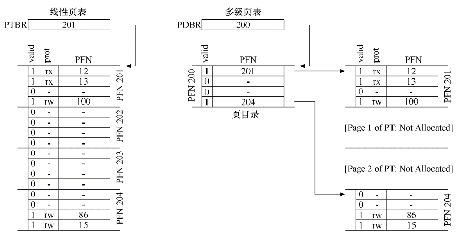
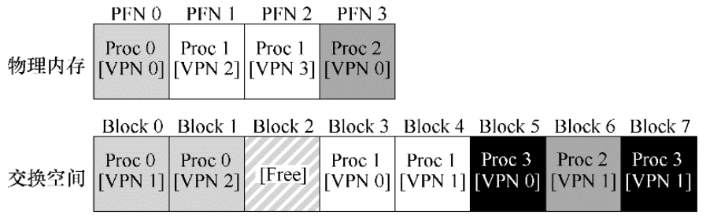
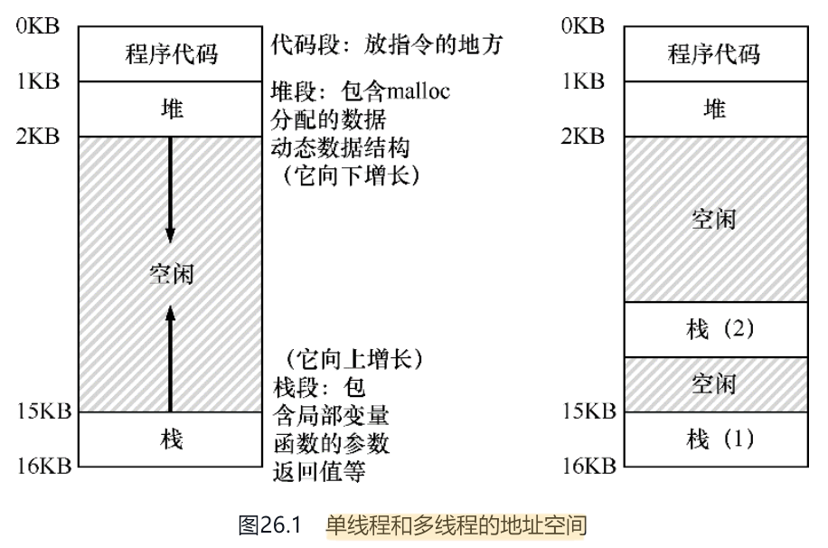
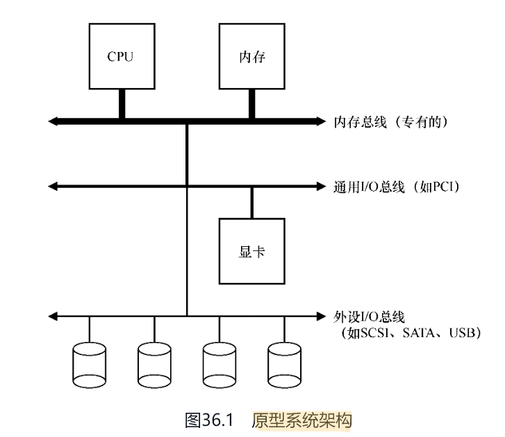
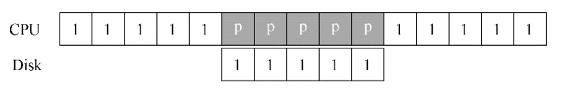
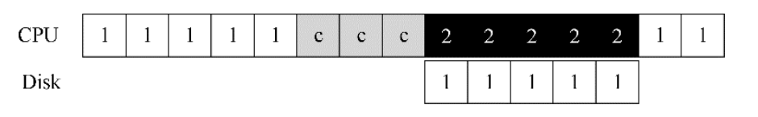
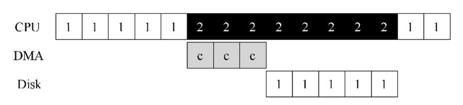
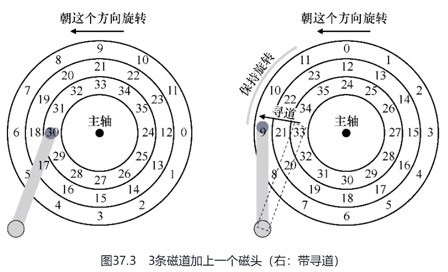
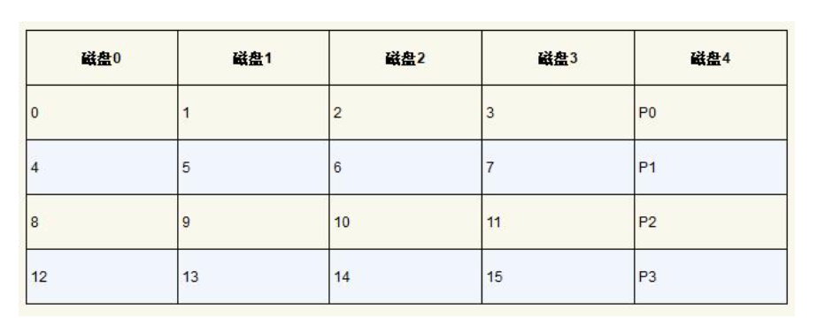

# 缓存

用缓存的方式，解决CPU与内存的数据链路上的瓶颈。

  

# 内存分段与分页

分段大体上细分为三段：

- 代码段
- 栈段
- 堆段

分页的思路在于：固定Size分配内存页。通过页表进行数据定位。如果内存空间很大，意味着单个页表会特别大，页表越大，查找成本越高，所以又提出了多张页表的方案，一张页表内容作为主页表，查找对应小页表，小页表才是最终内存地址。

  

# 超出内存空间

在磁盘空间划分一些临时存储空间，然后把内存空间相对空闲的内存页放入磁盘空间，这种选取空闲页的算法有多个：最近最少使用、先进先出等等

  

# 单线程与多线程的地址空间

  

# 原型系统架构

越靠近CPU，对IO速度的要求越高，如下：

  

早期计算机，在IO时期，CPU需要轮询IO是否完成，这意味着CPU的时间片会被过渡占用，因此提出了一个中断的方式，CPU不再轮询，而是切换的执行其他服务。当IO执行完成后，IO也会向CPU中断。

  

# DMA（Direct Memory Access）

如下，把一块大数据保存至磁盘，需要先进行Copy，先Copy至内存，然后再通过IO写入至磁盘，在Copy环节，CPU被完全占用，直到完成Copy

  

DMA 就是为了解决CPU被占用，把这部分工作交给DMA。如下：

  

# 早期磁盘

  

# RAID

通过校验，保障数据，一定程度上能找回丢失数据。

  

内存：

<https://www.zhihu.com/question/33979489>

---

# Ref

《操作系统导论》