- [空间换时间、时间换空间](#空间换时间时间换空间)
  - [空间换时间](#空间换时间)
  - [时间换空间](#时间换空间)
- [寻路算法](#寻路算法)
  - [A-Star](#a-star)
  - [JPS(跳点寻路算法)](#jps跳点寻路算法)
    - [JPS 预处理](#jps-预处理)
  - [WayPoint（路点寻路）](#waypoint路点寻路)
  - [B-Star](#b-star)
  - [D-Star](#d-star)
  - [漏斗算法](#漏斗算法)
- [博弈论](#博弈论)
  - [预测收益](#预测收益)
  - [剪枝算法](#剪枝算法)
  - [高级预测、深度学习、强化学习](#高级预测深度学习强化学习)
- [几何检测算法](#几何检测算法)
  - [2D 碰撞](#2d-碰撞)
    - [凸包 分离轴定理](#凸包-分离轴定理)
    - [AABB 包围盒](#aabb-包围盒)
    - [四叉树优化](#四叉树优化)
  - [3D 碰撞](#3d-碰撞)
    - [常规 3D 模型碰撞](#常规-3d-模型碰撞)
    - [不规则 3D 模型碰撞](#不规则-3d-模型碰撞)
      - [八叉树优化](#八叉树优化)
- [部分优化相关的算法](#部分优化相关的算法)
  - [模型坍缩](#模型坍缩)
  - [Motion Matching](#motion-matching)
- [计算机图形学相关算法](#计算机图形学相关算法)
- [RayTrace](#raytrace)
- [常规算法](#常规算法)
  - [动态规划](#动态规划)
  - [分治](#分治)
  - [回溯](#回溯)
  - [贪心](#贪心)
- [LeetCode](#leetcode)
- [Ref](#ref)

# 空间换时间、时间换空间

在算法中，常常会提到“空间换时间”与“时间换空间”，大致的意思就是指通过特别的手段来降低时间复杂度、空间复杂度，而代价就是稍微牺牲一点空间或时间。

  

## 空间换时间

空间换时间的例子随处可见，例如：

- 离线生成Shadow、Light;
- 对象池;
- 甚至是GetComponent也可以通过变量存储引用，防止再次取的消耗;

以上这些优化手段大多都是利用存储的方式，把CPU或GPU的运算节省一些。

## 时间换空间

现代计算机的发展，有个特点：CPU、GPU的运算力的增长速度不如存储设备的增长速度快。
或许存储设备的扩展只是在主机机箱中腾出一个足够大的位置，另外存储设备元件体积也越做越小。
因此对于多数中小型游戏来说，存储空间更加廉价，游戏客户端相对在空间中就有了更小的压力，可以相对放肆的使用。
当然也存在部分低端机，存储空间完全不够，所以往往也需要一些手段也优化。

在早些年，很多游戏，例如《超级马里奥》。当时的游戏卡带及其的小，所以多游戏开发也压榨到了极致，游戏内有许多资源是通过翻转变色，从而重复利用。游戏内的音乐也是几个基础音节按照特定数据描述，周期的播放，也就有了背景音乐。

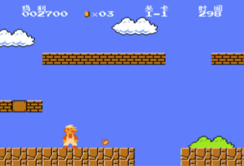  

例如 《我的世界》 大世界生成，采取的方法是程序化生成世界，得出的随机数据，转化为世界的构建。

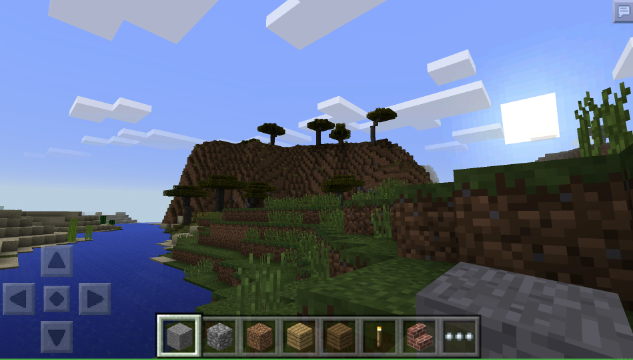  

# 寻路算法

在很多导航需求，AI移动需求方面，我们常常需要用上寻路算法，业内常规的寻路算法有：A星、JPS等等。

## A-Star

A*（A-Star)算法是一种静态路网中求解最短路最有效的方法。公式表示为：f(n)=g(n)+h(n)，其中f(n)是节点n从初始点到目标点的估价函数，g(n)是在状态空间中从初始节点到n节点的实际代价，h(n)是从n到目标节点最佳路径的估计代价。

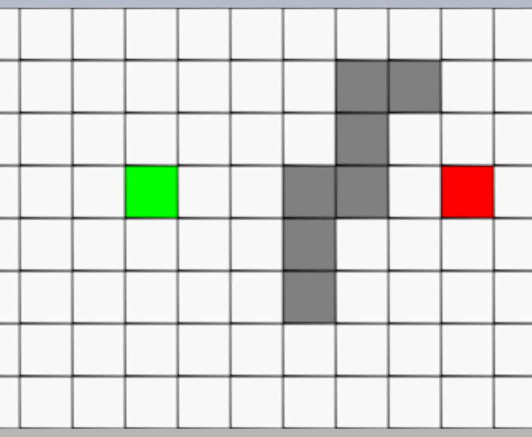  

当图结构特别庞大时，需要检索的节点会特别多，导致树的广度特别大，这是因为OpenList内太多节点需要进行比较，这时我们需要减少OpenList内的节点。

## JPS(跳点寻路算法)

当我们了解了A星之后，我们注意到OpenList过大一定会导致节点的比较次数增大，另外我们发现 Grid 类型的世界，很多节点是可以不用考虑到寻路内的。

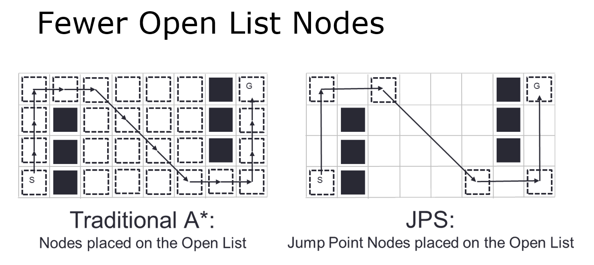  

### JPS 预处理

注意，预处理只能应用于静态地图，因为只有静态地图才是一种确定性的搜索。

情况一，对角的连通判断，例如每个障碍物，存在四个对角节点，若节点满足：节点非障碍物，并且有连通性。如图：

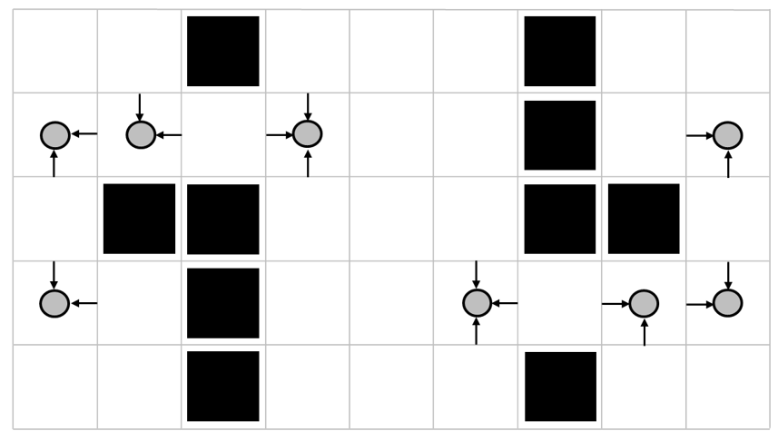

解读如下：例如 E 是障碍物，那么 E 存在四个对角：A、B、C、D。

如下图，分析情况：

- D 节点是障碍物，所以 D不是跳点。
- B 节点没有连通性，B 可以从西到东，但是B不能从北到南，因为B的南向是障碍物，所以B不是跳点。
- A 节点不是障碍物，并且可以从南到北，可以从东到西，有连通性，所以是跳点。
- C 节点不是障碍物，并且可以从北到南，可以从东到西，有连通性，所以是跳点。

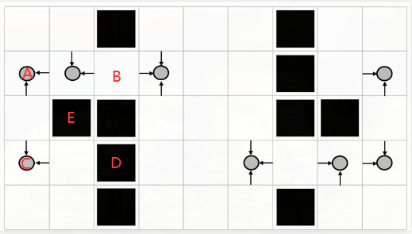  

直线方向上的判断。我们先从简单的情况开始，我们从左到右检查，按照ABCDEF的顺序检索下去。如下图所示：

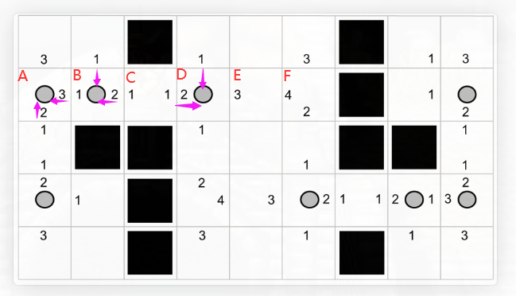  

A节点的强制邻居是右和下，所以我们画上的红色箭头。然后依次给B和D也画上。

如下图，我们来分析ABCDEF的向西（West）方向的值，这个值其实就是标注特别的跳点距离。注意是特别的跳点。

- B.West = 1，因为A.East 是满足强制邻居条件的，B和A的距离是1，所以B.West = 1
- C.West = 1, 因为B.East 也满足条件，C和B的距离是1
- D.West = 2, 因为B比A更近，距离为2
- E.West = 3, 同上理由
- E.West = 4, 同上理由

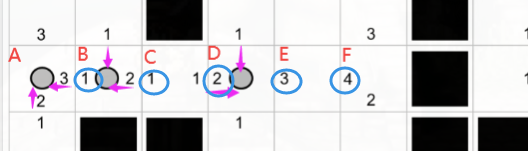  

接着处理四个斜线方向。

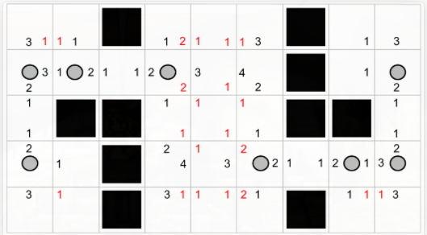  

然后对于剩余节点处理，记录距离，如下：

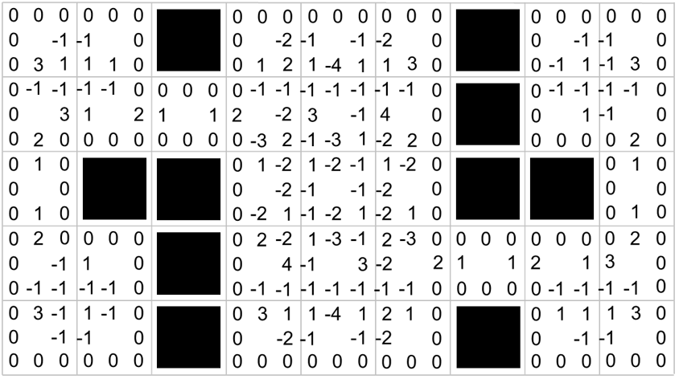

篇幅有限，可以查看其它人写的源码：
<https://github.com/trgrote/JPS-Unity>

## WayPoint（路点寻路）

并不是所有的游戏世界都能用 Grid 来描述的。特别对于一些偏向写实的游戏，更加不可能把整个世界按照大量小格子来做划分，其一，描述的过于简单，不适合描述更加复杂结构。其二，格子的尺寸很影响最终的格子数量，一旦地图过大，格子数量就特别庞大，对于超远距离的寻路一样是不友好的，即使是跳点寻路。

为此，这里采用另外一种寻路方式解决这类问题，路点寻路。如下图，通过Gizmos绘制运行时的寻路情况：

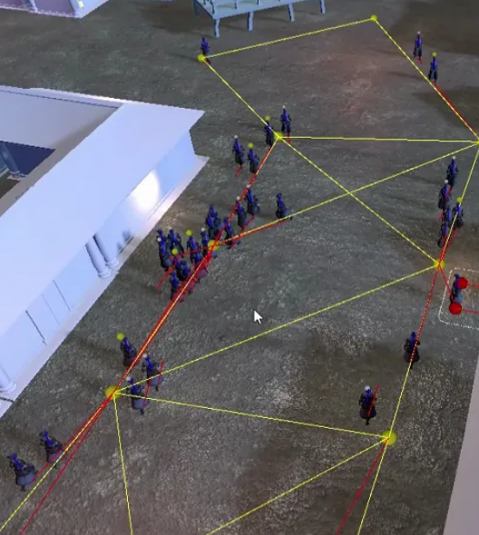  

整个技术方案如下描述：

- 提供一种Editor下的编辑工具，可以创建节点，可以任意选择两个节点是否相连，如果相连就产生了线，所产生的线可以自定义代价（这里的代价就是寻路的代价，默认情况下，代价越小，寻路越优）。并且产生的线可以选择是否单向或者双向（这意味着是否只是单向的寻路，或者双向的寻路，可以产生人行到靠右边的特殊效果，下面会提到）。最后把编辑好的图数据导出。
- 运行时通过图数据构建寻路数据，然后进行点到点的寻路，得出最近路径。

这种方式的寻路，还是有不少好处，对策划同学特别友好。

实现人群靠右行走：
<https://www.zhihu.com/zvideo/1339900170771976192>

几年前，写过一遍粗略的总结：
<https://zhuanlan.zhihu.com/p/194888259>

## B-Star

B-Star，BranchStar 即一种分支寻路算法。B-Star 的关键是产生分支，而产生分支的时机就是碰到障碍物（或者说碰到墙）。如下图所示：

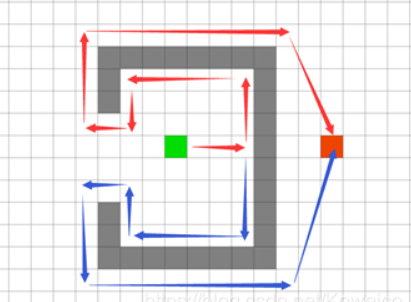  

这是一种消耗较低，但是不保证绝对最优，所搜索出来的路径是保证可达终点，但是路径代价几乎高于最优路径很多。这种算法据说是从自然界的现象观察出来的，例如：大量蚂蚁进行指向性的觅食（即从起点出发时，大致知道终点方向）。

算法大致步骤如下描述：

- 1.从起点出发时，按照终点的大致方向移动。
- 2.判断移动的前方是否是障碍，如果有墙就进行分支寻找（即变成两条寻找路径，前提是可以分支时，特殊死角不能分支除外）。
- 3.根据上一步，可能产生了n个分支，n个分支继续寻路，直到找到终点。

## D-Star

D-Star 即 Dynamic A Star，同样要维护一个OpenList，但是与 A Star 不同的是，D-Star 是从终点开始搜索。D-Star 比较适合对动态变化的环境寻路，这样能最小程度的进行再次的小范围寻路，从而修改小范围的路径。

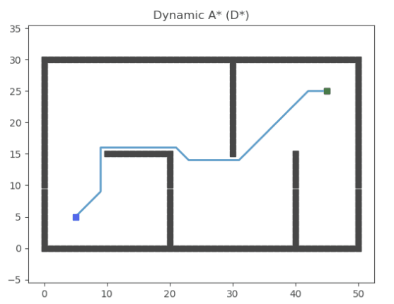

## 漏斗算法

Navigation 

在Unity 中，引擎提供了一种 Nav-Mesh 的数据，用来描述地图数据，划分可走区域与不可走区域，然后对于需要寻路的对象，挂载 NavAgent，赋予对象寻路能力。其中比较有意思的是 Nav-Mesh 是多个三角形组成的Mesh，这意味着它的寻路过程是一个三角形到另一个三角形的搜索。这和我们上面提到的 Grid 地图时间是有差异的。

# 博弈论

博弈论又被称为对策论（Game Theory），是现代数学的一个新分支，也是运筹学的一个重要学科。在很多棋牌类游戏中，我们时常遇到这类理论的运用。例如象棋游戏，我们希望在单机模式下，依然有AI与我们共同竞技，为此AI需要具备思考的能力，对于AI所做出的决策也一定是经过运算，从运算结果分析利弊，从而得出结论"这一步棋应该这么下"。

这里先从简单的棋类开始，分析棋类该怎么做出一个有一定思考能力的AI。我们选择用“井字棋”。

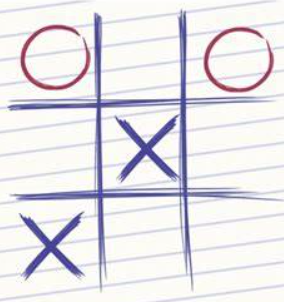  

井字棋特点：
- 步骤有限，双方总共9步
- 存在和棋

关于井字棋的博弈分享，在3年前写过一篇文章分享：<https://zhuanlan.zhihu.com/p/65219446>

## 预测收益

首先我们得告知 AI，游戏规则。游戏规则如下：
- 回合制
- 每回合轮流各下一子
- 若有一方棋子先同行同列同对角线三子，那么胜出
- 若棋盘下满后，无人胜出，则和棋

当AI知道规则后，我们还需要让AI知道：怎么让AI去判断下子的收益。为此我们需要去定义一些收益的例子，
例如：当自己两个棋子已经同行同列或者同对角线（并且没有被围堵）。这种情况下属于接近胜利，我们告诉AI这种时候收益很高。

显然 “收益” 的判断很重要，所以要有准确的 “收益” 制定，让AI知道做哪些事情可以带来收益，最后引导AI走向胜利。
除了 “收益” 外，我们还需要制定另外一种AI思考能力，那就是 “代价” 。

“代价” 可以认为是一种负 “收益”。之所以要提出这个，是因为AI在做出任何决策后，人类都会采取自己的对策，以AI视角来说，人类的“收益”就是AI的“代价”。同理，AI的“收益”就是人类的“代价”。

AI 通过计算当前的可走步子，权衡 “代价” 与 "收益"。可以画出如下的图：

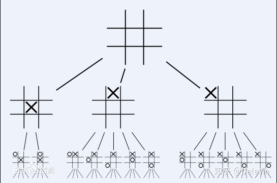  

注：由于对称性，所以第一轮的决策，原本有9种选择，被缩减成了三种。

当AI足够聪明时，它总是希望自己利益最大化的，那么这里就要引出一个问题：每一步利益最大化，是否会最终利益最大化。

其实并不会这样，并不是每一步利益最大化，就一定可以最终利益最大化。因为每一步的决策都会导致下一步的环境不一样，这意味着下一步的利益最大化只是针对某种情况而言，也就是说不同决策，后续的利益也无法直接对比，因此局部最优无法表达全局最优的情况。

这里可以列举寻路算法，如果我们选择贪心算法，每一步选择代价最低的步骤，也无法保证是代价最小的最短路径，因为当前步骤的最优，也会导致后续环境的不一样，这也就论证了上面的观点：局部最优无法保证全局最优。

注：只有当每一步决策后，所出状况也会完全相同，那么这种状况下，每一步最优一定可以得到全局最优。

## 剪枝算法

## 高级预测、深度学习、强化学习

# 几何检测算法

## 2D 碰撞

### 凸包 分离轴定理

### AABB 包围盒

### 四叉树优化

## 3D 碰撞

### 常规 3D 模型碰撞

### 不规则 3D 模型碰撞

#### 八叉树优化

# 部分优化相关的算法

## 模型坍缩

## Motion Matching

# 计算机图形学相关算法

# RayTrace

# 常规算法

## 动态规划

## 分治

## 回溯

例如迷宫、数独

## 贪心

# LeetCode

---

# Ref

<https://zhuanlan.zhihu.com/p/385733813>

<https://www.cnblogs.com/KillerAery/p/12242445.html>

<https://juejin.cn/post/6979895361397587982>

<https://www.cnblogs.com/674001396long/p/9901811.html>
