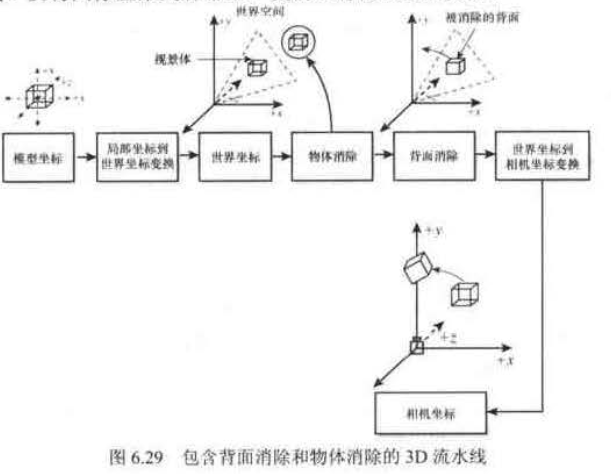
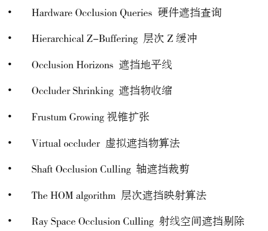
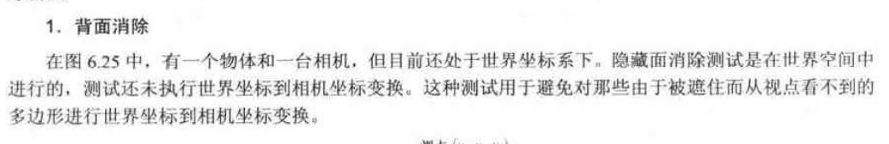

- [前言](#前言)
- [三维碰撞检测](#三维碰撞检测)
- [空间划分算法](#空间划分算法)
  - [BSP](#bsp)
  - [BVH](#bvh)
- [可见性判定](#可见性判定)
  - [视椎体剔除](#视椎体剔除)
  - [遮挡剔除](#遮挡剔除)
    - [硬件遮挡查询](#硬件遮挡查询)
  - [背面剔除](#背面剔除)
  - [剪切](#剪切)
  - [深度测试](#深度测试)
- [关于缓存命中率](#关于缓存命中率)
  - [缓存的由来](#缓存的由来)
    - [缓存 Miss](#缓存-miss)
    - [如何提高缓存命中率？](#如何提高缓存命中率)
- [Ref](#ref)

# 前言

上一篇主要介绍了一些通用算法包括：动态规划、分治、回溯、贪心、以及一些代表性的寻路、部分入门级的AI算法、部分碰撞检测的算法等等。

# 三维碰撞检测

GJK算法 从二维判定衍生到三维判定

# 空间划分算法

## BSP

## BVH

# 可见性判定

可见性判定，在游戏优化中，有着举足轻重的地位，不同粒度的剔除剪切，可以减少不必要的运算，能在性能上是有极大提升。
如下，主要的可见性判定算法：

- 视椎体剔除
- 遮挡剔除
- 背面剔除
- 剪切
- 深度测试

  

## 视椎体剔除

渲染对象用Bounding-Box包裹，结合视椎体的空间位置与方向，判定渲染对象是否处于视椎体内，不在视椎体内就直接剔除。通常情况下，视椎体剔除发生在CPU的应用阶段。

## 遮挡剔除

遮挡剔除比较复杂，目前存在多种遮挡剔除的相关算法，如下：

  

### 硬件遮挡查询

## 背面剔除

  

## 剪切

## 深度测试

# 关于缓存命中率

这一小节比较特别，关于缓存命中率这个内容，其实算不上和算法有关。不过缓存命中率这个知识点，还是比较关键，在游戏优化中，它出现的频率是极高的。

要知道，CPU与内存之间，往往代表着以下三个抽象阶段：

- 从内存中读取指令和数据，传输给CPU
- CPU收到指令和数据，CPU运行指令，运算数据
- CPU将运算结果写回内存

这是一个一读一写的操作。
一读：从内存把指令和数据读取到CPU。
一写：在CPU运算数据后，把数据写回内存。

## 缓存的由来

### 缓存 Miss

### 如何提高缓存命中率？

# Ref

《Real-time Rendering》提炼总结

<https://zhuanlan.zhihu.com/p/441754705>