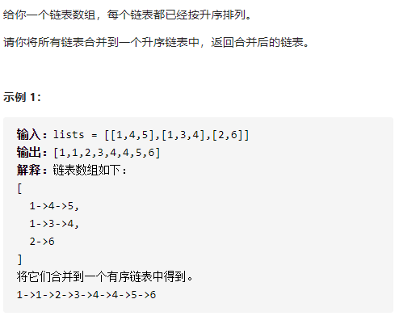

# 关于分治算法

分治算法是将一个相对复杂的问题，分解为相似的更小的子问题，而最终的子问题是相对可以更简单的求解。

分治算法与动态规划的区别是，分治的子问题相对独立，没有直接关联，不直接影响各自的决策。

注意：只有子问题的解可以合并，才能选择用分治。


# 分治算法实例

下面列举一些分治算法的实例

## [LeetCode]23. 合并K个升序链表
https://leetcode-cn.com/problems/merge-k-sorted-lists/

  

我们知道合并两个有序链表很简单，但是合并K个有序链表就不一样了。
如果已暴力解法求解，那么需要合并的次数是K-1次。

用分治算法就可以简化，将K个链表细分为两个链表为一组比较（多余的直接返回结果至下一次判断），然后比较每组比较出来的结果必然只是一个链表，然后再讲所得结果链表再分为两个为一组，再次比较，直到最后只剩一个组，所得结果就是合并后的最终解。
这也是上文描述的，必须是可合并的解，才适合分治算法求解。

```
    public ListNode MergeKLists (ListNode[] lists) {
        return Merge (lists, 0, lists.Length - 1);
    }

    private ListNode Merge (ListNode[] lists, int l, int r) {
        if (l == r) {
            return lists[l];
        }
        if (l > r) {
            return null;
        }
        int mid = (l + r) / 2;
        return MergeTwoList (Merge (lists, l, mid), Merge (lists, mid + 1, r));
    }

    private ListNode MergeTwoList (ListNode a, ListNode b) {
        if (a == null || b == null) {
            return a != null ? a : b;
        }
        ListNode head = new ListNode (0);
        ListNode tail = head, aPtr = a, bPtr = b;
        while (aPtr != null && bPtr != null) {
            if (aPtr.val < bPtr.val) {
                tail.next = aPtr;
                aPtr = aPtr.next;
            } else {
                tail.next = bPtr;
                bPtr = bPtr.next;
            }
            tail = tail.next;
        }
        tail.next = (aPtr != null ? aPtr : bPtr);
        return head.next;
    }
```


https://www.cnblogs.com/steven_oyj/archive/2010/05/22/1741370.html