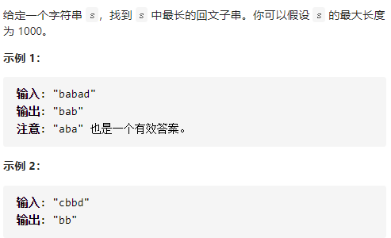
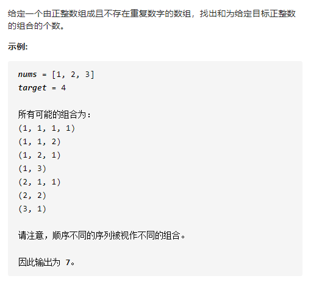

# 关于动态规划

动态规划算法通常用于求解某种最优性质的问题，通常来说某个问题的相对繁琐并且有存在一定规律（可分解为若干子问题）。

注意：可分解为若干子问题/子状态是指问题/状态的大小已经不影响求解问题/状态的方式，简单概况来说，就是不管问题大小，求解的方式都是一样的，分治也是这个特性。

注意：分治和动态规划都是对问题/状态的分解，但是有个不同的是，动态规划的子问题，有一定的关联，分治问题的分解区别在于子问题相对独立，不干扰。而动态规划子问题可以影响决策。

## 动态规划的常规分解

用一个不太恰当的公式来表示动态规划：

当前子问题/状态的解 = 某个子问题/状态的决策 + 当前决策方式。

---

下面列举几道动态规划题

# 动态规划实例

## [LeetCode]62. 不同路径
https://leetcode-cn.com/problems/unique-paths/


  

题意分析可得：机器人只能往右或往下走，所以图中左起第一排和第一列上的每个格子只有一种走法。而其他位置的走法是相邻左边和上边格子的走法之和

  

这样就可以列出状态转移方程

int dp[,] = new int[i,j];
当 i = 0; dp[i,j] = 1;
当 j = 0; dp[i,j] = 1;
其他情况：dp[i,j] = dp[i-1,j]+dp[i,j-1];

因此，代码如下：

```
    //动态规划
    public int UniquePaths (int m, int n) {
        //动态规划解法
        int[, ] arr = new int[m, n];
        for (int i = 0; i < m; i++) {
            for (int j = 0; j < n; j++) {
                if (i == 0 || j == 0) {
                    arr[i, j] = 1;
                }
            }
        }
        for (int i = 1; i < m; i++) {
            for (int j = 1; j < n; j++) {
                arr[i, j] = arr[i - 1, j] + arr[i, j - 1];
            }
        }
        return arr[m - 1, n - 1];
    }
```

## [LeetCode]5. 最长回文子串
https://leetcode-cn.com/problems/longest-palindromic-substring/



根据描述，可知：字符串"aba"是回文子串，那么在首尾各加一个字符时，只需要判断首尾两个字符是否相等，就可以判断出"?aba?"是否是回文字符串。
这就是符合动态规划的描述。

我们尝试来列出动态转移方程：

当字符串首尾索引差值为0时，dp[i,j] = true
当字符串首尾索引差值为1时，dp[i,j] = s[i] == s[j];
其他情况：dp[i,j] = dp[i+1,j-1] && s[i] == s[j];

如果是回文串，再比较长度，得到最长的回文子串
代码如下：

```
    private string Func (string s) {
        int len = s.Length ();
        bool[, ] dp = new bool[len, len];
        string str = "";
        for (int l = 0; l < len; l++) {
            for (int i = 0; i + l < len; i++) {
                int j = i + l;
                if (l == 0) {
                    dp[i, j] = true;
                } else if (l == 1) {
                    dp[i, j] = s[i] == s[j];
                } else {
                    dp[i, j] = s[i] == s[j] && dp[i + 1, i - 1];
                }

                //最后看长度是否超过之前的
                if (dp[i, j] && l + 1 > str.Length ()) {
                    str = s.Substring (i, i + l + 1);
                }
            }
        }
        return str;
    }
```

## [LeetCode]377. 组合总和 Ⅳ
https://leetcode-cn.com/problems/combination-sum-iv/

  

如上，动态规划是对子问题做决策，并且子问题的决策是受其他子问题决策影响的
上面要求的是一种组合，并且求的是组合个数，那么用动态规划比较合适，如果要求所有的组合结果，那么可以考虑用回溯

这里选择的是动态规划的解法

首先分析一下，找到规律，得到状态转移方程

如： 【1,2,3,4】  target = 10;

列举树状结构，我们可以知道，第一层有四种可能
分别是： 1，2，3，4

当我们分别选择了1，2，3，4
意味着这四个节点需要求解的是： 10-1，10-2，10-3，10-4

子问题和原问题是一样的思路

那么意味着状态方程式这样的：

all = Node1 + Node2+Node3+Node4;

求dp状态转移方程

dp[i] 表示 和为i时，有多少种组合

dp[i] = dp[target - nums[0]] + dp[target - nums[1]] .... + dp[target-nums[nums.length-1]]

注意：上面列的方程必须要保证  target-nums[i] >= 0 ，因为索引，target - nums[i] 必须不能是负数

当i=0时，直接是一个空数组
所以
dp[0] = 1;

那么可以通过dp[0]递推到dp[target]的值

```
    public int CombinationSum4(int[] nums, int target) {
        if (nums.Length == 0)
            return 0;

        int[] dp = new int[target + 1];
        dp[0] = 1;
        for (int i = 1; i <= target; i++) {
            for (int j = 0; j < nums.Length; j++) {
                if (i - nums[j] >= 0) {
                    dp[i] += dp[i - nums[j]];
                }
            }
        }
        return dp[target];
    }
```