# 冯-诺依曼计算机体系结构

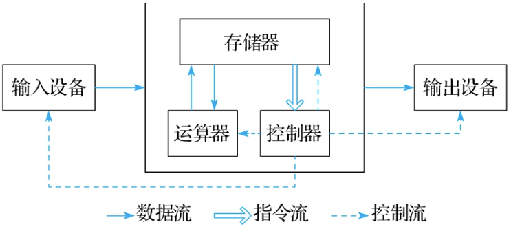  

# 早期南桥-北桥结构

  

# CPU 指令流水线

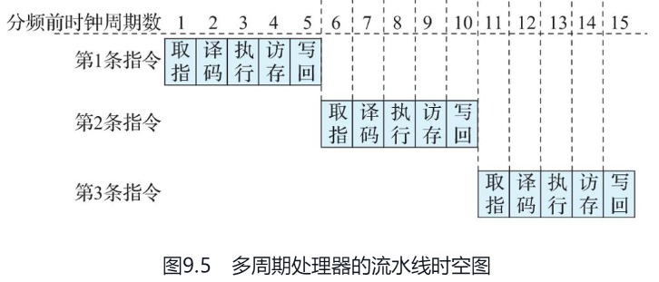  

上图未充分利用CPU各元件的资源，多数时候在等待。

下图，每个元件各自处理任务，这和GPU流水线的思路是一致的。

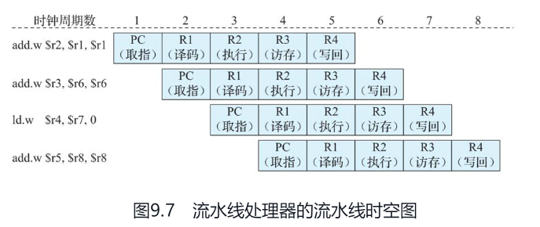  

由于数据的上下关联，往往需要等待上一个指令完成，才能执行下一个指令，这种强关联性就导致了CPU指令流水线的阻塞。

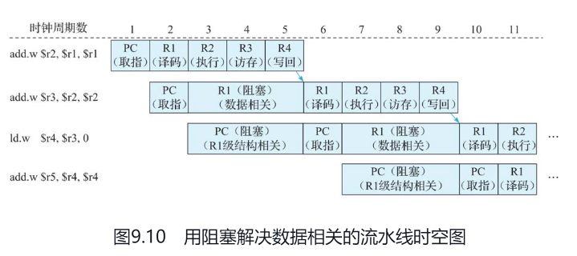  

## 流水线前递

当前指令执行的结果，如果是下一个指令的输入，那么下一个指令没必要等待当前指令把数据结果写入寄存器后，才去读取结果，而是应该把结果立刻传递给需要的指令。

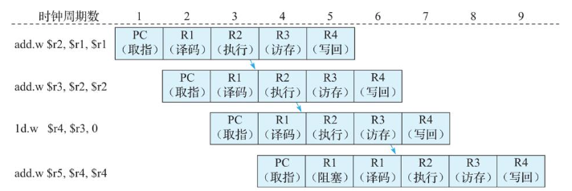  

## 分支预测（转移预测）

通过 转移预测表（Branch History Table）作信息数据，提供预测的数据。

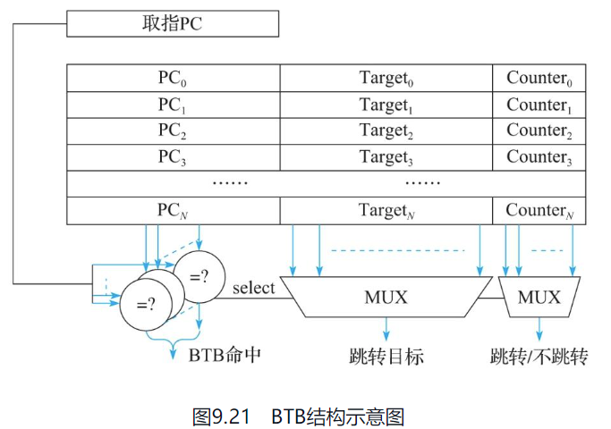  

## Cache(缓存)

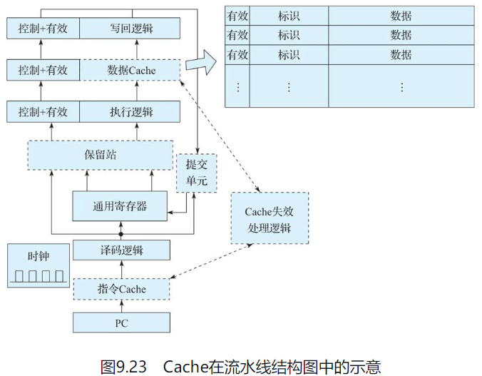  

# CPU 流水线

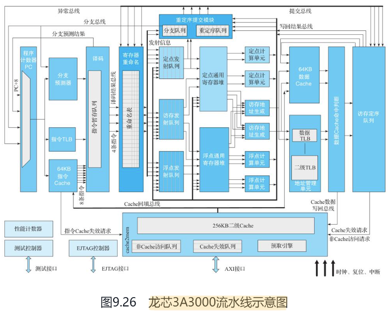  

# 关于并行

数据并行、任务并行

## 数据并行 （SIMD）

需要向量寄存器、向量运算器支持。

通过一个指令运算多个数据结果。

## 任务并行

这种需要多核CPU来做到，不同CPU核运行完全不关联的数据时，处理起来就特别简单。一旦多核CPU上运行的逻辑需要共享数据时，事情就变的复杂多了。
采用共享存储或者消息传递。

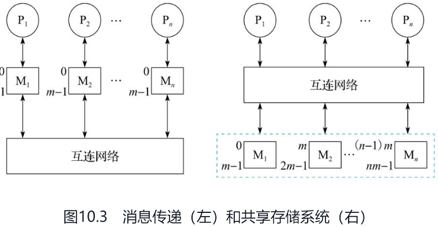  

# 多核CPU的访存

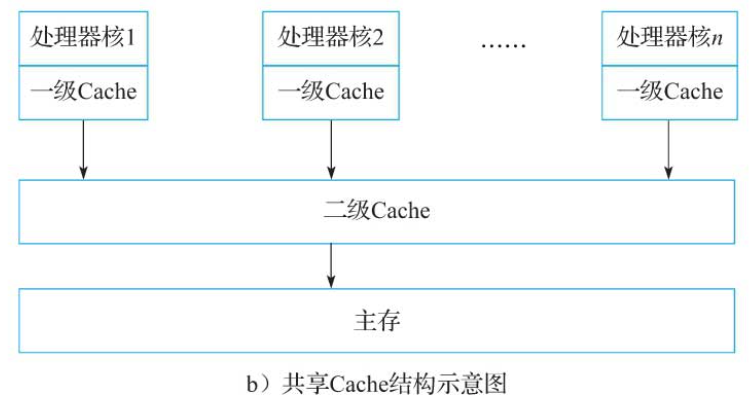  

Cache 的同步与写穿透

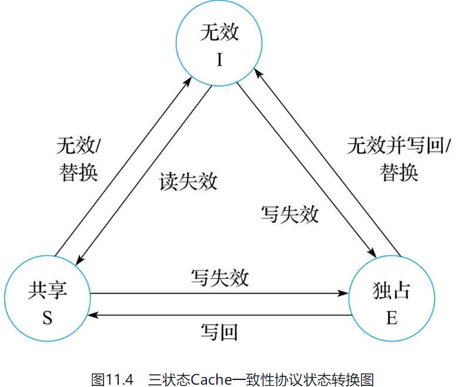  

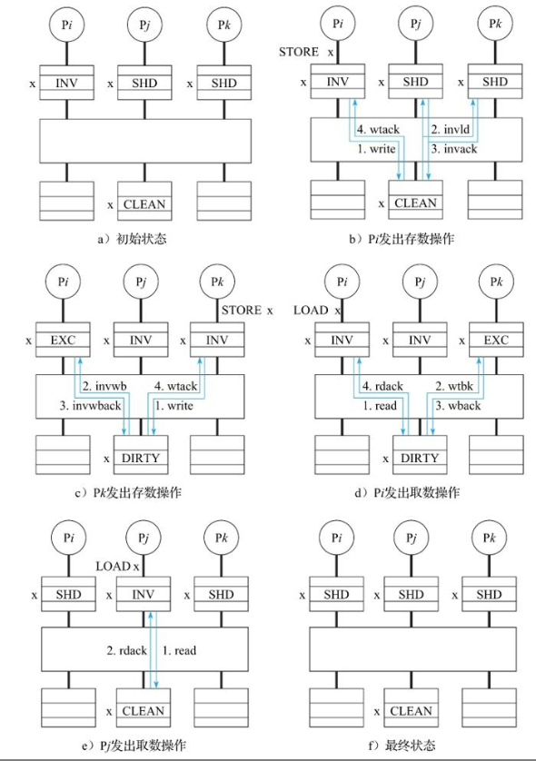  

# GPU

Fermi 体系结构GPU。

16个SM（流多处理器），每个SM包含32 CUDA Core。4个 特殊处理单元（Special Function Unit,SFU）、16个 Load/Store 单元、64K 片上高速存储。

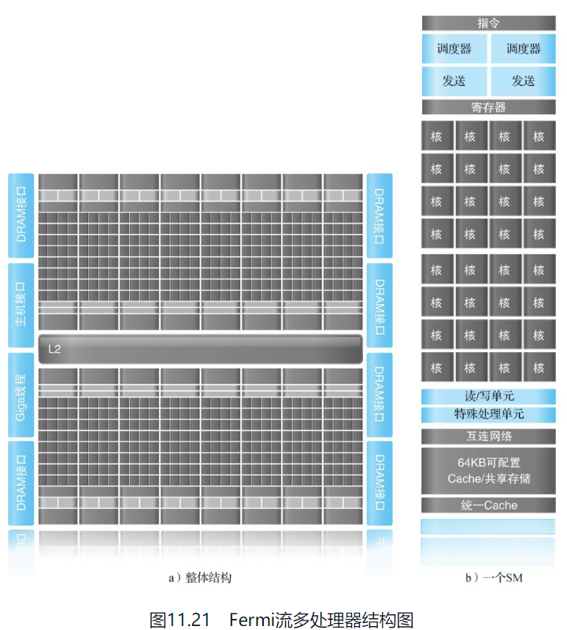  

单个 CUDA Core 结构：

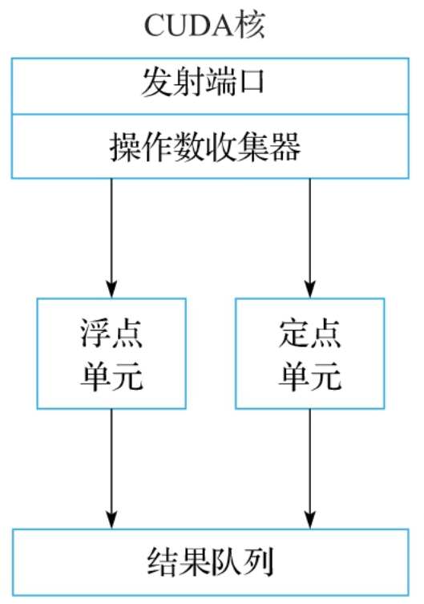  

