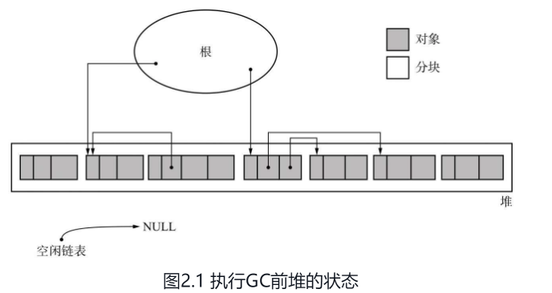
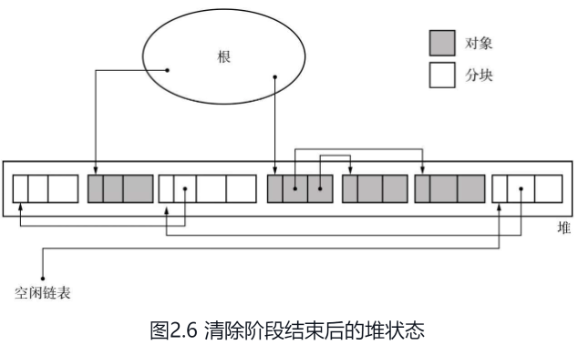
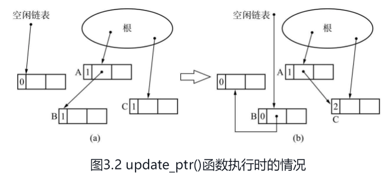
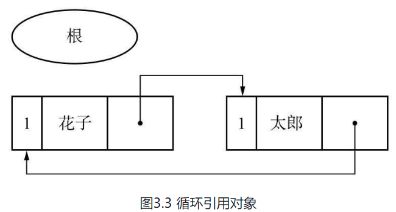
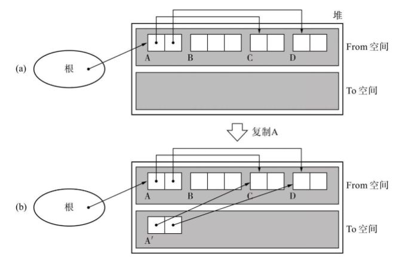
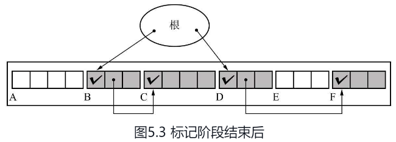
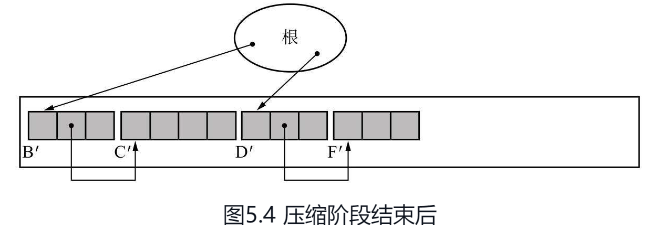
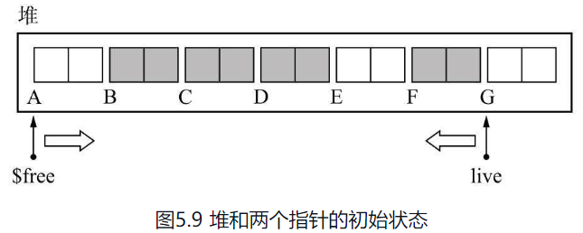
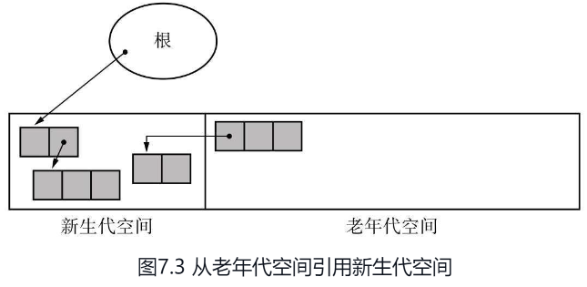
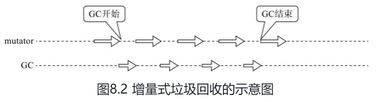

# GC

GC 算法是多个策略的集合体，因为GC要处理的问题从来不是固定的，所以没办法用一种GC策略来解决所有问题，这样先介绍多个GC策略

# 标记-清除

  

两次遍历堆：
- 标记是否被Root 引用
- 把未引用的放入空闲链表

  

缺点：碎片化

# 引用计数

同样是两次遍历堆

  

缺点：无法识别循环引用

  

# 复制算法

按照深度遍历的话，数据相对紧凑，相关性很高。对缓存命中率很友好。

  

缺点：空间利用率不足

# 标记-压缩

  

  

缺点：拷贝代价高

## 双指针 标记-压缩

  

# 分代策略

频繁产生回收对象的情况，多数发生在年轻代，年轻代对象往往数量多Size小，最容易碎片化，而老年代对象往往数量少Size大，很有可能生命周期伴随整个应用程序的生命周期。

  

# 增量式GC

把压力分摊到多个CPU时间片上。

  