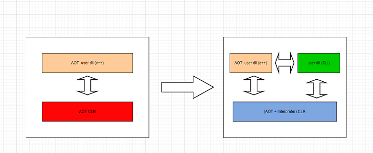


# forward

```
HybridCLR是一个特性完整、零成本、高性能、低内存的近乎完美的Unity全平台原生c#热更方案。

HybridCLR扩充了il2cpp的代码，使它由纯AOT runtime变成AOT+Interpreter 混合runtime，进而原生支持动态加载assembly，使得基于il2cpp backend打包的游戏不仅能在Android平台，也能在IOS、Consoles等限制了JIT的平台上高效地以AOT+interpreter混合模式执行，从底层彻底支持了热更新。

HybridCLR不仅支持传统的全解释执行模式，还开创性地实现了 Differential Hybrid Execution(DHE) 差分混合执行技术。即可以对AOT dll任意增删改，会智能地让变化或者新增的类和函数以interpreter模式运行，但未改动的类和函数以AOT方式运行，让热更新的游戏逻辑的运行性能基本达到原生AOT的水平。

```

# core



绿色部分的 user dll(CLI) 就是新增的DLL，以一种解释器模式执行。


- 实现了一个高效的元数据(dll)解析库
- 改造了元数据管理模块，实现了元数据的动态注册
- 实现了一个IL指令集到自定义的寄存器指令集的compiler
- 实现了一个高效的寄存器解释器
- 额外提供大量的instinct函数，提升解释器性能

## MonoBehaviour


挂载热更新脚本的资源（场景或prefab）必须打包成ab，在实例化资源前先加载热更新dll即可（这个要求是显然的！）。


## 泛型问题

- 基于il2cpp的泛型共享技术。
- 基于补充元数据技术。这也是HybridCLR的专利技术。该技术社区版本也可使用。
- 基于full generic sharing 完全泛型共享技术。该技术目前只在商业化版本提供。

```
补充元数据技术彻底解决了这个问题。粗略地说，你补充AOT泛型类（或泛型函数）的原始元数据后，就可以任意实例化这个泛型类了。以上面List<MyVector3>为例，你补充了List类（而不是MyVector3）所在的mscorlib.dll元数据后，就可以在热更新代码中使用任意List<T>泛型类了。

补充元数据技术的缺陷是增大了包体或者需要额外下载补充元数据dll，导致工作流复杂一些，另外还多占用了内存。full generic sharing 又进一步解决补充元的这些缺陷。由于full generic sharing是商业化方案，这儿限于篇幅只介绍补充元数据的用法。
```

---

# Ref

<https://hybridclr.doc.code-philosophy.com/docs/intro>

<https://hybridclr.doc.code-philosophy.com/docs/basic/aotgeneric>