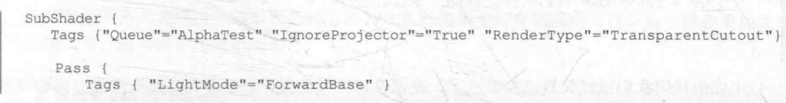

Standard Surface Shader

Unlit Shader

Image Effect Shader

Computer Shader

Pass

UsePass

GrabPass

BRDF

https://www.sardinefish.com/blog/338

兰伯特光照模型

Texture  滤波模型

Filter Mode

Point

Bilinear

Trilinear

