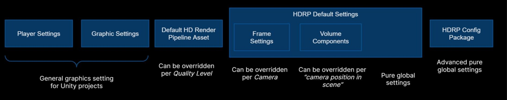
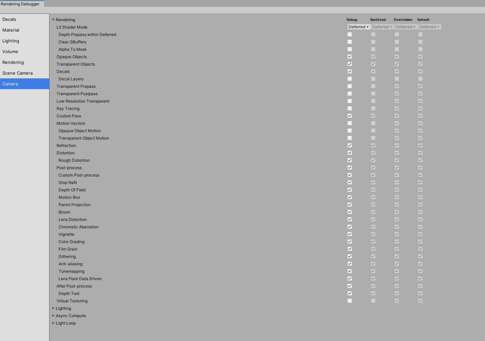
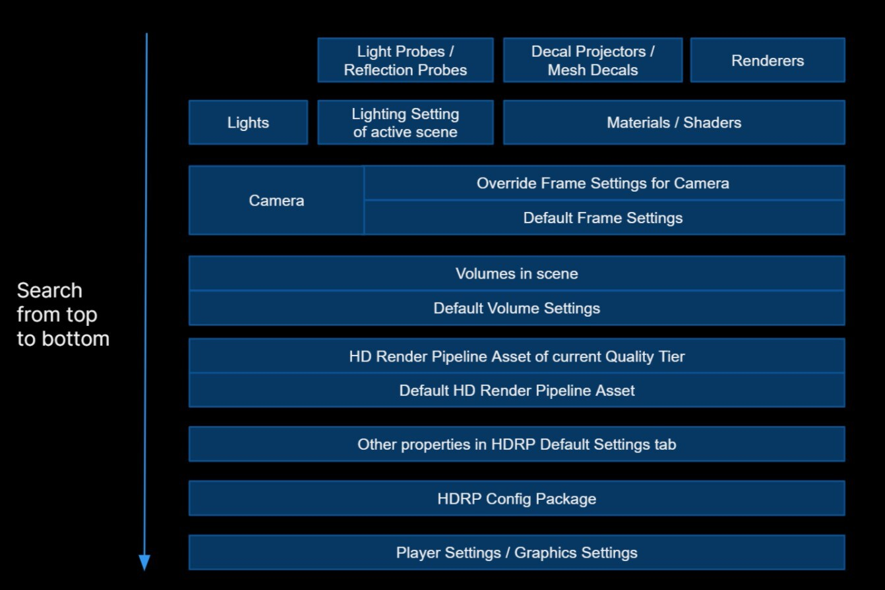

# 版本环境

Unity v2021.2.8f1

HDRP v12.1.3

# HDRP 可选设置

Player Settings、Graphic Settings、HDRP Asset、Frame Setting、Volume

  

设置 ：HDRP Asset > Camera Custom Frame Settings > HDRP Global Settings 

应用层设置：Render、Volume

# Rendering Debug 查看结果

  

# 设置的流水线

  

# 多维度的设置

- 根据不同设备平台，采取不同的品质设置
- 当前的相机设置
- 当前相机所处的Volume
- 渲染的模型材质
- 影响模型的光照设置

