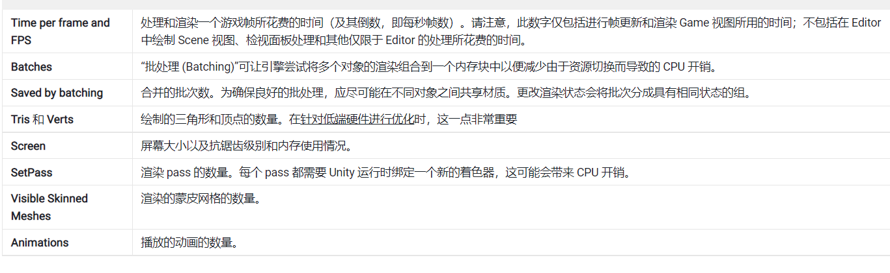

# Stats 窗口 说明

  

# 内存层面

https://zhuanlan.zhihu.com/p/370467923

---

# 运行效率优化

运行效率主要影响的是CPU的运行效率，而引起效率下降的主要原因包括但不限于：
- 代码质量
- 频繁创建与销毁对象
- 一帧处理过多计算

## 代码优化

C#语言特性、以及一些托管堆垃圾回收的影响。
装箱与拆箱，使用泛型防止过多的装箱与拆箱操作。

## 缓存池和预处理

缓存池通过提前创建好一些对象，留着备用，用完立即回收到池中，防止频繁创建与销毁。

## 分帧运行

一帧过多的渲染绘制、计算都会导致降帧或者掉帧，
把这一帧内的操作，分到几帧内执行，减少这一帧的执行压力，防止下一帧等待过久。

# 渲染优化

Verts与DrawCall过多都是渲染压力，主要优化也是这两点

## 贴图优化

https://www.cnblogs.com/joeshifu/p/5489906.html

### 自定义图片格式

### 调色板算法

## 定点优化

### 优化模型面数

## Batch

## Shader优化

### 避免复杂运算

### 空间换时间

### 采用效果类似的近似值算法

# 安装包大小优化

## 适当降低资源质量与精度

## 按需加载

# 加载速度优化

## 网络下载优化

### 如何突破下载器限制

## 本地IO优化

### 小文件合并为一个大文件，减少IO

# 网络优化

## HTTPS 

适合网络通信频率较低的场景

## TCP

对延迟不敏感的场景，要求不丢包

## UDP

网络通信频繁，且对延迟敏感的场景

https://zhuanlan.zhihu.com/p/29087888

https://zhuanlan.zhihu.com/p/29377705

https://zhuanlan.zhihu.com/p/29849244

