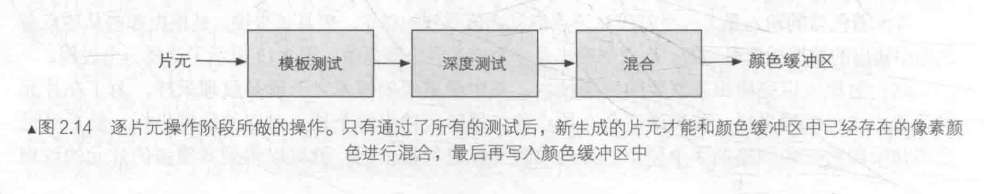

## 应用阶段

- 把数据加载到显存
- 设置渲染状态:定义场景中的网格是怎么样渲染的。
- 调用DrawCall：CPU对GPU底层接口的调用。

---
当GPU收到CPU的 DrawCall 命令后，进入GPU的流水线

## 几何阶段

- 顶点着色器：实现空间变换、顶点着色
- 曲面细分着色器：可选，用于细分图元。
- 几何着色器：可选，用于执行逐图元的着色操作。
- 裁剪：把不在摄像机视野内的顶点裁剪掉，并剔除某些三角图元的面片。

### 顶点着色器

输入来着CPU，输入尽量的每个顶点都会调用一次顶点着色器，无法得知顶点与顶点之间的关系。
顶点着色器主要处理的工作：坐标变换、顶点着色。
一个最基本的顶点着色器必须完成的一个工作是：把顶点从模型空间转换到齐次裁剪空间。

顶点着色器会将模型顶点的位置变换到齐次裁剪坐标空间下，进行输出后再由硬件做透视除法得到DNC下的坐标。

### 裁剪

由于我们已知 NDC 下的顶点位置，不在单位立方体内的部分被裁剪掉，原本在外部的顶点会舍弃，新的顶点会生成。

### 屏幕映射

这一步输入的坐标是三维坐标系下的坐标，屏幕映射时把每个图元的x,y转换到屏幕坐标系下。

## 光栅化阶段

- 三角形设置
- 三角形遍历
- 片元着色器
- 逐片元操作

光栅化阶段有两个最重要的目标，计算每个图元覆盖哪些像素，以及为这些像素计算他们的颜色。

### 三角形设置

这个阶段会计算光栅化一个三角网格所需的信息。

### 三角形遍历

三角形遍历阶段会检查每个像素是否被某个三角形网格所覆盖。如果被覆盖的化，就会生成一个片元。这个阶段也称做扫描变换。

### 片元着色器

片元着色器也称作像素着色器。

这个阶段可以完成很多重要的渲染计数，其中最重要的技术之一就是纹理采样。为了在片元着色器中进行纹理采样，我们通常会在顶点着色器阶段输出各个顶点对应的纹理坐标，对三角形网格的3个顶点对应的纹理坐标进行插值后，就可以得到其覆盖的片元的纹理。

### 逐片元操作

这个阶段有几个主要任务：

- 决定每个片元的可见性。如深度测试、模板测试。
- 如果一个片元通过了所有的测试，就需要把这个片元的颜色值和已经存储在颜色缓冲区中的颜色进行合并，或者说是混合。

#### 模板测试

#### 深度测试

根据深度（离摄像机的距离）来舍弃不通过测试的片元

#### 混合

对于不透明的物体，开发者可以关闭混合操作。那么片元着色器计算得到的颜色值就会直接覆盖掉颜色缓冲区中的像素值。但对于半透明的物体，我们就需要使用混合操作来让这个物体看起来是透明的。

半透明物体的绘制需要遵循画家算法，由远至近进行绘制。

---

《Unity Shader 入门精要》
《细说图形渲染管线》