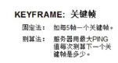

1. 进程、线程、协程的关系是怎么样的。
   - 进程在某种程度上，是属于应用程序的单位。操作系统会为进程分配独立的内存空间。
   - 进程的并发：宏观上，是一种“并行”，微观上，是串行
   - 对于有限的时间片（CPU资源）、有限的空间（内存）。所以对于多个进程，为了充分发挥效率，操作系统需要通过各种策略去管理多个进程的使用情况，例如：最近最少使用、最后剩余时间等算法，作为调度进程的参考；
   - 进程上下文的切换，也只局限于内核态
   - 线程是被进程包含的，线程是一个具体任务或者逻辑的划分，通常在程序设计过程中，我们期望用多线程来发挥硬件的最大性能，让多个子线程之间减少等待和阻塞的事情发生。
   但是多线程同时还是有缺点，例如，多线程读写同一份数据，这会导致数据错乱，所以要加锁，加锁之后，势必导致有线程会被阻塞，那么运算速度又被下降了。
   - 线程是调度的基本单位，而进程则是资源拥有的基本单位；
   - 协程是分配在线程之中的更小时间片，//TODO:
2. 虚拟地址的好处有哪些
   - 保护各自进程的内存空间，
   - 另外一个是让地址空间范围超过实际的内存空间地址，为虚拟内存做准备；
3. OSI五层结构，每层的具体功能有哪些
   - 应用层，与应用进程直接联系，收发数据的最上一层；
   - 传输层，选择是否可靠的传输方式，对于传输的数据包，可供收发确认，控制数据的收发包- 网络层，每个数据包中都包含源地址和目的按地址，提供路由选择。查找MAC地址，为数据链路层提供MAC地址。
   - 数据链路层，收发帧数据包
   - 物理层，最低一层，提供物理链路，建立两个网络节点之间的物理链接。
4. 网络粘包是指什么？
   - 通常发生在TCP内，因为常规的UDP是面向报文的发送数据包，而TCP是面向字节流发送数据包，TCP会选择将数据包拆成多个子包，并且进行收发确认。
   - 通常处理粘包的策略是，在数据包中标记数据的尾部，这样在接收数据的时候能判断出字节流在哪个位置是尾部。解析数据就可以指定字节流长度。或者，数据首部内，描述完整的Msg的长度大小。
5. 引擎架构分层的细节有哪些？大概能分哪些层？
   - 工具层
   - 资源管理层
   - 内核层
   - 系统\平台层
6. 渲染管线的整体流程
	- 应用阶段
		- CPU提交需要绘制的数据，发起DrawCall
	- 几何阶段
		- 顶点着色器 （顶点数量不变）
		- 曲面细分（顶点数量增加）
		- 几何着色器（顶点数量可能增加也可能减少）
		- 裁剪
		- 映射
	- 光栅化阶段
		- 三角形设置
		- 三角形遍历
		- （提前深度测试）
		- 像素着色器
		- 深度测试
		- 混合
		- Swap Frame
7. 曲面细分着色器主要用来做什么？需要注意什么问题？
```
曲面细分着色器（Tessellation Shader）是渲染管线中的一个阶段，用于在运行时对模型的几何细分进行处理。它主要用于增加模型的细节和曲面光滑度，以提高渲染质量和真实感。

曲面细分着色器可以将低细节的模型（如简单的三角形网格）细分为更高细节的模型，通过添加新的顶点和细分面来增加模型的细节层次。这样可以在渲染时更准确地呈现模型的曲面细节，使其看起来更加真实和光滑。

使用曲面细分着色器时需要注意以下几个问题：

1. 性能开销：曲面细分是一个计算密集型的过程，会增加GPU的负载。需要权衡细节级别和性能之间的平衡，避免过度细分导致性能下降。

2. 控制细分级别：曲面细分着色器通常具有控制细分级别的参数，可以调整细分的程度。需要根据具体需求和性能要求来选择合适的细分级别。

3. 网格一致性：曲面细分会改变模型的网格拓扑结构，可能会对后续的渲染和处理步骤产生影响。需要确保细分后的网格仍然是有效和一致的，以避免渲染错误或其他问题。

4. 材质支持：曲面细分可能需要与合适的着色器和材质一起使用，以正确渲染细分后的模型。需要确保所使用的材质和着色器能够正确处理细分后的几何数据。

总之，曲面细分着色器在渲染管线中用于增加模型细节和曲面光滑度。使用时需要注意性能开销、细分级别的控制、网格一致性和材质支持等问题，以获得良好的渲染效果和性能表现。
```
8. 几何着色器主要用了做什么？需要注意什么问题？
```
几何着色器（Geometry Shader）是渲染管线中的一个阶段，位于顶点着色器和片段着色器之间。它主要用于对几何图元进行处理和生成新的图元，从而实现一些高级的几何操作和效果。

几何着色器可以执行以下几种主要功能：

1. 几何图元扩展：几何着色器可以接收输入的几何图元（如点、线、三角形），并生成新的几何图元。例如，可以将一个输入的三角形扩展为多个细分后的三角形，或者将一条线段扩展为带有额外顶点的线段。

2. 几何图元剔除：几何着色器可以根据一定的条件剔除输入的几何图元，使其在渲染中不被绘制。这可以用于优化渲染过程，减少不必要的绘制操作。

3. 几何图元的变换：几何着色器可以对输入的几何图元进行变换操作，例如平移、旋转、缩放等。这可以用于实现一些特殊的效果，如模型的动态变形或扭曲。

4. 几何图元的生成：几何着色器可以根据输入的几何图元生成新的几何图元。例如，可以根据输入的点生成立方体、根据输入的线生成管道等。

使用几何着色器时需要注意以下几个问题：

1. 性能开销：几何着色器是一个相对较重的计算阶段，会增加GPU的负载。需要谨慎使用，并确保在性能可接受的范围内进行优化。

2. 输入图元的限制：几何着色器对输入的几何图元类型有一定的限制，不同的硬件和渲染API可能支持的输入类型不同。需要了解目标平台的支持情况，并确保输入数据满足要求。

3. 输出图元的限制：几何着色器对输出的几何图元类型和数量也有限制。需要根据需求和目标平台的支持情况，选择合适的输出图元类型和数量。

4. 几何图元的一致性：几何着色器可能会改变输入几何图元的拓扑结构，需要确保输出的几何图元仍然是有效和一致的，以避免渲染错误或其他问题。

总之，几何着色器在渲染管线中用于对几何图元进行处理和生成新的图元。使用时需要注意性能开销、输入图元的限制、输出图元的限制和几何图元的一致性等问题，以获得期望的几何效果和良好的性能表现。
```
9. 为什么要有四元数？
```
四元数（Quaternions）是一种数学工具，用于表示旋转和方向。它们在计算机图形学、物理引擎、机器人学、游戏开发等领域中广泛应用。以下是一些使用四元数的原因：

1. 表示三维旋转：四元数提供了一种紧凑且高效的方式来表示三维空间中的旋转。与其他表示方法（如欧拉角）相比，四元数可以避免万向锁（Gimbal Lock）问题，即旋转轴重合导致失去自由度的情况。

2. 插值和平滑：四元数在插值和平滑旋转方面非常有用。通过在两个旋转之间进行四元数插值，可以实现平滑的动画过渡和旋转插值。这在动画、相机控制和物体运动等方面非常有用。

3. 球面插值：四元数可以进行球面插值（Slerp），这是一种在单位球面上插值两个旋转的方法。球面插值可以确保插值过程中旋转保持在最短路径上，避免了不自然的旋转。

4. 运算效率：四元数的运算效率通常比矩阵运算高。旋转矩阵的乘法运算相对复杂，而四元数的乘法运算比较简单，可以更高效地进行计算。

5. 组合旋转：四元数可以方便地进行旋转的组合操作。通过将多个旋转的四元数相乘，可以将它们组合成一个等效的旋转，而不需要进行繁琐的矩阵运算。

需要注意的是，四元数也有一些限制和挑战，如理解和可视化的复杂性，以及一些特殊情况下的数值稳定性问题。然而，总体来说，四元数提供了一种有效而灵活的方式来表示和操作旋转和方向，使其成为许多领域中广泛使用的工具。
```
10. 四元数的球面插值是怎样计算的？
```
四元数的球面插值（Slerp，Spherical Linear Interpolation）是一种在单位球面上插值两个四元数的方法，用于实现平滑的旋转过渡。球面插值保持了旋转路径上的连续性，避免了不自然的旋转效果。

球面插值的计算步骤如下：

1. 首先，确保两个四元数（假设为q1和q2）都是单位四元数，即它们的模长都为1。如果不是单位四元数，可以将它们归一化。

2. 计算两个四元数之间的夹角θ。可以使用内积（点乘）来计算夹角，公式为：

   θ = acos(q1 · q2)

   其中，q1 · q2表示两个四元数的内积。

3. 计算插值的权重因子t。t的取值范围为[0, 1]，表示从q1过渡到q2的插值程度。可以根据需要使用线性插值或者其他插值函数来计算t。

4. 计算插值的四元数q_interp。根据球面插值公式，可以使用以下公式计算插值四元数：

   q_interp = (sin((1 - t)θ) * q1 + sin(tθ) * q2) / sin(θ)

   其中，sin表示正弦函数。

5. 最后，如果需要，可以对插值的四元数进行归一化，使其成为单位四元数。

通过以上步骤，就可以得到两个四元数之间的平滑插值旋转。球面插值保持了旋转路径上的连续性，避免了万向锁等问题，因此在动画、相机控制和物体运动等领域广泛应用。

需要注意的是，球面插值要求两个四元数都是单位四元数，并且夹角θ小于180度。如果夹角大于180度，则可以通过取反号来选择更短的路径进行插值。此外，球面插值对于计算量较大的情况可能需要进行优化，以提高计算效率。
```
11. 延迟渲染和前向渲染，TBR 与 分簇着色
	- 前向渲染主要是简单，好理解，最符合直觉。但是缺点也很明显:
		- 不好处理多光源情况
		- OverDraw特别明显。即使是不透明物体，也容易出现OverDraw
	- 延迟渲染对多光源的情况，有很大的优化。
		- 计算复杂度下降
		- 场景复杂不再直接影响渲染复杂度，
		- 跟渲染计算关系最紧密的是：分辨率。这个直接影响GBuff设置的Size
	- 延迟渲染也有缺点：
		- 对硬件有硬性要求，要求MRT、对显存带宽也要求
		- 对抗锯齿支持不高，只能TAA，因为延迟渲染，如果用传统的抗锯齿，那么抗锯齿则发生在光照计算之前，这样得到的像素颜色是错误的。
	- TBR 是对多光源、复杂度高的场景的另外一种优化方案。它有如下好处：
		- 对显存带宽有优化作用，场景多数情况下，只是具体修改，这样的优化等同于增量式渲染。对于不变化的格子，不进行渲染更新
		- 将光源数量与二维空间的关系理清楚，减小了光源的计算范围。
		- 这种优化特性，在移动设备上，被大量采用
	- 分簇着色，比较硬核，在Nanite中，被频繁提到，还有Voxel GI 也有提及。//TODO:
12. 移动平台下的 GPU 架构是怎样的?
```
移动平台下的GPU架构通常与传统的桌面GPU架构有所不同，主要是为了满足移动设备的功耗和性能需求。下面是一些常见的移动GPU架构特点：

1. 统一着色器架构：移动GPU通常采用统一着色器架构，其中包含了可编程的顶点着色器和片段着色器。这种架构使得开发者可以使用相同的着色器代码来处理顶点和片段的计算，简化了开发流程。

2. 低功耗设计：移动设备对功耗的要求较高，因此移动GPU通常采用低功耗设计。这包括使用节能的电源管理技术、动态功耗调整和频率调整等策略，以在保证性能的同时降低功耗。

3. 基于片上存储的优化：为了减少对外部内存的访问，移动GPU通常采用片上存储（On-Chip Memory）来存储频繁访问的数据，如纹理、顶点数据等。这可以提高访问速度并减少功耗。

4. 基于Tile的渲染架构：为了提高渲染效率，移动GPU通常采用基于Tile的渲染架构。这种架构将屏幕分割为多个小块（Tile），每个Tile独立进行渲染，以减少不必要的像素处理和片段着色器计算。

5. 支持移动图形API：移动平台通常支持专门针对移动设备的图形API，如OpenGL ES和Vulkan。这些API提供了优化的图形渲染功能，并与移动GPU的架构相匹配。

需要注意的是，移动GPU的架构在不同的设备和厂商之间可能存在差异。不同的移动GPU厂商（如ARM、Imagination Technologies、Qualcomm等）会有自己的架构设计和特点。因此，在开发移动设备上的图形应用程序时，需要考虑特定设备和平台的要求和限制。
``` 
13. 内存为什么要求随机访问的特性？
```
内存要求随机访问的特性主要是因为计算机系统中的许多任务需要频繁地随机读取和写入内存中的数据。以下是一些原因：

1. 数据结构：许多常见的数据结构，如数组、链表、哈希表等，需要通过随机访问内存来访问和操作数据。例如，在数组中查找特定元素或在链表中插入/删除节点时，需要能够快速访问内存中的不同位置。

2. 程序执行：计算机程序的指令和数据存储在内存中，CPU需要能够随机访问内存来执行程序。程序中的条件分支、循环和函数调用等结构通常会导致对内存的随机访问。

3. 多任务处理：在多任务处理的场景下，不同的任务可能同时访问内存，并且它们的访问模式可能是随机的。为了保证各个任务之间的公平性和效率，内存需要能够快速响应随机访问请求。

4. 缓存和预取：现代计算机系统中通常包含多级缓存和预取机制，这些机制需要根据当前访问模式来预先加载数据到缓存中。如果内存无法支持随机访问，缓存和预取机制的效果将大大降低，导致性能下降。

总之，内存需要具备随机访问的特性，以满足计算机系统中各种任务对数据的随机读写需求。这有助于提高程序的执行效率、多任务处理的性能，并支持缓存和预取机制等优化技术的应用。
```
14. png、JPG 是否支持像素的随机访问？TGA是否支持像素的随机访问？如果支持随机访问，会有什么好处吗？
```
PNG和JPG是两种常见的图像文件格式，它们在像素的随机访问方面有所不同。

1. PNG（Portable Network Graphics）：PNG是一种无损压缩的图像格式，支持像素的随机访问。PNG图像文件中的像素数据以扫描线的方式存储，每个像素可以通过其坐标在图像中进行随机访问。这使得PNG图像可以高效地进行随机像素的读取和修改。

2. JPG（Joint Photographic Experts Group）：JPG是一种有损压缩的图像格式，不支持像素的随机访问。JPG图像文件中的像素数据以压缩的方式存储，压缩算法通常基于图像的统计特性。这导致了JPG图像的像素数据在存储上是连续的，无法直接进行随机访问。

3. TGA（Truevision Graphics Adapter）：TGA是一种无损或有损压缩的图像格式，支持像素的随机访问。TGA图像文件中的像素数据以扫描线的方式存储，类似于PNG格式。因此，TGA图像可以像PNG一样进行随机像素的读取和修改。

好处：
- 随机访问的好处是可以快速访问和修改图像中的特定像素，而无需遍历整个图像。这对于图像处理、编辑和渲染等任务非常重要，可以提高处理效率和交互性。
- 随机访问还使得在图像中进行局部区域的采样和分析变得更加便捷。例如，可以快速提取图像中的特定区域或像素值，并进行进一步的分析和处理。

需要注意的是，尽管PNG和TGA支持像素的随机访问，但它们的存储方式和压缩算法可能会对访问效率产生影响。对于大型图像或需要频繁进行随机访问的场景，适当的优化和数据结构选择仍然很重要。
```
15. 对于大型图像或需要频繁进行随机访问的场景，是选择 Png 还是选择 Tga ?

```
对于大型图像或需要频繁进行随机访问的场景，选择PNG还是TGA取决于具体的需求和考虑因素。以下是一些指导原则：

1. 文件大小：PNG和TGA在存储图像时使用不同的压缩算法，因此文件大小会有所不同。一般情况下，PNG文件相对较大，而TGA文件相对较小。如果对文件大小有限制或者希望尽量减小存储空间，可以选择TGA。

2. 透明度支持：PNG支持透明度通道，可以存储图像中的透明像素。如果图像需要透明度支持，例如在图像合成或叠加时，选择PNG更为适合。

3. 兼容性：PNG是一种广泛支持的图像格式，几乎所有的图像处理软件和浏览器都能够读取和处理PNG图像。TGA的兼容性相对较差，一些较旧的软件和浏览器可能无法直接支持TGA格式。

4. 高性能要求：如果对图像读取和修改的性能要求较高，TGA可能会比PNG更快。由于TGA图像存储像素数据的方式与PNG类似，可以进行快速的随机访问。

综合考虑以上因素，如果文件大小和兼容性不是主要问题，并且对性能和随机访问有较高要求，选择TGA可能更为合适。如果需要透明度支持或更广泛的兼容性，选择PNG会是一个更好的选择。
```

16. CPU架构与GPU架构的特点
	- CPU 从远古时期的单核CPU逐渐往多核方向发展，就是为了一种多线程的并行计算更加顺畅。
	- 从操作系统的底层知识可以了解到，操作系统将内存和CPU的时间片进行分配，提出了很多高效率的分配算法。例如时间片：最近最少使用，最优先运算，剩余最少时间调度，甚至为了避免进程一直占用，周期性的调用系统中断指令，来抢先中断恶意的进程，确保操作系统进程能拿回主动权。
	- 多核也是为了调度的分配有更多的选择，对应用户态的进程。调度的优先级，往往是平级的，而多核是为了更好的雨露均沾。
	- 但是CPU多核又引发了数据同步的代价。多核CPU读写同一份数据，如果存在写数据，这里面就涉及数据的写回内存，以及多级缓存数据的更新。这往往是多线程阻塞的主要原因。
	- 而GPU就单纯很多，设计的出发点，就是为了并行运算多个数据，并且设计思路也是保证数据同时写入，批量式操作，读写不冲突。
	- GPU架构里面也包含SM 簇，再细分就是 SM，再往下就是 多个 运算Core,运算Core中包含海量的寄存器，保证更快的读写速度。
17. Computer Shader 使用方式，需要注意什么问题？
```
Computer Shader（计算着色器）是一种在图形渲染管线中用于进行通用计算的着色器。它可以在GPU上执行高度并行的计算任务，例如物理模拟、粒子系统、图像处理等。下面是使用Computer Shader的一般步骤以及需要注意的问题：

1. 编写Shader代码：首先，你需要编写计算着色器的代码。计算着色器通常使用HLSL（High-Level Shading Language）或其他类似的着色器语言编写。在计算着色器中，你可以定义输入和输出缓冲区，以及执行具体的计算逻辑。

2. 创建Compute Shader对象：在你的应用程序中，你需要创建一个Compute Shader对象，并将编写的计算着色器代码加载到该对象中。具体的操作方式取决于你使用的图形API，例如DirectX或OpenGL。

3. 设置输入和输出缓冲区：在使用Compute Shader之前，你需要创建输入和输出缓冲区。输入缓冲区用于提供输入数据，输出缓冲区用于存储计算结果。你需要确保缓冲区的大小和格式与计算着色器中定义的一致。

4. 设置常量和资源：如果你的计算着色器需要使用常量或纹理等资源，你需要将它们绑定到Compute Shader对象中，以便在计算过程中进行访问。

5. 调度计算任务：一旦设置好输入和输出缓冲区以及相关的资源，你可以通过调用图形API提供的函数来调度计算任务。你可以指定计算任务的线程组大小、线程组数量等参数，以控制计算的规模和并行度。

6. 处理计算结果：在计算任务完成后，你可以从输出缓冲区中读取计算结果，并在需要的地方使用这些结果。

在使用Computer Shader时，还需要注意以下问题：

- 内存访问模式：计算着色器通常需要频繁地访问内存，因此需要注意优化内存访问模式，以最大程度地减少内存访问延迟和带宽消耗。

- 线程同步：在计算着色器中，多个线程可能同时访问共享数据。因此，需要使用适当的同步机制，例如原子操作或屏障，来确保数据的一致性和正确性。

- 线程组大小：线程组大小的选择对计算性能有重要影响。合理选择线程组大小，以充分利用GPU的并行计算能力，并避免资源竞争和线程束束缚。

- 算法设计：计算着色器的性能很大程度上取决于算法的设计。需要选择适合并行计算的算法，并避免不必要的计算和数据依赖。

- 资源管理：在使用计算着色器时，需要注意合理管理GPU资源，包括缓冲区、纹理、常量等。及时释放不再使用的资源，避免内存泄漏和资源浪费。

以上是使用Computer Shader的一般步骤和需要注意的问题。具体的实现方式和注意事项可能会因使用的图形API和编程环境而有所不同，你可以参考相关的文档和教程来获得更详细的信息。
```
14. 渲染方程
    - 大体上是数学对渲染的趋近表达，因为现实世界的呈像是物理光学的理论，里面的计算是一种无限的运算，而当前计算机，只需要趋近表达，也就是近似表达就行，原因有二：1.计算机运算力有限。2.人眼的精度也是有限的（就好像电影，只用了24帧画面就可以表达运动）
    - 在渲染上，计算机可以利用精度的特点，离散表达世界，呈像也是离散的，因为图形最终输出在二维设备上，像素全都是离散的，无法无限细分下去，好在人眼精度不够，在一定距离之外，人眼也察觉不到问题。
    - 最后用蒙特卡洛方法去趋近于积分值，这是一种数学近似方法。
15. PBR
    - 能量守恒 与 微表面
    - FGD：菲涅尔、法线分布、几何函数
16. 寻路算法总结
    - A Star
    - Branch Star
    - Dynamic A Star: //TODO: 这个比较有趣，具体是如何更新局部路径的？
    - 漏斗算法
17. 光线追踪 与 实时运算的策略
    - 实时光线追踪，在于效率，需要适当利用历史信息、适当Hack、组合多种算法，得到一个效率可观和效果可观的结果
18. Lumen 实现原理
```
在 Unreal Engine 中，Lumen 是一种基于光线追踪的全局光照和阴影解决方案。它的实现原理可以概括如下：

1. 光线追踪：Lumen 使用光线追踪算法来模拟光的传播和交互。它通过发射光线从摄像机位置开始，沿着光线路径进行追踪，以确定光线与场景中的物体的交互情况。

2. 路径追踪：Lumen 使用路径追踪算法来模拟光线在场景中的传播和反射。它追踪光线的路径，通过考虑光线与物体的相互作用，计算光线在场景中的传输和能量变化。

3. 光线传播：Lumen 使用光线传播算法来确定光线在场景中的传播路径。它考虑了光线与物体的相互作用，包括反射、折射和散射等现象，以模拟真实世界中光线的传播行为。

4. 光照计算：Lumen 使用光照计算算法来确定场景中的全局光照情况。它考虑了光线与物体的交互，包括直接光照和间接光照，以计算每个像素的颜色和亮度。

5. 阴影计算：Lumen 使用阴影计算算法来确定场景中的阴影效果。它考虑了光线与物体之间的遮挡关系，以计算物体表面的阴影强度和阴影的投射。

总体而言，Lumen 的实现原理是利用光线追踪和路径追踪算法，通过模拟光线在场景中的传播和交互，计算全局光照和阴影效果，以提供更加真实和逼真的光照渲染结果。这使得 Unreal Engine 中的场景和角色可以获得更高质量的视觉效果和光照表现。
```
14. Nanite 实现原理
    - 关键在于Cluster的处理，包括剔除、LOD等等
    - 并且可见性判断等逻辑转移到了GPU中运算
15. C++ 特性
    - 智能指针
    - 引用
    - 多继承
    - 编译等
    - inline??
16. 物理碰撞检测
    - 离散型碰撞与连续型碰撞
    - GJK 算法
    - 分离轴定理
    - 空间划分，提高查找效率，例如：二维空间的四叉树、三维空间的八叉树、以及VBH
17. 布料模拟 PBD算法 
    - 具体的算法步骤：
      - 初始化点、初始化约束
      - 使用半隐式欧拉法，计算未来坐标，（半隐式欧拉：未来的力得到加速度，用求得的加速度，作用到当前帧，得到未来速度，最后根据时间，得到位置的变化值，求得未来坐标）
      - 未来坐标可能会产生要求解的方程
      - 通过迭代，解出约束方程的解
      - 最后的解就是真正的稳定坐标
      - 最后稳定的坐标赋值给点
      - 通过前后帧的点差值，得到真正的速度，把最终的速度值赋值给点对象
18. 动画细节、IK算法
    - CCD、FRABIK
19. TCP的可靠是怎么保证的
    - 滑动窗口
    - 收发确认
    - 丢失重传
20. 从电路设计上描述，为什么乘法运算快过除法运算
```
在计算机中，乘法通常比除法运算更快，这是由于硬件设计和算法优化的原因。

1. 硬件设计：计算机中的乘法运算通常使用乘法器电路来执行，而除法运算则需要使用更复杂的除法器电路。乘法器电路可以被设计为更高效和更快速执行乘法运算，而除法器电路的设计更为复杂，因此除法运算的执行时间通常比乘法运算更长。

2. 算法优化：在算法层面上，乘法运算具有更多的优化机会。乘法运算可以通过使用位移和加法等基本操作来进行近似乘法、乘法分解、快速乘法等优化技巧，从而减少乘法的执行时间。而除法运算的优化机会相对较少，因为除法运算本身的性质较为复杂，难以通过简单的算法优化来加速。

此外，还要考虑到乘法运算在计算机硬件中的广泛应用。乘法常用于向量和矩阵运算、信号处理、图形渲染等领域，因此在硬件设计和优化算法时，乘法运算的性能得到了更多关注和优化。

需要注意的是，对于特定的硬件架构和算法实现，除法运算的性能可能会有所提升，而乘法运算的性能可能会有所下降。因此，在具体的应用场景中，需要综合考虑算法的复杂度、数据的特点以及硬件平台的特性，选择适合的运算方式以达到最佳性能。
```
21. 帧同步的步骤有哪些，回滚的触发、帧输入的存储
    - 本质上，帧同步与状态同步不是对立关系，可以统一为 状态帧 概念，核心区别是：本地执行与...
    - 允许客户端快于服务器帧号，但是不能快太多，之所以快是因为本地运行硬件和网络畅通，最后进行预测，可提前与其他客户端，但是不能提前太多
    - 网络较差的客户端，可能会有网络滞后性，但是好在本地帧号可以进行追帧，
    - 
    - 乐观帧锁定: 不在严格要求等待所有客户端的输入
    - Time Warp:  而近两年国外动作游戏领域也涌现出其他一些新的改良方法，比如 Time Warp，以客户端先行+逻辑不一致时回滚的方式，带来了更好的同步效果，俗称时间回退法。不果国内暂时没看到有游戏这么尝试，更多的是国外近两年的双人动作游戏比较多，要求游戏每帧状态都可以保存，逻辑上开发会复杂一些。国内大部分是超过两人出去副本的，在3-4人出去 PK的情况下，引入状态回退，会让整个效果大打折扣。不过2人的效果确实有所改进，有兴趣的同学可以搜索 Time Warp相关的论文。
22. GC回收算法
    - 标记清除、引用可达
23. Unity 中，贝母 垃圾回收器的原理？
```
在Unity中，BoehmGC（Boehm Garbage Collector）是一种垃圾回收器，用于自动管理动态分配的内存。它是一种基于标记-清除算法的垃圾回收器，下面是BoehmGC的实现原理：

1. 标记阶段（Mark Phase）：BoehmGC从根对象开始，通过遍历对象图的方式标记所有可达的对象。根对象可以是全局变量、静态变量、寄存器等。在遍历过程中，BoehmGC会将已访问的对象进行标记，以表示它们是可达的。

2. 清除阶段（Sweep Phase）：在标记阶段完成后，BoehmGC会对堆内存进行清除。它会遍历整个堆内存，将未被标记的对象认定为垃圾，并回收它们所占用的内存空间。清除阶段会释放垃圾对象的内存，并将内存空间标记为可用。

3. 压缩阶段（Compact Phase）（可选）：在清除阶段后，BoehmGC还可以执行可选的压缩阶段。在压缩阶段，BoehmGC会将存活的对象移动到堆内存的一端，以便在分配新对象时有更大的连续内存空间可用。这有助于减少内存碎片化，提高内存利用率。

BoehmGC的实现原理基于标记-清除算法，通过标记可达对象并清除垃圾对象来回收内存。与传统的垃圾回收器不同，BoehmGC是一种基于C/C++的垃圾回收器，它通过在运行时注入特定的代码来实现垃圾回收功能。在Unity中，BoehmGC可以与Mono运行时一起使用，用于管理C/C++层面的内存分配和回收。

需要注意的是，BoehmGC是一种停顿式垃圾回收器，意味着在垃圾回收过程中，应用程序的执行会被暂停。这可能会对实时性要求高的应用程序产生影响。在使用BoehmGC时，开发者需要根据具体的应用需求和性能要求进行评估和选择。
```
24. 图像压缩算法
        图像压缩算法是将图像数据进行压缩以减少存储空间或传输带宽的算法。以下是几种常见的图像压缩算法：
        - 无损压缩算法：
            - 无损压缩算法能够压缩图像文件大小而不损失图像质量。常见的无损压缩算法有：
                - Huffman 编码：通过构建变长编码表来替代图像中常见像素值的固定长度编码。
                - LZW（Lempel-Ziv-Welch）压缩：通过构建字典来替代重复出现的像素值序列。
                - PNG（Portable Network Graphics）：使用DEFLATE算法进行压缩，结合了多种无损压缩技术。
        - 有损压缩算法：
            - 有损压缩算法通过牺牲一定的图像质量来实现更高的压缩率。常见的有损压缩算法有：
                - JPEG（Joint Photographic Experts Group）：使用离散余弦变换（DCT）将图像转换为频域表示，并丢弃高频分量以减少数据量。
                - MPEG（Moving Picture Experts Group）：用于视频压缩，基于帧间差分和运动补偿等技术。
                - WebP：由Google开发的一种旨在提供更高压缩率的图像格式，使用有损和无损压缩算法。

25. Motion Matching 的技术要点是什么？底层原理是怎样的？使用时需要注意什么问题？
```
Motion Matching（动作匹配）是一种用于实现逼真角色动画的技术。它基于一组预先录制的动作片段，通过在运行时根据当前角色状态和输入来选择和混合最匹配的动作片段，从而实现流畅和逼真的动画过渡。以下是Motion Matching的技术要点和底层原理，以及使用时需要注意的问题：

技术要点：
1. 动作片段录制：Motion Matching的第一步是录制一组丰富多样的动作片段，涵盖各种角色动作，如行走、奔跑、跳跃等。这些动作片段通常以动作帧的形式存储，每一帧包含角色的骨骼姿势和其他相关数据。

2. 运行时匹配：在运行时，Motion Matching会根据当前的角色状态和输入来选择最匹配的动作片段。它会计算当前角色的姿势和动作特征，并与动作片段进行比较，找到最相似的片段。

3. 动作片段混合：一旦找到最匹配的动作片段，Motion Matching会使用插值和混合技术将当前动作与最匹配的片段进行平滑过渡。这可以确保角色的动作过渡自然流畅，避免突然的跳变或不连续性。

底层原理：
Motion Matching的底层原理涉及到动作片段的比较和混合过程。具体来说，它通常包括以下步骤：

1. 动作特征提取：从动作片段中提取关键的动作特征，如角色的位置、速度、方向、骨骼姿势等。这些特征用于描述动作片段的属性。

2. 动作片段比较：将当前角色的状态和输入与动作片段的特征进行比较，计算它们之间的相似度。常见的比较方法包括欧氏距离、余弦相似度等。

3. 动作片段选择：根据相似度计算结果，选择最匹配的动作片段作为当前动作的候选。

4. 动作片段混合：使用插值和混合技术将当前动作与最匹配的片段进行平滑过渡，以实现流畅的动画过渡效果。

注意事项：
1. 动作片段覆盖：为了获得更好的动画过渡效果，需要录制和准备丰富多样的动作片段，以覆盖各种可能的角色状态和输入情况。

2. 匹配算法选择：选择合适的动作匹配算法和相似度计算方法对于Motion Matching的性能和效果至关重要。不同的算法可能适用于不同的场景和需求。

3. 数据管理和内存占用：动作片段的存储和管理可能需要大量的内存空间。在使用Motion Matching时，需要考虑内存占用和数据管理的问题，以避免性能问题和资源浪费。

4. 动作过渡平滑性：在混合动作片段时，需要注意过渡的平滑性，以避免突然的跳变或不连续性。合适的插值和混合技术可以帮助实现流畅的动画过渡效果。

总结起来，Motion Matching是一种通过在运行时选择和混合最匹配的动作片段来实现逼真角色动画的技术。它涉及动作片段的比较和混合过程，以及丰富的动作片段录制和合适的算法选择。在使用Motion Matching时，需要注意动作片段的覆盖、匹配算法选择、数据管理和内存占用，以及动作过渡的平滑性等问题。
```
26. Motion Matching 的匹配算法是怎样的？

```
Motion Matching的匹配算法可以根据具体的实现方式和需求而有所不同。下面介绍一种常见的匹配算法，称为基于动作特征的匹配算法：

1. 动作特征提取：首先，从动作片段中提取关键的动作特征。这些特征可以包括角色的位置、速度、方向、骨骼姿势等。提取的特征可以是数值型或离散型的，用于描述动作片段的属性。

2. 特征距离计算：对于当前角色的状态和输入，计算它们与每个动作片段的特征之间的距离或相似度。常见的距离计算方法包括欧氏距离、曼哈顿距离、余弦相似度等。距离越小或相似度越高，表示当前状态与动作片段的匹配程度越高。

3. 最佳匹配选择：根据计算得到的距离或相似度，选择最匹配的动作片段作为当前动作的候选。可以使用一些选择策略，如选择距离最小的片段或相似度最高的片段。

4. 动作片段混合：一旦选择了最匹配的动作片段，可以使用插值和混合技术将当前动作与最匹配的片段进行平滑过渡，以实现流畅的动画过渡效果。

需要注意的是，Motion Matching的匹配算法可以根据具体需求进行定制和优化。例如，可以根据不同的动作特征赋予不同的权重，以便更准确地匹配角色的状态。此外，还可以结合机器学习和人工智能的技术，如神经网络，来提高匹配算法的性能和效果。

总之，Motion Matching的匹配算法通常涉及动作特征提取、特征距离计算、最佳匹配选择和动作片段混合等步骤。通过计算当前状态与动作片段之间的距离或相似度，选择最匹配的片段，并通过混合技术实现流畅的动画过渡效果。
```
[](/#.code/MotionMatching.cs)

27. 帧同步下，使用动画驱动位移：
    ```
    定义动画：首先，你需要定义动画，包括动画的关键帧和每个关键帧的位移信息。关键帧是动画中的重要时间点，位移信息描述了每个关键帧中对象的位置。

    同步关键帧：在帧同步中，所有参与的客户端都需要同步关键帧信息。这可以通过在服务器端定义动画并将关键帧信息发送给客户端来实现。客户端接收到关键帧信息后，可以在本地进行动画播放。

    插值计算：在每两个关键帧之间，需要进行插值计算以获取中间帧的位移信息。插值可以使用线性插值、贝塞尔曲线等方法来计算。

    应用位移：根据插值计算得到的位移信息，可以在每一帧中将对象的位置进行更新。这可以通过将位移应用于对象的坐标或变换矩阵来实现。

    时间同步：在帧同步中，确保所有客户端以相同的速度播放动画非常重要。因此，需要进行时间同步，以使每个客户端在相同的时间点更新动画。
    ```
28. Shadow Mapping 算法
    - 在光源处，看向场景，生成一张深度图，
    - 然后再从相机位置，生成一张深度图
    - 最后再把相交观察到的了表面，映射到光源处的深度图
    - 比较两者的深度图的值，如果光源处的深度值更小，那么像素点一定在阴影内
29. 可见性算法的剔除
    - 遮挡剔除
    - 视椎体剔除
    - 背面剔除
    - 裁剪剔除
    - 深度剔除
30. 简述，从浏览器输入网址，到最终浏览器显示网页内容的详细步骤
    - 网址转IP，DNS 域名解析
    - 请求目标 IP 和端口
    - 发起应用层协议，例如: HTTP 请求
    - 通过传输层，TCP 指定 IP 和 端口号
    - 再到网络层，路由查找，IP 映射 MAC 地址
    - 数据链路层和物理层，将数据包 转 信号 //TODO:
31. 光栅化中，三角形设置所需的重心坐标是如何计算出来的，具体的三个比例值是如何算的？
	- 这里要用上面积的比例来计算
	- 通过面积划分，可以把划分的面积记做A、B、C，然后把比值换算成高度比值。
	- 最后得到高度比值，
	- 例如P点到AB的距离 ： 模长（向量AP X 向量AB）/AB长度 。这个值就是三个比值中的一个，另外两个用一样的计算方式。
32. 傅里叶变换和傅里叶逆变换
```
傅里叶变换（Fourier Transform）是一种数学变换，用于将一个函数（时域信号）转换为另一种表示（频域信号）。它将一个函数分解成一系列正弦和余弦函数的叠加，揭示了函数在不同频率上的成分。

傅里叶变换可以将一个时域信号分解为不同频率的正弦和余弦函数，得到频谱信息。这个频谱表示了信号中各个频率成分的强度和相位信息。傅里叶变换在信号处理、图像处理、通信等领域中广泛应用，可以用于频谱分析、滤波、信号合成等任务。

傅里叶逆变换（Inverse Fourier Transform）则是傅里叶变换的逆操作，用于将频域信号恢复为原始的时域信号。通过傅里叶逆变换，可以从频谱信息中重构出原始信号。

傅里叶变换和傅里叶逆变换是一对互逆的操作，它们在信号处理中相互转换时起到了重要的作用。傅里叶变换可以将信号从时域转换到频域，而傅里叶逆变换则可以将信号从频域恢复回时域。这种变换使得信号的频域分析和处理更加方便和有效。
```
31. 蒙特卡洛方法
```
蒙特卡洛方法（Monte Carlo methods）是一类基于随机抽样和统计推断的计算方法。它以蒙特卡洛赌场（Monte Carlo Casino）得名，因为这种方法使用了随机数生成器，类似于在赌场中进行赌博。

蒙特卡洛方法通过随机抽样和统计分析来解决问题，特别适用于复杂的数学问题或物理模拟。它的基本思想是通过生成大量的随机样本来近似计算问题的解或评估概率分布。

在蒙特卡洛方法中，问题通常被建模为随机过程或概率模型。通过生成大量的随机样本，并根据这些样本的统计特性进行推断和估计。通过对大量样本的统计分析，可以得到问题的近似解或概率分布。

蒙特卡洛方法在众多领域中得到广泛应用，例如金融领域的期权定价、风险评估和投资组合优化，物理学中的粒子模拟和蒙特卡洛积分，计算机图形学中的光线追踪，以及统计学中的抽样和模拟实验等。

蒙特卡洛方法的优点在于它可以处理复杂的问题，不受问题维度和非线性的限制。然而，它的计算效率通常较低，需要生成大量的随机样本才能得到准确的结果。因此，在实际应用中需要权衡计算资源和结果精度之间的平衡。
```
32. 头发模拟
```
在游戏开发中，实现头发模拟通常涉及以下步骤：

1. 确定头发模型：首先，需要创建头发的模型。这可以通过使用三维建模工具创建头发的几何形状，或者使用头发模型库中的现有模型。

2. 划分头发发束：将头发分成多个发束可以更好地模拟真实的头发行为。发束可以根据头发的密度、长度和风格进行划分。

3. 定义发束的物理属性：为每个发束定义物理属性，例如弹性、刚度和质量。这些属性将影响头发的运动和形状。

4. 应用力场和约束：使用力场和约束来模拟头发的运动。力场可以模拟风、重力或其他外部力对头发的影响。约束可以限制头发的运动范围，例如头皮约束、碰撞约束等。

5. 运动模拟：使用物理引擎或自定义的头发模拟算法对头发进行运动模拟。这可以通过在每一帧中更新头发发束的位置、速度和加速度来实现。

6. 碰撞检测和响应：进行头发和其他物体之间的碰撞检测，并根据碰撞结果调整头发的运动轨迹和形状。这可以避免头发穿过物体或与物体发生不自然的交互。

7. 渲染和着色：将模拟的头发数据传递给渲染引擎，使用适当的着色技术和材质来呈现头发的外观。这可以包括使用阴影、透明度和光照等效果来增强头发的真实感。

需要注意的是，头发模拟是一项复杂的任务，涉及到物理计算、碰撞检测和渲染等方面。在实际开发中，可能会使用现有的头发模拟解决方案（如物理引擎的头发模拟模块）或者自行开发定制的头发模拟算法，以满足游戏的需求和性能要求。
```
33. 布料模拟的DCC流程
```
在数字内容创作（DCC）中进行布料模拟通常涉及以下流程：

1. 创建布料模型：首先，需要使用三维建模工具创建布料的几何模型。这可以通过建模软件中的多边形建模工具来创建布料的形状，并确保布料模型具有足够的细节和拓扑结构以支持模拟。

2. 设定布料属性：为布料模型设置物理属性，例如质量、弹性、刚度和摩擦力等。这些属性将影响布料的形变、弯曲和碰撞行为。

3. 创建布料约束：在布料模拟中，约束用于限制布料的运动范围，使其符合现实世界的行为。常见的约束包括固定点约束（例如固定在衣物上的纽扣）、固定边缘约束（例如固定在身体上的边缘）和碰撞约束（例如与身体或其他物体的碰撞）等。

4. 模拟布料运动：使用物理引擎或专门的布料模拟软件对布料进行运动模拟。在每一帧中，模拟引擎会根据布料的物理属性和约束条件计算布料的位置、速度和加速度，并更新布料的形状和动画。

5. 碰撞检测和响应：进行布料与其他物体之间的碰撞检测，并根据碰撞结果调整布料的形状和运动轨迹。这可以避免布料穿过物体或产生不自然的交互。

6. 优化和调整：根据需要对布料模拟进行优化和调整。这可能包括调整物理属性、约束条件和碰撞参数，以获得更符合预期的布料效果。

7. 渲染和着色：将模拟的布料数据传递给渲染引擎，使用适当的着色技术和材质来呈现布料的外观。这可以包括添加纹理、光照和阴影等效果，以增强布料的真实感。

需要注意的是，布料模拟是一项复杂的任务，涉及到物理计算、碰撞检测和渲染等方面。在实际的DCC工作中，可能会使用专门的布料模拟软件（如Marvelous Designer、Cloth Simulation等）或者集成布料模拟功能的建模和动画软件来进行布料模拟。具体的流程和工具选择将取决于项目需求和艺术家的偏好。
```
34. 帧同步的情况下，回滚用的历史帧是怎样运用的
关键在于，用快照去存储数据，需要回滚时，才用上快照数据去恢复。
35. 动画重定向的ReTarget的引擎计算底层是怎样的
```
在游戏引擎中，动画重定向（Animation Retargeting）是一种技术，用于将一个角色的动画应用到另一个角色上。这在游戏开发中非常有用，因为不同的角色可能具有不同的骨骼结构和动画数据，但我们希望能够共享和重用动画资源。

在底层，动画重定向通常涉及以下几个步骤：

1. **骨骼匹配（Bone Matching）**：首先，需要对源角色和目标角色的骨骼进行匹配。这涉及将源角色的每个骨骼与目标角色的相应骨骼进行对应。这可以通过骨骼命名约定或手动设置来完成。匹配的目的是确保源角色的动画可以正确地应用到目标角色的骨骼上。

2. **姿势调整（Pose Adjustment）**：由于不同角色的骨骼结构可能不同，因此源角色的动画在目标角色上可能会产生不正确的姿势。为了解决这个问题，需要进行姿势调整，以使源角色的动画在目标角色上看起来更自然。这可以通过对骨骼进行旋转、平移和缩放等变换来实现。

3. **曲线映射（Curve Mapping）**：动画数据中通常包含曲线（如位移曲线、旋转曲线等）来控制角色的动作。在动画重定向过程中，这些曲线需要映射到目标角色的相应曲线上，以确保动画的表现一致。这可能涉及曲线的缩放、偏移和调整等操作。

4. **根骨骼调整（Root Bone Adjustment）**：根骨骼是骨骼层次结构中的顶层骨骼，它负责控制整个角色的位置和旋转。在动画重定向中，需要对根骨骼进行调整，以确保源角色的根骨骼的运动正确应用到目标角色上。

5. **其他调整和优化**：根据具体的引擎和需求，可能还需要进行其他调整和优化操作。例如，可能需要处理角色之间的比例差异、解决骨骼层次结构不匹配的问题，以及处理动画过渡和混合等。

总的来说，动画重定向的底层计算涉及骨骼匹配、姿势调整、曲线映射、根骨骼调整等操作，以确保源角色的动画能够正确地应用到目标角色上，并保持自然和一致的动画表现。这些计算通常由游戏引擎的动画系统或工具来处理。不同的引擎可能有不同的实现方式和技术细节。
```
36. 关于DS服务端的特点。
```
在Unity中使用Dedicated Server（专用服务器）的优点和缺点如下：

优点：
1. **可扩展性：** Dedicated Server允许你将游戏逻辑从客户端移至服务器端，这样可以更好地处理大规模的玩家并发。服务器可以处理大量的游戏逻辑和数据，从而提供更好的可扩展性。

2. **安全性：** 使用Dedicated Server可以提高游戏的安全性。由于游戏逻辑在服务器端运行，客户端无法直接修改或作弊。这可以防止一些作弊行为和外挂的出现，保护游戏的公平性。

3. **控制权：** Dedicated Server使开发者对游戏逻辑和数据具有更多的控制权。通过将游戏逻辑集中在服务器端，开发者可以更方便地进行调试、监控和更新。这样可以提供更好的游戏维护和管理。

4. **跨平台支持：** Dedicated Server可以支持多个平台，包括PC、主机和移动设备等。这意味着你可以在不同的平台上运行服务器，为不同平台的玩家提供统一的游戏体验。

缺点：
1. **复杂性：** Dedicated Server的实现和管理相对复杂。你需要编写服务器端的游戏逻辑，并处理服务器和客户端之间的通信。这可能需要更高水平的技术和开发成本。

2. **服务器成本：** 运行Dedicated Server需要服务器硬件和网络资源。这意味着你需要投资购买和维护服务器，增加了运营成本。

3. **延迟：** 使用Dedicated Server时，客户端和服务器之间的通信会引入一定的延迟。这可能会对游戏的实时性和响应性产生影响。需要进行良好的网络优化和设计，以减少延迟对游戏体验的影响。

4. **单点故障：** 如果服务器出现故障或宕机，所有依赖服务器的玩家都将受到影响。因此，需要考虑高可用性和容错机制，以确保服务器的稳定性和可靠性。

需要根据具体项目需求和团队能力来评估是否使用Dedicated Server。它适用于需要处理大量并发玩家和保证游戏公平性的情况，但也需要投入更多的资源和精力来实现和维护。
```
37. 帧同步的角色控制。动画的RootMotion 方案
38. CIL 与 MONO
```
在Unity中，CIL（Common Intermediate Language）和Mono之间有密切的关系。下面是它们之间的关系概述：

1. **CIL（Common Intermediate Language）：** CIL是一种中间语言，也称为IL（Intermediate Language）或MSIL（Microsoft Intermediate Language）。它是由.NET平台使用的通用中间语言，可以在不同的.NET编程语言之间进行交互和共享。

2. **Mono：** Mono是一个开源的跨平台开发框架，用于在不同的操作系统上运行.NET应用程序。它是由Xamarin开发并由Microsoft支持的项目。Mono实现了.NET平台的一部分功能，包括CIL的执行和运行时环境。

3. **Unity与Mono：** Unity游戏引擎最初使用Mono作为其脚本运行时环境。在Unity中，C#和其他.NET编程语言的代码会被编译成CIL，并在Mono运行时环境中执行。这意味着Unity游戏中的脚本代码实际上是在Mono虚拟机上运行的。

4. **IL2CPP：** 随着时间的推移，Unity引入了IL2CPP（Intermediate Language to C++）作为替代的脚本编译器。IL2CPP将CIL代码转换为C++代码，并生成可在目标平台上运行的本机代码。这样可以提供更高的性能和更好的跨平台支持。

总结来说，Unity使用CIL作为中间语言，脚本代码在Mono虚拟机上执行。然而，Unity还提供了IL2CPP作为另一种编译选项，将CIL代码转换为本机代码以提高性能。这些技术使得Unity能够在不同的平台上运行游戏，并提供强大的脚本编程能力。
```
39. IL2CPP 是怎样运行的？
```
在Unity中，IL2CPP是一种将CIL（Common Intermediate Language）代码转换为本机代码的编译器。IL2CPP的运行过程可以简单概括为以下几个步骤：

1. **C#脚本编写：** 开发人员使用C#或其他.NET编程语言编写游戏逻辑和脚本代码。

2. **CIL生成：** Unity将C#代码编译为CIL（Common Intermediate Language），这是一种中间语言，类似于字节码。CIL是.NET平台的一部分，可以在不同的.NET编程语言之间共享和交互。

3. **IL2CPP转换：** Unity的IL2CPP编译器接收CIL代码作为输入，并将其转换为本机代码。IL2CPP执行静态分析和优化，将CIL指令转换为等效的C++代码。

4. **C++代码生成：** IL2CPP生成的C++代码包含了原始C#代码的本机等效表示。这些C++代码使用Unity的运行时库和底层操作系统API进行交互。

5. **本机代码编译：** 生成的C++代码被编译为目标平台的本机可执行文件，例如Windows上的可执行文件（.exe）或Android上的动态链接库（.so）。

6. **运行时执行：** 编译后的本机代码在目标平台上运行。IL2CPP生成的本机代码执行游戏逻辑，处理输入输出，管理内存和资源等。

通过将CIL代码转换为本机代码，IL2CPP提供了更高的执行性能和更好的跨平台支持。它可以减少虚拟机的开销，并允许游戏在不同的平台上以本机代码的形式运行，从而提高游戏的性能和兼容性。
```
40. 采样的重心坐标计算方式
```
在计算机图形学中，重心坐标（Barycentric Coordinates）是一种用于描述一个点在三角形内的位置的方法。它表示一个点相对于三角形的三个顶点的权重或比例。

假设有一个三角形，其三个顶点分别为A、B和C。给定一个点P，我们想要计算P相对于三角形ABC的重心坐标。

重心坐标的计算方式如下：

1. 计算三个顶点与点P的重心坐标的分子。分别计算点P与每个顶点的有向线段的叉积面积。对于顶点A，计算P与线段BC的叉积面积；对于顶点B，计算P与线段CA的叉积面积；对于顶点C，计算P与线段AB的叉积面积。这些叉积面积的计算可以使用向量运算或行列式来实现。

2. 计算三个顶点与点P的重心坐标的分母。计算整个三角形ABC的有向面积。这个面积可以通过计算线段AB和线段AC的叉积面积来获得。

3. 计算重心坐标。将步骤1中计算得到的三个叉积面积分别除以步骤2中计算得到的整个三角形的面积，得到三个重心坐标的比例或权重。这些比例或权重的总和应为1。

重心坐标的计算结果可以表示为P = uA + vB + wC，其中u、v和w分别为P相对于顶点A、B和C的重心坐标。

重心坐标在图形学中有广泛的应用，例如在三角形插值、纹理映射、形状变形等方面。它可以帮助确定一个点在三角形内的位置，并用于生成平滑的过渡效果。
```
41. UI上显示 3D模型或者特效，怎么处理相机
```
在Unity中，要在UI上显示3D模型或特效，可以使用以下方法：

1. 使用Raw Image：在UI Canvas上添加一个Raw Image组件，并将其作为纹理容器。然后，将渲染3D模型或特效的相机设置为Render Texture，并将Render Texture赋值给Raw Image的纹理属性。这样，相机渲染的内容就会显示在UI上。

2. 使用Screen Space - Camera：将UI Canvas的渲染模式设置为Screen Space - Camera，并将相机设置为渲染UI的相机。然后，在UI上创建一个空物体，将3D模型或特效作为其子对象，并将其放置在UI Canvas上。通过调整空物体的位置和缩放，可以控制3D对象在UI上的显示位置和大小。

3. 使用UI粒子系统：Unity提供了UI粒子系统（UI Particle System），它是专门用于在UI上显示特效的组件。可以在UI Canvas上添加UI粒子系统组件，并将所需的特效资源分配给它。通过调整粒子系统的属性，可以控制特效在UI上的呈现效果。

无论使用哪种方法，都可以通过调整UI元素的位置、缩放和层级关系，以及相机的参数设置来控制3D模型或特效在UI上的显示效果。此外，还可以使用脚本来动态控制3D对象的行为和属性，实现交互和动画效果。
```
42. BuildIn、SRP的特性与区别
```
在Unity中，有两种主要的渲染管线：Built-in渲染管线（也称为传统渲染管线）和SRP（Scriptable Render Pipeline）渲染管线。它们之间的特性区别如下：

Built-in渲染管线：
1. 默认渲染管线：Built-in渲染管线是Unity的默认渲染管线，适用于大多数项目，并提供了广泛的功能和效果。
2. 基于阶段的渲染：Built-in渲染管线使用基于阶段的渲染，将渲染过程划分为一系列阶段，例如几何处理、光照计算、透明度排序等。
3. 可编程性较低：Built-in渲染管线的可编程性相对较低，开发者的自定义程度有限。
4. 支持的平台广泛：Built-in渲染管线在多个平台上都有良好的兼容性和性能表现。

SRP渲染管线：
1. 可编程性强：SRP渲染管线提供了更高的可编程性，开发者可以通过自定义渲染管线来实现更高级的渲染效果和优化。
2. 模块化和可扩展性：SRP渲染管线采用模块化的设计，开发者可以根据项目需求选择和组合不同的模块，以满足特定的渲染需求。
3. 分离渲染数据和渲染逻辑：SRP渲染管线将渲染数据和渲染逻辑分离，使得开发者可以更灵活地处理和管理渲染过程。
4. 可优化性：SRP渲染管线可以针对特定平台和需求进行优化，以提供更高的性能和效果。
5. 自定义后处理：SRP渲染管线支持自定义的后处理效果，开发者可以实现各种图像处理和特效。

总的来说，Built-in渲染管线适用于大多数项目，提供了广泛的功能和效果，而SRP渲染管线则提供了更高的可编程性和灵活性，适用于需要定制化渲染流程和高级渲染效果的项目。选择哪种渲染管线取决于项目的需求和开发者的技术要求。
```
43. Unity asmdef 用途
```
在Unity中，asmdef（Assembly Definition）文件是一种用于定义程序集的文件。它的作用主要有以下几个方面：

1. 组织代码：asmdef文件可以将代码组织成逻辑上独立的程序集（Assembly），使得代码结构更清晰、模块化。可以将相关的脚本文件放在同一个程序集中，方便管理和维护。

2. 编译控制：asmdef文件可以用于控制编译时的条件和选项。你可以为不同的asmdef文件设置不同的编译平台、编译符号和编译器选项，以便在不同的构建配置下编译不同的代码。

3. 减少编译时间：使用asmdef文件可以将代码分割成多个程序集，这样在进行增量编译时，只需要编译发生变化的程序集，可以减少整体的编译时间，提高开发效率。

4. 依赖管理：asmdef文件可以用于管理程序集之间的依赖关系。你可以在asmdef文件中指定其他程序集作为依赖，这样在编译时会自动解析和处理依赖关系，确保正确的编译顺序和依赖关系。

总的来说，asmdef文件在Unity中的作用是帮助组织和管理代码，控制编译选项，减少编译时间，并管理程序集之间的依赖关系。它是一种有助于项目结构和性能优化的工具。
```
44. HybridCLR 
```
在Unity中，HybridCLR（Hybrid Common Language Runtime）是一项技术，旨在解决C#与C++之间的性能差异问题。它通过将C#代码编译成高效的本地机器码，与C++代码进行混合执行，以提高C#代码的性能。

HybridCLR的原理如下：

1. AOT编译：首先，HybridCLR使用AOT（Ahead-of-Time）编译技术，将C#代码编译成本地机器码。与传统的JIT（Just-in-Time）编译相比，AOT编译在应用程序启动前就将代码编译成机器码，避免了运行时的即时编译开销。

2. IL2CPP转换：接下来，HybridCLR使用Unity的IL2CPP工具链，将AOT编译生成的机器码转换为C++代码。这个过程中，C#的类型信息、垃圾回收和异常处理等特性都会被转换为对应的C++实现。

3. 与C++代码混合执行：转换为C++代码后，C#代码与C++代码可以在同一个执行环境中混合执行。这使得C#代码可以直接调用C++代码，避免了C#与C++之间的跨语言调用开销，提高了性能。

通过使用HybridCLR，Unity开发者可以获得接近原生C++代码的性能，同时仍然享受C#编程的便利性和高级特性。HybridCLR对于需要高性能的游戏和应用程序非常有用，特别是对于需要处理大量数据、复杂计算或与底层系统交互的场景。
```
45. 编译原理
```
编译原理是研究将高级程序语言转换为可执行代码的原理和方法。它涉及多个核心内容，包括：

1. 词法分析（Lexical Analysis）：词法分析是将源代码分解成一系列词法单元（Token）的过程。它通过识别关键字、标识符、运算符、常量等，生成词法单元流供后续处理使用。

2. 语法分析（Syntax Analysis）：语法分析将词法单元流转换成抽象语法树（Abstract Syntax Tree，AST）。它根据语言的语法规则，对词法单元流进行分析和组织，构建出程序的结构化表示。

3. 语义分析（Semantic Analysis）：语义分析是对语法树进行静态语义检查的过程。它检查变量的声明和使用、类型匹配、函数调用等语义规则，确保程序在语义上是合法的。

4. 中间代码生成（Intermediate Code Generation）：中间代码生成将源代码转换成一种中间表示形式。中间代码通常是一种抽象的、与机器无关的表示，便于后续的优化和目标代码生成。

5. 代码优化（Code Optimization）：代码优化是对中间代码进行改进，以提高程序的执行效率和资源利用率。优化技术包括常量折叠、循环优化、内联展开等，旨在生成更高效的目标代码。

6. 目标代码生成（Code Generation）：目标代码生成将中间代码转换为目标机器代码或虚拟机指令。它根据目标平台的特性和约束，生成可执行的、与硬件相关的代码。

7. 符号表管理（Symbol Table Management）：符号表管理是编译器对标识符进行管理和查找的过程。它维护变量、函数、类型等符号的信息，包括名称、类型、作用域等，以支持语义分析和代码生成。

8. 错误处理（Error Handling）：错误处理是编译器在编译过程中遇到错误时的处理机制。它能够识别并报告错误，并尽可能提供有用的错误信息，帮助开发者调试和修复代码。

这些是编译原理的核心内容，它们相互关联，共同构成了将高级程序语言转换为可执行代码的过程。编译原理的研究和应用对于开发高效、可靠的编译器和解释器至关重要。
```
46. 帧同步下的缓存帧技巧
```
在游戏开发中，帧同步是一种常用的技术，用于确保多个客户端之间的游戏状态保持一致。在帧同步中，为了提高性能和减少网络延迟，通常会采用缓存帧的技巧。以下是几种常见的缓存帧技巧：

1. 帧缓冲（Frame Buffering）：帧缓冲是最基本的缓存帧技巧。它通过在客户端和服务器之间引入一个或多个帧的延迟，将客户端的输入和服务器的更新进行解耦。客户端先缓存几帧的输入，然后将输入发送给服务器进行处理，服务器根据接收到的输入进行游戏状态更新，最后将更新后的状态发送给客户端进行渲染。

2. 预测性输入（Predictive Input）：预测性输入是一种缓存帧技巧，用于减少网络延迟对游戏响应的影响。客户端可以根据之前的输入和状态信息预测未来的输入，并在发送给服务器之前先在本地进行处理。这样可以使得游戏在等待服务器响应时保持流畅，减少玩家的感知延迟。

3. 插值和平滑（Interpolation and Smoothing）：在帧同步中，由于网络延迟和帧率的不一致，客户端可能会收到不连续的状态更新。为了使游戏表现更平滑，可以使用插值和平滑技巧。插值可以在两个已知状态之间进行插值，平滑可以通过平滑算法对状态进行平滑处理，以减少不连续性和抖动。

4. 回滚和重播（Rollback and Rewind）：在帧同步中，如果客户端和服务器之间的状态不一致，可能需要进行回滚和重播操作。当客户端的输入和服务器的状态冲突时，可以回滚到之前的状态，并重新应用客户端的输入，以纠正不一致。这可以确保游戏状态的一致性，并修复潜在的预测错误。

这些缓存帧技巧可以提高帧同步游戏的表现和玩家体验，但同时也需要考虑到网络延迟、带宽和性能等因素，以平衡游戏的实时性和稳定性。具体的实现方式和技术选择会根据游戏的需求和网络环境而有所不同。
```
47. dll 的好处与用途
```
在C#中，DLL（Dynamic Link Library）是一种动态链接库，它包含可重用的代码和数据，可以在多个应用程序中共享和调用。以下是DLL的一些好处和用途：

1. 代码重用：DLL允许将代码封装为可重用的模块，可以在多个项目或应用程序中共享使用。这样可以减少代码的冗余，提高开发效率，并且在更新或修复代码时只需修改DLL而无需修改每个使用它的应用程序。

2. 模块化设计：通过将功能分解为DLL，可以实现模块化的软件设计。每个DLL可以专注于特定的功能或任务，使得代码更加清晰、可维护和可扩展。

3. 动态加载：DLL可以在运行时动态加载和卸载，这为应用程序提供了灵活性和可扩展性。应用程序可以根据需要加载DLL，从而减少内存占用和启动时间，并且可以根据不同的条件加载不同的DLL，以实现定制化的功能。

4. 版本控制：通过将功能封装在DLL中，可以更好地管理代码的版本控制。当需要更新或升级功能时，只需替换DLL文件，而不需要修改应用程序的源代码。

5. 加密和保护：DLL可以进行加密和保护，以防止未经授权的访问和使用。这对于保护知识产权和防止恶意行为非常重要。

6. 并行开发：通过将不同的开发任务分配给不同的团队或开发者，可以并行开发不同的DLL，从而加快整个项目的开发进度。

7. 扩展性：DLL可以用于扩展应用程序的功能。通过提供插件式的DLL，可以允许第三方开发者开发定制的功能模块，并将其集成到主应用程序中。

总的来说，DLL在C#中具有提高代码重用性、模块化设计、动态加载、版本控制、加密保护、并行开发和扩展性等多种好处和用途。它是一种强大的工具，可以提高开发效率、代码质量和应用程序的灵活性。
```
48. 协程在线程中的设计思想，缺陷与优点
```
协程是一种轻量级的线程设计思想，它与传统的线程模型有一些不同之处。下面是协程在线程中的设计思想、缺陷和优点的一些讨论：

设计思想：
1. 协作式多任务：协程采用协作式的多任务处理方式，即任务之间自愿地交出控制权，而不是由系统强制进行切换。这种设计思想使得协程之间的切换更加轻量级和高效。

2. 无需锁和同步：协程在同一个线程中运行，共享相同的上下文，因此不需要像多线程那样使用锁和同步机制来保护共享资源。这简化了并发编程的复杂性。

3. 非抢占式调度：协程的调度是非抢占式的，即一个协程执行完毕或主动让出控制权后，才会切换到下一个协程。这种调度方式可以避免线程切换的开销，提高程序的运行效率。

缺陷：
1. 阻塞问题：如果一个协程发生了阻塞操作（如IO操作），它会阻塞整个线程，导致其他协程无法执行。为了避免这个问题，需要使用非阻塞的IO操作或将阻塞操作委托给其他线程。

2. 单线程限制：协程在单个线程中运行，因此无法利用多核处理器的并行能力。如果需要充分利用多核处理器，仍然需要使用多线程。

3. 无法利用多台机器：协程只能在单个机器的单个线程中运行，无法利用多台机器进行分布式计算。

优点：
1. 轻量级和高效：协程切换的开销比线程切换小很多，可以在同一个线程中运行大量的协程，提高程序的并发能力和性能。

2. 简化并发编程：协程的设计避免了锁和同步机制的使用，减少了并发编程的复杂性和潜在的线程安全问题。

3. 简洁的代码：协程可以使用类似于同步编程的方式编写代码，避免了回调地狱和复杂的异步编程模型，使代码更加简洁和易于理解。

总的来说，协程在线程中的设计思想强调协作式多任务、无需锁和同步以及非抢占式调度。它具有轻量级和高效、简化并发编程以及简洁的代码等优点。然而，协程也存在阻塞问题、单线程限制和无法利用多台机器等缺陷。在实际应用中，需要根据具体的需求和场景来选择合适的并发编程模型。
```
49. Unity Playable 底层设计，源码解读
```
Unity Playable 是 Unity 引擎中的一个底层系统，用于创建和控制可播放性（playable）对象，实现高度可定制的时间轴控制和动画效果。下面是对 Unity Playable 的底层设计的一些解读：

1. PlayableGraph（可播放性图）：PlayableGraph 是 Unity Playable 的核心概念，它代表了一个时间轴控制图，用于组织和连接各种可播放性对象。PlayableGraph 提供了一种图形化的方式来表示和编辑可播放性对象之间的关系。

2. Playable（可播放性对象）：Playable 是 Unity Playable 的基本构建块，代表了一个可播放的实体，可以是动画剪辑、音频剪辑、粒子系统等。每个 Playable 都有一个对应的 PlayableHandle，用于在底层进行控制和管理。

3. PlayableBehaviour（可播放性行为）：PlayableBehaviour 是一个可选的接口，用于自定义 Playable 的行为。通过实现 PlayableBehaviour 接口，开发者可以自定义可播放性对象的行为，例如在播放开始和结束时执行特定的逻辑。

4. PlayableDirector（可播放性导演）：PlayableDirector 是一个组件，用于在 Unity 场景中控制和管理 PlayableGraph 的播放。它可以将 PlayableGraph 关联到一个 GameObject 上，并提供一些接口用于控制播放、暂停、跳转等操作。

5. PlayableOutput（可播放性输出）：PlayableOutput 用于将 PlayableGraph 的输出连接到 Unity 引擎的渲染管线或音频系统。通过 PlayableOutput，可以将 PlayableGraph 的结果应用到游戏对象的动画、音频或其他效果上。

Unity Playable 的源代码是 Unity 引擎的一部分，属于 Unity 的专有代码。它的具体实现涉及到底层的 C++ 代码和 Unity 引擎的运行时系统。如果你对 Unity Playable 的源码感兴趣，可以参考 Unity 官方文档提供的相关文档和示例代码，以及 Unity 社区中的开源项目和讨论。这些资源可以帮助你更深入地了解 Unity Playable 的底层设计和实现细节。
```
50. 从机器学习到深度学习与强化学习
```
从机器学习到深度学习再到强化学习，这些领域之间有一些基本的原理和演进关系。下面是对它们的大致原理的解释：

1. 机器学习（Machine Learning）：机器学习是一种人工智能的分支，旨在通过从数据中学习模式和规律来使计算机具备学习和决策的能力。机器学习算法通常分为监督学习、无监督学习和强化学习三大类。

   - 监督学习（Supervised Learning）：监督学习是通过给算法提供带有标签的训练数据，让算法学习输入和输出之间的映射关系。通过学习这种映射关系，算法可以对新的输入数据进行预测或分类。

   - 无监督学习（Unsupervised Learning）：无监督学习是在没有标签的情况下，从数据中发现隐藏的模式和结构。无监督学习的目标是对数据进行聚类、降维或生成新的表示。

   - 强化学习（Reinforcement Learning）：强化学习是一种通过与环境进行交互来学习最优行为策略的方法。在强化学习中，智能体通过观察环境的状态、执行动作并接收奖励来学习如何做出决策，以最大化长期累积奖励。

2. 深度学习（Deep Learning）：深度学习是机器学习的一个分支，它利用人工神经网络（Artificial Neural Networks）的深层结构来学习和表示复杂的模式和关系。深度学习的核心是多层神经网络，通过层层堆叠的方式提取和组合输入数据的特征，实现对数据的高级抽象和表示。

   - 神经网络（Neural Networks）：神经网络是由多个神经元（Neurons）组成的计算模型。每个神经元接收一组输入，通过激活函数进行非线性变换，并将输出传递给下一层神经元。深度学习中的神经网络通常包含多个隐藏层，可以学习到更复杂的特征表示。

   - 反向传播算法（Backpropagation）：反向传播是深度学习中用于训练神经网络的一种算法。它通过计算预测值与真实值之间的误差，并反向传播这个误差来更新神经网络中的权重和偏置，以使网络的输出逼近真实值。

3. 强化学习（Reinforcement Learning）：强化学习是一种通过智能体与环境的交互来学习最优策略的方法。在强化学习中，智能体通过观察环境的状态，执行动作并接收环境的奖励或惩罚来学习如何做出决策。强化学习的核心是建立一个学习者和环境之间的交互过程，并通过试错来逐步优化策略。

   - 状态（State）：状态是描述环境的特征或观测值，它是智能体做出决策的基础。

   - 动作（Action）：动作是智能体基于当前状态所做的决策或行为。

   - 奖励（Reward）：奖励是环境根据智能体的动作给予的反馈信号，用于评估动作的好坏。

   - 策略（Policy）：策略是智能体根据当前状态选择动作的方法。目标是通过学习最优策略来最大化累积奖励。

   - 值函数（Value Function）：值函数用于评估状态或状态-动作对的价值，指示在当前策略下的长期累积奖励。

以上是机器学习、深度学习和强化学习的大致原理。这些领域都有更复杂和深入的概念、算法和技术，需要进一步学习和实践才能掌握。
```
51. 游戏引擎的可见性算法总结
```
游戏引擎中的可见性算法是用于确定在渲染场景时哪些物体或区域是可见的，以便减少不必要的渲染工作，提高渲染性能。下面是几种常见的可见性算法的总结：

1. 视锥体剔除（Frustum Culling）：视锥体剔除是一种基本的可见性算法，它通过检查物体是否位于相机的视锥体内来判断物体是否可见。只有位于视锥体内的物体才需要进行渲染，从而减少了不必要的渲染开销。

2. 粗粒度空间划分（Coarse-grained Spatial Partitioning）：粗粒度空间划分算法将场景划分为多个空间区域，例如八叉树（Octree）或网格划分。这些空间区域可以根据相机的位置和视锥体来动态确定可见性，只有与视锥体相交的区域内的物体才会进行渲染。

3. 细粒度空间划分（Fine-grained Spatial Partitioning）：细粒度空间划分算法在粗粒度空间划分的基础上进一步细分场景，例如使用网格划分或层次网格（Hierarchical Grids）。这些算法可以更精确地确定物体的可见性，只有与相机视锥体相交并且在可见范围内的物体才会进行渲染。

4. 基于遮挡物的可见性（Occlusion Culling）：基于遮挡物的可见性算法通过检测场景中的遮挡物来判断物体的可见性。它可以使用空间划分、深度缓冲区或光线追踪等技术来确定遮挡物，并根据遮挡物的位置和形状来决定物体是否可见。

5. 图像空间可见性（Image-Space Visibility）：图像空间可见性算法利用渲染管线中已经生成的图像信息来判断物体的可见性。例如，可使用可见性缓冲区（Visibility Buffer）或屏幕空间遮挡剔除（Screen-Space Occlusion Culling）来确定物体的可见性。

这些可见性算法可以单独或结合使用，根据具体的场景和需求选择合适的算法。它们可以显著提高游戏引擎的渲染性能，使得只有可见的物体才会进行渲染，从而提高游戏的帧率和性能表现。
```
52. Unity  中 CullingGroup 的工作原理
```
在Unity中，CullingGroup是一个用于可见性剔除的类，可以用于动态确定场景中哪些物体是可见的。CullingGroup通过检测物体的边界与相机视锥体之间的相交关系来确定物体的可见性。以下是CullingGroup的工作原理：

1. 创建CullingGroup：首先，你需要创建一个CullingGroup对象，并设置相关的参数，如相机、剔除阈值等。

2. 添加物体：将需要进行可见性剔除的物体添加到CullingGroup中。你可以通过调用CullingGroup的SetBoundingSpheres或SetBoundingDistances方法来设置物体的边界信息。

3. 设置回调函数：为CullingGroup设置回调函数，当物体的可见性状态发生变化时，该回调函数会被调用。你可以在回调函数中根据物体的可见性状态来执行相应的操作，例如启用或禁用物体的渲染组件。

4. 更新CullingGroup：在每一帧中，调用CullingGroup的Update方法来更新物体的可见性状态。CullingGroup会根据相机的位置和视锥体来检测物体的可见性，并将结果存储在CullingGroup中。

5. 处理回调：当物体的可见性状态发生变化时，CullingGroup会调用之前设置的回调函数。在回调函数中，你可以根据物体的可见性状态来执行相应的操作，例如启用或禁用物体的渲染组件。

CullingGroup的工作原理基于物体的边界与相机视锥体的相交关系。当物体的边界与视锥体相交时，物体被认为是可见的；当物体的边界完全位于视锥体之外时，物体被认为是不可见的。通过实时更新物体的可见性状态，可以在渲染过程中剔除不可见的物体，提高渲染性能。

需要注意的是，CullingGroup只能用于动态物体的可见性剔除，对于静态物体，Unity提供了静态批处理和静态遮挡剔除等技术来优化渲染性能。
```
[](/#.code/CullingGroup.cs)
53. Unity 内动画 Skeleton 驱动 与 布娃娃驱动、以及 SkinMeshRender 顶点更新顺序
```
在Unity中，动画驱动的方式可以有多种，其中包括Skeleton驱动和布娃娃驱动。下面我将解释这两种驱动方式以及SkinMeshRenderer顶点更新的顺序。

1. Skeleton驱动：
   Skeleton驱动是一种基于骨骼的动画驱动方式。在这种方式下，模型的动画是通过对骨骼进行变换来实现的。每个骨骼都有自己的变换矩阵，通过对这些矩阵进行插值和叠加，可以计算出模型的最终变换。这种方式适用于骨骼动画，例如人物的行走、跑动等。

2. 布娃娃驱动：
   布娃娃驱动是一种基于布娃娃（Ragdoll）的动画驱动方式。布娃娃是一种物理模拟系统，通过对模型的各个部分应用物理力和约束来模拟真实的物理行为。在布娃娃驱动下，模型的动画是通过物理引擎计算得出的。这种方式适用于需要实现真实物理效果的动画，例如角色被击倒、掉落等。

3. SkinMeshRenderer顶点更新顺序：
   在Unity中，当使用SkinMeshRenderer组件进行骨骼动画时，顶点的更新顺序是由引擎自动处理的。通常情况下，引擎会按照以下顺序进行顶点更新：
   a. 骨骼变换：首先，引擎会根据骨骼的变换矩阵对模型的顶点进行变换，计算出骨骼动画后的顶点位置。
   b. 蒙皮权重：然后，引擎会根据每个顶点与骨骼的蒙皮权重进行插值，计算出每个顶点受到的影响。
   c. 顶点动画：如果有顶点动画（Vertex Animation）应用在模型上，引擎会在此步骤中对顶点进行额外的变换。
   d. 形状融合：最后，引擎会根据形状融合（Blend Shapes）来对顶点进行进一步的变形，以实现表情、变形等效果。

请注意，这只是一种常见的顶点更新顺序，实际上，顶点更新的具体顺序可能会受到其他因素的影响，例如使用的着色器、材质等。在大多数情况下，Unity的引擎会自动处理顶点更新，你通常不需要手动干预顶点更新的顺序。
```
54. 深度学习与强化学习的差异
```
深度学习和强化学习是两个不同的概念和方法，它们在目标、方法和应用领域上存在一些差异。下面是深度学习和强化学习的几个主要差异：

1. 目标：深度学习的目标是通过训练模型来学习数据的表示和特征，以实现对输入数据的分类、回归等任务。而强化学习的目标是通过学习智能体与环境的交互，使其能够采取一系列动作以最大化累积奖励。

2. 数据和反馈：深度学习通常使用有标签的数据进行监督学习，通过比较模型的输出和真实标签来进行梯度下降优化。而强化学习中的数据通常是在与环境的交互中生成的，智能体通过观察环境状态和接收奖励来学习最优策略。

3. 建模方式：深度学习使用神经网络等模型来建模输入和输出之间的映射关系，通过反向传播算法进行训练。而强化学习使用马尔可夫决策过程（Markov Decision Process，MDP）来建模智能体与环境的交互，通过价值函数或策略来指导智能体的决策。

4. 数据需求和训练方式：深度学习通常需要大量的标记数据进行训练，模型的性能往往与数据的质量和数量密切相关。而强化学习可以通过与环境的交互来进行学习，无需标记数据，但可能需要更多的交互步骤和时间来达到较好的性能。

5. 应用领域：深度学习在计算机视觉、自然语言处理、语音识别等领域取得了巨大成功，广泛应用于图像分类、目标检测、机器翻译等任务。强化学习在机器人控制、自动驾驶、游戏智能等领域有广泛应用，可以用于训练智能体在复杂环境中做出决策。

需要注意的是，深度学习和强化学习并不是相互排斥的概念，它们可以结合使用，例如在强化学习中使用深度学习模型来近似值函数或策略。这种结合被称为深度强化学习，是当前研究的热点之一。
```
55. Unity JobSystem 的原理，适用于那些应用场景，需要注意哪一些问题？
```
Unity Job System是Unity引擎中的一种并行计算系统，旨在优化游戏开发中的多线程处理。它基于任务并行模型，允许开发者将工作分配给多个工作线程以提高性能。下面是Unity Job System的原理、适用场景和需要注意的问题：

原理：Unity Job System通过将任务拆分为较小的作业（Jobs）并将其分配给多个工作线程来实现并行计算。这些作业是独立的、无状态的任务单元，可以并行执行而无需锁定。Unity Job System使用了一种称为“工作切片”（Work Stealing）的技术，以确保工作线程在完成自己的任务后可以获取其他线程的未完成任务，以充分利用系统资源。

适用场景：Unity Job System适用于需要处理大量计算密集型任务的场景，例如物理模拟、碰撞检测、路径规划等。它可以显著提高处理这些任务的效率，使得游戏在多核处理器上能够更好地利用并行计算能力。

注意事项：

数据依赖性：在使用Unity Job System时，需要注意任务之间的数据依赖性。如果存在数据依赖关系，需要使用相关的同步机制来确保数据的正确性。
内存分配：Unity Job System要求作业使用结构体来传递数据，而不是引用类型。这是为了避免在工作线程之间进行内存分配和垃圾回收。因此，在使用Job System时需要注意避免频繁的内存分配和释放操作。
主线程交互：Unity Job System主要用于处理后台计算任务，因此在与主线程进行交互时需要注意同步和数据共享的问题，以避免潜在的竞态条件和数据不一致性。
总的来说，Unity Job System是一个强大的并行计算系统，可以帮助开发者充分利用多核处理器的性能优势，提高游戏的性能和响应速度。但在使用时需要注意数据依赖性、内存分配和与主线程的交互等问题，以确保代码的正确性和性能的提升。
```
56. JobSystem 是否受 CPU 核心数影响
```
是的，Unity Job System的性能和CPU核心数是相关的。Unity Job System的设计目标之一是充分利用多核处理器的并行计算能力，以提高游戏的性能。每个CPU核心都可以执行一个工作线程，因此，拥有更多的CPU核心可以提供更多的并行计算资源，从而加速任务的执行。

在使用Unity Job System时，可以通过设置工作线程的数量来控制并行计算的程度。通常情况下，将工作线程的数量设置为CPU核心数或稍多一些是比较常见的做法。这样可以确保每个CPU核心都有足够的任务来执行，充分利用系统资源。

然而，需要注意的是，并不是所有任务都适合并行执行。有些任务可能存在数据依赖性或者需要频繁的同步操作，这可能会导致并行计算的效果不佳甚至降低性能。因此，在使用Unity Job System时，需要评估任务的特性和数据依赖关系，合理设置工作线程的数量，以获得最佳的性能提升。

总结来说，Unity Job System的性能与CPU核心数有关，通过充分利用多核处理器的并行计算能力，可以加速任务的执行。但需要根据任务的特性和数据依赖关系，合理设置工作线程的数量，以获得最佳的性能提升效果。
```
57. CPU 是否分大小核心，为什么要区分？
```
是的，现代的CPU通常由大核心（Big Core）和小核心（Little Core）组成。这种设计被称为异构多核心（Heterogeneous Multi-Core）架构。

区分大小核心的设计有以下几个原因：

1. 性能和功耗平衡：大核心通常具有更高的性能，适用于执行高性能任务，例如复杂的计算、游戏渲染等。小核心则更注重功耗效率，适用于执行轻量级任务，例如浏览网页、观看视频等。通过将任务分配给不同的核心，可以在性能和功耗之间实现平衡，提供更好的用户体验和电池寿命。

2. 多任务处理：异构多核心架构可以同时运行多个任务，并根据任务的需求将其分配给适当的核心。例如，当有一个高性能任务正在运行时，可以将其他轻量级任务分配给小核心，以保持系统的响应性能。

3. 功耗管理：大小核心的设计也有助于功耗管理。当系统处于较低负载时，可以关闭大核心，只使用小核心来处理轻量级任务，从而降低功耗。当系统需要更高性能时，大核心可以被启动以处理更复杂的任务。

总的来说，区分大小核心的设计可以在性能和功耗之间实现平衡，提供更好的用户体验和功耗管理。大核心提供更高的性能，适用于高性能任务，而小核心则注重功耗效率，适用于轻量级任务。通过合理分配任务给不同的核心，可以充分利用系统资源，提供更好的性能和功耗管理。
```
58. 如何将线程锁定在大核心CPU上运行？
```
要将线程锁定在大核心CPU上运行，您可以使用特定的线程绑定（Thread Affinity）技术。线程绑定是一种操作系统级别的功能，允许您将线程绑定到特定的CPU核心上运行。

在不同的操作系统中，线程绑定的实现方式可能会有所不同。以下是一些常见操作系统的示例：

1. Windows：在Windows操作系统上，您可以使用`SetThreadAffinityMask`函数将线程绑定到指定的CPU核心。该函数允许您指定一个位掩码，用于表示线程可以运行的CPU核心。通过将位掩码设置为大核心所对应的CPU核心，您可以将线程锁定在大核心上运行。

2. Linux：在Linux操作系统上，您可以使用`pthread_setaffinity_np`函数将线程绑定到指定的CPU核心。该函数允许您指定一个CPU集合，表示线程可以运行的CPU核心。通过将CPU集合设置为只包含大核心所对应的CPU核心，您可以将线程锁定在大核心上运行。

请注意，线程绑定需要具有足够的权限才能执行。此外，将线程锁定在大核心上可能会导致负载不均衡，因为其他核心可能无法充分利用。因此，在使用线程绑定时，需要谨慎评估系统的需求和性能要求，确保合理分配任务给不同的核心。

最后，需要注意的是，线程绑定是一个高级技术，适用于对线程调度和性能有严格要求的特定场景。在大多数情况下，操作系统的线程调度机制会自动将线程分配到可用的CPU核心上，以实现负载均衡和性能优化。因此，只有在特定需求和优化场景下，才需要考虑使用线程绑定。
```
59. 安卓和IOS上怎么锁定在大核心上运行线程？ 
```
在安卓和iOS上，直接锁定线程在大核心上运行的能力是受限的，因为这些操作系统通常由操作系统自己的线程调度器来管理线程的分配和调度。然而，您可以采取一些措施来尽量让线程在大核心上运行：

在安卓上：
1. 使用线程优先级：您可以通过将线程的优先级设置为较高的值，使其更有可能在大核心上运行。较高的线程优先级可能会使线程在竞争资源时更有利。

2. 使用CPU亲和性：通过使用`Process.setThreadAffinityMask()`方法，您可以指定线程可以运行的CPU核心。虽然这并不能完全锁定线程在大核心上运行，但可以尽量将线程分配给大核心。

在iOS上：
1. 使用GCD（Grand Central Dispatch）：GCD是iOS的并发编程框架，它可以自动处理线程的分配和调度。您可以使用GCD来创建任务，并根据任务的类型和优先级，让操作系统自行决定将任务分配给哪个核心。

2. 使用Quality of Service（QoS）：iOS提供了不同的QoS级别，例如用户交互、后台、默认等。通过选择适当的QoS级别，您可以影响线程在大核心上运行的可能性。

需要注意的是，这些方法只能尽量让线程在大核心上运行，而不能完全锁定。操作系统会根据系统负载和资源管理的需要，动态地分配和调度线程，以实现最佳的性能和能源效率。在大多数情况下，操作系统的自动线程调度机制已经能够很好地管理线程的分配和调度，因此通常不需要手动干预。

如果您对特定应用程序的性能优化有特殊需求，您可能需要考虑使用更底层的技术，如使用C或C++编写的底层线程库，以便更精确地控制线程的分配和调度。但这需要更深入的系统级编程知识和对特定操作系统的了解。
```
60. Unity Burst 工作原理
```
Unity Burst是Unity引擎的一项功能，旨在提供高性能的代码编译和执行。它通过使用基于LLVM的即时编译器（Just-in-Time Compiler，JIT）来生成高度优化的本机代码，以取代传统的C#脚本解释执行。

下面是Unity Burst的工作原理的简要概述：

1. 代码注释：在使用Burst进行优化之前，您需要在代码中使用特定的注释来标记要进行优化的方法或函数。这些注释包括`[BurstCompile]`和`[BurstCompile(CompileSynchronously = true)]`。这些注释会告诉Burst编译器对标记的代码进行优化。

2. 静态分析：Burst编译器会对标记的代码进行静态分析，以了解代码的结构和依赖关系。这有助于识别潜在的优化机会，并生成更高效的代码。

3. IL到LLVM IR转换：在静态分析之后，Burst编译器将C#代码转换为LLVM中间表示（LLVM Intermediate Representation，IR）。这是一种低级别的表示形式，可以在后续的优化和代码生成阶段进行处理。

4. 优化：Burst编译器使用LLVM优化器来对生成的LLVM IR进行优化。这些优化包括常量折叠、循环展开、内联等，以提高代码的执行效率。

5. 代码生成：在优化阶段之后，Burst编译器将LLVM IR转换为本机机器码，以便在目标平台上执行。这通常是通过LLVM的代码生成器来实现的。

6. 执行：生成的本机代码可以直接在目标平台上执行，而无需进行解释或中间层的转换。这提供了更高的执行性能和更低的内存消耗。

需要注意的是，Burst并非适用于所有类型的代码优化。它主要针对数值计算密集型的代码，如矩阵运算、物理模拟等。对于其他类型的代码，Burst的优化效果可能有限。

此外，Burst还与Unity的Job System紧密集成，可以与并行计算一起使用，以实现更高效的多线程执行。

总的来说，Unity Burst通过使用LLVM编译器和优化器，将C#代码转换为高度优化的本机代码，提供了更高性能的执行效果，特别适用于数值计算密集型的场景。
```
61. 帧同步详细流程
    //略
62. 动画优化，为什么float精度下降，包体会减少
```
缩短float类型的精度，导致动画文件内点的位置发生了变化，引起Constant Curve和Dense Curve的数量也有可能发生变化，最终可能导致动画的点更稀疏，而连续相同的点更多了。所以Dense Curve是减少了，Constant Curve是增多了，总的包体是减小了。
```
63. Unity 中，Set PassCall 与 Batcher 是什么关系？
```
在Unity中，SetPassCall和Batcher是与渲染管线相关的概念。

SetPassCall是指在渲染过程中设置渲染状态的操作。在Unity中，渲染状态包括着色器、材质、纹理、渲染目标等。SetPassCall用于将这些渲染状态绑定到渲染管线中的一个渲染通道。每个渲染通道都是一次渲染的过程，包括顶点处理、光照计算、像素处理等。SetPassCall用于指定要在当前渲染通道中使用的渲染状态，以便正确地渲染场景或对象。

Batcher是Unity中的批处理系统，用于优化渲染性能。在渲染过程中，如果有多个对象使用相同的渲染状态（例如相同的着色器和材质），Batcher会将它们合并成一个批次进行渲染，从而减少渲染调用的次数，提高性能。Batcher会尽可能地将相同渲染状态的对象放在一起进行批处理渲染，以减少状态切换的开销。

SetPassCall和Batcher之间的关系是，SetPassCall用于设置渲染状态，而Batcher则负责在渲染过程中对相同渲染状态的对象进行批处理渲染。通过合并相同渲染状态的对象，Batcher可以减少渲染调用的次数，提高渲染性能。在使用Unity进行游戏开发时，合理使用SetPassCall和Batcher可以帮助优化游戏的渲染性能。


在一般情况下，SetPassCall越少，渲染性能通常会更好。这是因为每次调用SetPassCall都会引发一次渲染状态的切换，而渲染状态的切换是比较昂贵的操作，会带来一定的性能开销。

当多个对象使用相同的渲染状态（如相同的着色器和材质）时，使用Batcher进行批处理渲染可以减少SetPassCall的数量，从而提高性能。Batcher会将相同渲染状态的对象合并成一个批次进行渲染，减少了渲染状态切换的次数，从而提高了性能。

然而，并非所有情况下SetPassCall越少就一定会带来性能的提升。有时候，根据具体的渲染需求，需要在不同的渲染通道中使用不同的渲染状态，这就需要调用多次SetPassCall来进行设置。在这种情况下，过度减少SetPassCall的数量可能会导致渲染结果不正确或不符合预期。

因此，在优化渲染性能时，需要综合考虑场景的具体需求和渲染管线的特性。合理使用SetPassCall和Batcher可以帮助优化渲染性能，但需要权衡渲染质量和性能之间的关系。

Batcher次数越多并不一定意味着性能更好。Batcher的目的是将相同渲染状态的对象合并成一个批次进行渲染，从而减少渲染调用的次数，提高性能。

然而，过度合并对象可能会导致一些性能问题。当合并的对象数量过多时，每个批次的渲染工作量可能会变得很大，导致渲染时间增加，从而降低帧率。此外，合并的对象可能具有不同的变换矩阵、光照参数或其他渲染参数，这可能需要在渲染过程中进行额外的计算和状态切换，进一步增加了渲染的开销。

因此，合理使用Batcher需要平衡合并对象的数量和渲染的工作量。如果合并的对象数量过多或对象之间的渲染参数差异较大，可能需要进行细分批次或调整合并策略，以避免性能下降。

总之，Batcher的目标是减少渲染调用的次数，但要注意在合并对象时平衡渲染工作量和渲染参数的差异，以获得最佳的渲染性能。

```
64. Static Batcher 的原理流程是怎样的？有哪些问题需要注意？
```
Static Batcher是Unity中的一种批处理技术，用于在编辑器阶段对静态对象进行合并，以减少运行时的渲染调用次数，提高性能。以下是Static Batcher的原理流程：

1. 预处理阶段：在编辑器中，Unity会对场景中的静态对象进行分析。静态对象是指不会在运行时发生位置、旋转或缩放变化的对象，例如静态地形、静态建筑等。

2. 合并阶段：在预处理阶段，Unity将具有相同材质和渲染参数的静态对象合并成一个或多个批次。合并的过程会将对象的顶点数据、索引数据以及渲染状态等进行合并，生成合并后的网格数据和渲染批次。

3. 运行时阶段：在游戏运行时，当需要渲染静态对象时，Unity会使用合并后的网格数据和渲染批次进行渲染。由于静态对象已经在预处理阶段进行了合并，因此渲染时只需要进行一次渲染调用，从而提高性能。

Static Batcher的使用可以有效减少渲染调用次数，提高渲染性能。然而，也需要注意以下一些问题：

1. 动态对象不适用：Static Batcher只适用于静态对象，即不会在运行时发生位置、旋转或缩放变化的对象。对于动态对象，需要使用其他批处理技术或动态合并技术。

2. 渲染参数差异：合并的对象需要具有相同的材质和渲染参数。如果对象之间的渲染参数有较大差异，可能无法进行合并，或者合并后的渲染结果不正确。

3. 内存占用：合并后的网格数据可能会占用更多的内存，因为它需要存储合并后的顶点数据和索引数据。在处理大型场景时，需要注意内存的使用情况。

4. 场景修改：如果在运行时对合并的静态对象进行修改（例如位置、旋转或缩放），则需要重新进行合并或更新合并后的数据，以确保渲染结果正确。

综上所述，Static Batcher可以提高渲染性能，但需要注意合并对象的静态性质、渲染参数差异、内存占用和场景修改等问题。在使用时，需要根据具体场景和需求进行合理的配置和调整。
```
65. Unity 中，SRP Batcher 的工作原理是怎样的？需要注意哪些问题？
```
SRP（Scriptable Render Pipeline）Batcher是Unity中的一种渲染批处理技术，用于在运行时对对象进行合并，以减少渲染调用次数，提高性能。SRP Batcher的工作原理如下：

1. 对象分类：在渲染前，SRP Batcher会对场景中的渲染对象进行分类。分类的依据通常是对象的材质、渲染状态和渲染参数等。

2. 批次合并：根据对象的分类，SRP Batcher会将具有相同材质和渲染参数的对象合并成一个或多个渲染批次。合并的过程会将对象的顶点数据、索引数据以及渲染状态等进行合并，生成合并后的网格数据和渲染批次。

3. 渲染调用：在渲染时，SRP Batcher会使用合并后的网格数据和渲染批次进行渲染。由于对象已经在合并阶段进行了合并，因此渲染时只需要进行少量的渲染调用，从而提高性能。

SRP Batcher的使用可以减少渲染调用次数，提高渲染性能。然而，也需要注意以下一些问题：

1. 动态对象：SRP Batcher对动态对象的支持有限，通常只适用于静态或几乎静态的对象。对于频繁变化的对象，可能无法进行合并，或者合并后的渲染结果不正确。

2. 渲染参数差异：合并的对象需要具有相同的材质和渲染参数。如果对象之间的渲染参数有较大差异，可能无法进行合并，或者合并后的渲染结果不正确。

3. 内存占用：合并后的网格数据可能会占用更多的内存，因为它需要存储合并后的顶点数据和索引数据。在处理大型场景时，需要注意内存的使用情况。

4. 渲染状态切换：合并的对象可能具有不同的渲染状态，例如不同的混合模式、光照模式等。在渲染过程中，可能需要进行额外的渲染状态切换，这可能会增加渲染的开销。

5. 动态修改：如果在运行时对合并的对象进行修改（例如材质属性的变化），则需要重新进行合并或更新合并后的数据，以确保渲染结果正确。

综上所述，SRP Batcher可以提高渲染性能，但需要注意动态对象的限制、渲染参数差异、内存占用、渲染状态切换和动态修改等问题。在使用时，需要根据具体场景和需求进行合理的配置和调整。
```
66. Static Batcher 与 SRP Batcher 如何配合起来用？要注意什么问题？
```
Static Batcher和SRP Batcher是两种不同的渲染批处理技术，它们可以在Unity中一起使用以提高渲染性能。以下是它们如何配合以及需要注意的问题：

1. 静态对象合并：首先，可以使用Static Batcher对静态对象进行合并。Static Batcher在编辑器阶段对静态对象进行合并，以减少运行时的渲染调用次数。这可以通过将具有相同材质和渲染参数的静态对象合并成一个或多个批次来实现。合并后的静态对象可以减少渲染调用次数，提高性能。

2. 动态对象合并：对于动态对象，可以使用SRP Batcher进行合并。SRP Batcher在运行时对对象进行合并，以减少渲染调用次数。它通过对象分类、批次合并和渲染调用等步骤实现。SRP Batcher可以处理动态对象的渲染，但需要注意动态对象的限制、渲染参数差异、内存占用、渲染状态切换和动态修改等问题。

3. 注意对象分类：在使用SRP Batcher时，需要确保正确分类对象。静态对象应该在编辑器阶段使用Static Batcher进行合并，而动态对象应该在运行时使用SRP Batcher进行合并。正确的对象分类可以确保合并的对象具有相同的材质和渲染参数，以获得最佳的渲染性能。

4. 渲染参数一致性：在使用Static Batcher和SRP Batcher时，需要确保合并的对象具有相同的渲染参数。这包括材质属性、渲染状态、光照模式等。如果对象之间的渲染参数有较大差异，可能无法进行合并，或者合并后的渲染结果不正确。

5. 内存占用：合并后的对象可能会占用更多的内存，因为它们需要存储合并后的顶点数据和索引数据。在处理大型场景时，需要注意内存的使用情况，并根据需要进行合理的优化和调整。

综上所述，Static Batcher和SRP Batcher可以配合使用以提高渲染性能。需要注意正确的对象分类、渲染参数一致性和内存占用等问题，以确保合并的对象能够正确地进行渲染，并获得最佳的性能提升。
```
67. Unity 中，GPUInstance 的工作原理是怎样的？需要注意哪些问题？
```
在Unity中，GPU Instancing是一种渲染技术，用于在GPU上实例化和渲染大量相似的对象，以提高性能。其工作原理如下：

1. 对象实例化：首先，需要创建一个原始的模型或网格，称为原型（Prototype）。然后，通过将原型复制多次来创建大量相似的对象实例。这些对象实例共享相同的网格数据，但可以具有不同的变换矩阵和材质属性。

2. GPU数据缓冲：为了在GPU上进行实例化渲染，需要将对象实例的数据存储在GPU的数据缓冲中。这些数据包括对象的变换矩阵和材质属性等。每个对象实例都有一个对应的实例ID，用于在渲染时从数据缓冲中获取相应的数据。

3. 渲染调用：在渲染时，使用GPU Instancing技术，可以通过一次渲染调用同时渲染多个对象实例。在渲染过程中，通过使用实例ID来获取对应的变换矩阵和材质属性等数据，从而在GPU上进行实例化渲染。

使用GPU Instancing时需要注意以下问题：

1. 材质支持：GPU Instancing需要使用支持实例化渲染的材质。通过启用"Enable GPU Instancing"选项，可以在材质属性中启用GPU Instancing。不是所有的材质都支持GPU Instancing，所以需要确保选择支持该功能的材质。

2. 变换矩阵限制：GPU Instancing使用变换矩阵来确定对象实例的位置、旋转和缩放等变换。在渲染过程中，所有的对象实例共享相同的网格数据，但可以具有不同的变换矩阵。然而，由于GPU限制，变换矩阵的数量可能有限。具体限制取决于硬件和图形API。

3. 网格数据一致性：由于GPU Instancing共享相同的网格数据，因此要求所有对象实例具有相同的网格。如果对象实例具有不同的网格，将无法使用GPU Instancing。

4. 内存占用：GPU Instancing需要将对象实例的数据存储在GPU的数据缓冲中，这可能会占用一定的内存。在处理大量对象实例时，需要注意内存的使用情况，并根据需要进行合理的优化和调整。

综上所述，GPU Instancing是一种用于在GPU上实例化和渲染大量相似对象的渲染技术。需要注意材质支持、变换矩阵限制、网格数据一致性和内存占用等问题，以确保正确地使用GPU Instancing并获得性能提升。
```
68. Dynamic Batcher 的工作原理是怎样的？需要注意什么问题？

```
在Unity中，Dynamic Batcher是一种渲染技术，用于在CPU和GPU之间优化渲染调用，以提高性能。其工作原理如下：

1. 对象分类：在渲染前，Dynamic Batcher会对场景中的对象进行分类，将具有相同材质和渲染参数的对象分组。这样可以减少渲染状态的切换和数据传输。

2. 批次合并：对于每个对象分组，Dynamic Batcher会尝试将它们合并成一个或多个渲染批次。合并的条件包括材质属性、渲染状态和光照模式等。合并后的批次将共享相同的渲染状态和材质属性，从而减少渲染调用次数。

3. 渲染调用：在渲染时，Dynamic Batcher会根据合并后的批次，使用尽可能少的渲染调用来渲染对象。它会将对象的顶点数据和材质属性等发送到GPU，并在GPU上进行渲染。

使用Dynamic Batcher时需要注意以下问题：

1. 对象分类：Dynamic Batcher的性能优化依赖于正确的对象分类。确保具有相同材质和渲染参数的对象被正确地分组，以便能够进行批次合并。

2. 渲染参数一致性：为了能够合并对象成批次，需要确保合并的对象具有相同的渲染参数，例如材质属性、渲染状态和光照模式等。如果对象之间的渲染参数有较大差异，可能无法进行合并，或者合并后的渲染结果不正确。

3. 渲染状态切换：Dynamic Batcher通过减少渲染状态的切换来提高性能。然而，如果合并的对象具有不同的渲染状态，可能需要进行额外的状态切换，从而降低性能。因此，在使用Dynamic Batcher时，尽量确保合并的对象具有相同的渲染状态，以最大程度地减少状态切换。

4. 动态修改：如果对象在运行时发生了动态修改，例如位置、旋转或材质属性的变化，可能会破坏批次合并的条件。这可能导致Dynamic Batcher无法进行批次合并，从而降低性能。在需要频繁修改对象属性的情况下，Dynamic Batcher的性能优势可能会减弱。

综上所述，Dynamic Batcher是一种用于优化渲染调用的技术。需要注意正确的对象分类、渲染参数一致性、渲染状态切换和动态修改等问题，以确保正确地使用Dynamic Batcher并获得性能提升。
```

69. Unity 中，Animation Instance 的工作原理是怎样的？

```
在Unity中，Animation Instance是一种用于在运行时实例化和控制动画的技术。它允许在同一动画剪辑的基础上创建多个独立的动画实例，并对每个实例进行独立的控制。其工作原理如下：

1. 动画剪辑：首先，需要创建一个动画剪辑（Animation Clip），它包含了动画的关键帧数据和动画状态信息。动画剪辑定义了动画的播放速度、循环模式、混合方式等属性。

2. Animation Controller：Animation Instance需要使用一个Animation Controller来管理动画实例。Animation Controller是一个状态机，用于控制和切换不同的动画状态。每个动画状态可以关联一个或多个动画剪辑。

3. 实例化：在运行时，可以通过Animation Controller实例化动画实例。每个动画实例都是Animation Controller中的一个状态，它独立于其他实例，并具有自己的播放位置、播放速度和混合权重等属性。

4. 控制和更新：通过对动画实例的控制，可以控制其播放速度、混合权重、循环模式等。每帧更新时，需要更新动画实例的播放位置，并将其应用于相关的模型或角色。

使用Animation Instance时需要注意以下问题：

1. 内存占用：每个动画实例都需要占用一定的内存，因此在创建大量动画实例时需要注意内存的使用情况。如果不再需要某个动画实例，应该及时销毁它，以释放内存资源。

2. 动画状态切换：Animation Instance允许在不同的动画状态之间进行切换。在切换动画状态时，需要进行平滑的过渡，以避免动画的突然切换和不连续性。可以使用动画混合（Blend）技术来实现平滑的状态切换。

3. 动画同步：如果有多个动画实例，例如多个角色同时播放动画，需要确保它们的播放速度和位置同步，以保持动画的一致性。可以使用时间缩放和时间偏移等技术来实现动画的同步。

4. 性能考虑：在同时处理多个动画实例时，需要注意性能的消耗。过多的动画实例可能会占用大量的CPU和GPU资源。可以通过合理的优化和调整来提高性能，例如使用动画剪辑压缩、动画裁剪和动画 LOD（Level of Detail）等技术。

综上所述，Animation Instance是一种用于在运行时实例化和控制动画的技术。需要注意内存占用、动画状态切换、动画同步和性能考虑等问题，以正确地使用Animation Instance并获得所需的动画效果。
```
70. 在游戏开发中，如何解决同屏粒子数过多导致的overdraw问题？
```
同屏粒子数过多导致的overdraw问题是一个常见的性能挑战，特别是在移动设备和低端硬件上。下面是一些解决同屏粒子过多导致overdraw问题的方法：

1. 减少粒子数量：最直接的方法是减少同屏粒子的数量。可以通过调整粒子系统的参数，如减少发射速率、减少粒子的生命周期等来实现。也可以使用级联粒子系统，只在特定区域内显示粒子。

2. 使用粒子优化技术：有一些技术可以帮助减少overdraw问题。例如，使用GPU实例化来批量绘制相同的粒子，减少绘制调用的次数。还可以使用粒子着色器来优化粒子的渲染，减少不必要的overdraw。

3. 考虑使用GPU粒子系统：Unity提供了GPU粒子系统，它可以在GPU上进行粒子计算和渲染，可以显著提高性能。GPU粒子系统可以更有效地处理大量的粒子，减少CPU和GPU之间的数据传输。

4. 使用遮挡剔除：通过使用遮挡剔除技术，只绘制可见的粒子，减少不可见区域的overdraw。可以使用Unity的可编程渲染管线（例如SRP）来实现自定义的遮挡剔除算法。

5. 考虑使用粒子替代方案：有时候，使用完全模拟的粒子系统可能不是必需的。根据实际需求，可以考虑使用预渲染的动画、贴花、精灵或其他技术来代替粒子效果。这些替代方案可能会减少overdraw并提高性能。

6. 优化其他渲染方面：除了粒子数量，还要考虑其他渲染方面的优化。例如，减少不必要的透明物体、合并网格、使用LOD（Level of Detail）技术等，这些都可以减少overdraw并提高性能。

在解决overdraw问题时，需要根据具体情况进行优化。通过结合上述方法，可以减少同屏粒子数过多导致的overdraw问题，并提高游戏的性能。
```
71. 游戏开发中，LOD 启动时会加载全部等级的Mesh 吗
```
在游戏开发中，LOD（Level of Detail）是一种优化技术，用于在不同距离或细节级别上使用不同的模型来减少渲染开销。LOD的目的是在保持视觉质量的同时，降低渲染所需的多边形数量。

通常情况下，LOD并不会在游戏启动时加载全部等级的Mesh。相反，游戏会根据相机距离或其他指标来动态选择适当的LOD级别。这意味着在游戏开始时，只会加载最低细节级别的模型，随着相机或对象的接近，系统会根据需要加载更高细节级别的模型。

LOD系统通常会根据一些指标来判断何时切换到更高或更低细节级别的模型。这些指标可以是相机距离、对象在屏幕上的大小、对象的重要性等等。根据这些指标，游戏引擎会在运行时动态选择适当的LOD级别，并加载或卸载相应的模型。

通过使用LOD技术，游戏可以在不影响视觉质量的情况下，减少渲染所需的多边形数量，从而提高性能和效率。这样可以在保持良好的视觉效果的同时，确保游戏在各种硬件平台上的流畅运行。
```

72. C# 的反射原理是什么？可以用来做什么？需要注意哪些问题？
```
C# 的反射是指在运行时动态地获取和操作类型的能力。它允许程序在不提前知道类型的情况下，通过名称、属性、方法等信息来访问和修改类型的成员。反射提供了一种强大的机制，可以在运行时检查和操作类型的信息，使得程序可以更加灵活和动态。

反射的原理是通过使用`System.Reflection`命名空间中的类和方法来实现。主要涉及以下几个关键类：

1. `Type`：表示类型的类，可以用于获取类型的信息，如名称、成员、属性、方法等。

2. `MethodInfo`：表示方法的类，可以用于获取和调用方法。

3. `PropertyInfo`：表示属性的类，可以用于获取和修改属性的值。

4. `FieldInfo`：表示字段的类，可以用于获取和修改字段的值。

通过使用这些类，可以在运行时动态加载程序集，获取类型的信息，并进行实例化、调用方法、获取和设置属性值等操作。

反射的应用非常广泛，可以用于以下几个方面：

1. 动态加载程序集：在运行时加载外部程序集，实现插件化或模块化的功能。

2. 创建实例和调用方法：在不提前知道类型的情况下，通过反射创建对象实例，并调用其方法。

3. 获取和修改属性值：通过反射获取对象的属性信息，并对其进行读取和修改。

4. 枚举类型的操作：通过反射获取枚举类型的成员信息，进行遍历和操作。

需要注意的是，反射是一种强大但复杂的技术，使用不当可能会带来性能和安全性方面的问题。以下是一些需要注意的问题：

1. 性能开销：反射操作通常比直接调用代码更慢，因为它需要在运行时进行类型的解析和查找。因此，在性能敏感的场景中，应谨慎使用反射，并考虑其他替代方案。

2. 安全性：反射可以绕过类型的访问修饰符，访问私有成员或执行潜在危险的操作。因此，使用反射时要特别小心，确保只在必要的情况下使用，并进行适当的权限检查。

3. 异常处理：由于反射涉及到动态解析类型和成员，因此可能会引发各种异常，如`NullReferenceException`、`ArgumentException`等。在使用反射时，要注意对异常进行适当的处理和捕获。

总之，反射是一种强大的技术，可以在运行时动态地获取和操作类型的信息。它在某些场景下非常有用，但需要谨慎使用，并注意其性能和安全性方面的问题。
```

73. RPC 是什么？工作原理是怎样的？
```
RPC（Remote Procedure Call）是一种进程间通信（IPC）方法，用于使不同计算机或进程之间能够相互调用和执行远程过程（函数或方法）。它使得开发人员可以像调用本地函数一样调用远程计算机上的函数，隐藏了底层通信细节，使得分布式系统开发更加方便。

RPC的工作原理如下：

1. 定义接口：首先，需要定义远程过程的接口，包括函数名、参数和返回值等。通常使用接口定义语言（IDL）来描述接口。

2. 生成存根：在客户端和服务器端分别生成存根（Stub）代码。存根代码负责将本地函数调用转换为网络消息，并将其发送到远程服务器。

3. 序列化和传输：客户端的存根将函数调用参数序列化为网络可传输的格式，然后通过网络发送给服务器端。服务器端的存根接收到网络消息后，将其反序列化为本地函数调用参数。

4. 执行远程过程：服务器端接收到函数调用参数后，执行相应的远程过程，并得到结果。

5. 序列化和传输结果：服务器端将执行结果序列化为网络可传输的格式，并通过网络发送给客户端。

6. 客户端处理结果：客户端的存根接收到执行结果后，将其反序列化为本地函数调用的返回值。

通过以上步骤，RPC实现了客户端和服务器端之间的透明远程调用。对于客户端来说，它可以像调用本地函数一样调用远程函数，而不需要关心底层通信细节。RPC框架负责处理网络通信、序列化和反序列化等操作，使得远程过程调用变得简单和方便。

需要注意的是，RPC并不是一种具体的协议，而是一种通用的概念和模式。在实际应用中，可以使用不同的协议来实现RPC，如XML-RPC、JSON-RPC、gRPC等。这些协议在数据序列化、通信协议和安全性等方面有所不同，开发人员可以根据具体需求选择适合的RPC实现。
```
74. 在 C# 的CLR角度上来说，new class 需要经过哪些流程?

```
在C#的CLR（公共语言运行时）角度上，创建一个新的类（class）实例需要经过以下流程：

1. 类加载：CLR首先会加载类的元数据信息，包括类的结构、方法、字段等。这些元数据信息通常存储在程序集（assembly）中，可以是编译后的可执行文件（例如.exe）或动态链接库（例如.dll）。

2. 类验证：CLR会对加载的类进行验证，确保其符合CLR的安全和类型规范。这个验证过程包括检查类的继承关系、访问权限、方法签名等，以防止恶意代码或类型错误。

3. 类的内存分配：一旦类通过验证，CLR会为该类的实例分配内存。这个内存通常是在托管堆（managed heap）上分配的，CLR负责管理和回收这些内存。

4. 类的构造函数调用：CLR会调用类的构造函数来初始化类的实例。构造函数是类中特殊的方法，用于执行对象的初始化操作，例如设置字段的初始值、分配资源等。

5. 类的初始化：在类的实例创建完成后，CLR会执行类的静态构造函数（如果有的话）。静态构造函数是类中的特殊方法，用于执行类级别的初始化操作，例如静态字段的初始化、静态方法的注册等。

6. 类的实例化完成：一旦类的构造函数和静态构造函数执行完毕，类的实例就被完全创建并可以使用了。

需要注意的是，CLR会自动处理类的垃圾回收（garbage collection）和内存释放，当不再使用类的实例时，CLR会自动回收其占用的内存资源。

以上是创建一个新的类实例的基本流程，CLR还负责其他许多任务，例如执行代码的即时编译（Just-In-Time Compilation）、异常处理、线程管理等。CLR的目标是提供一个可管理、可扩展和安全的执行环境，使C#等托管语言能够在其中运行。
```

75. 在Unity 热更方案中，HybridCLR 的具体的原理和流程是怎样的？
```
在Unity的热更方案中，HybridCLR是一种常用的技术，它结合了Unity的IL2CPP和Mono运行时，实现了热更的能力。下面是HybridCLR的具体原理和流程：

1. 编译阶段：在Unity项目中，通常使用C#编写游戏逻辑和功能。在编译阶段，Unity的IL2CPP编译器将C#代码编译为中间语言（Intermediate Language，IL）。

2. 构建DLL：在编译阶段生成的IL代码会被转换为DLL（动态链接库）文件，其中包含了游戏逻辑的实现。

3. 游戏启动：在游戏启动时，Unity会加载并执行原始的DLL文件，这些DLL文件包含了游戏的初始逻辑。

4. 热更DLL加载：在游戏运行过程中，如果需要进行热更操作，新的DLL文件会被下载或获取到，并通过Mono运行时加载到Unity中。

5. Mono运行时加载：Mono运行时是Unity默认的脚本运行时环境，它负责解释和执行C#代码。通过Mono运行时，Unity可以动态加载和执行新的DLL文件。

6. 热更逻辑执行：一旦新的DLL文件被加载，其中的热更逻辑就可以被执行。这样，游戏的功能和行为可以在不重新启动游戏的情况下进行修改和更新。

需要注意的是，HybridCLR的热更方案并不是完全无缝的，因为Unity的IL2CPP编译器会对C#代码进行静态分析和优化，将其转换为高效的本地代码。而热更DLL中的代码是通过Mono运行时解释执行的，性能可能相对较低。因此，在设计热更方案时，需要注意性能和功能的平衡。

此外，HybridCLR还需要处理热更DLL的版本管理、资源加载、类型映射等问题，以确保热更操作的正确性和稳定性。因此，在实际使用HybridCLR进行热更时，需要仔细考虑和处理这些方面的细节。

```


76. 

---
部分答案来自于 ChatGPT