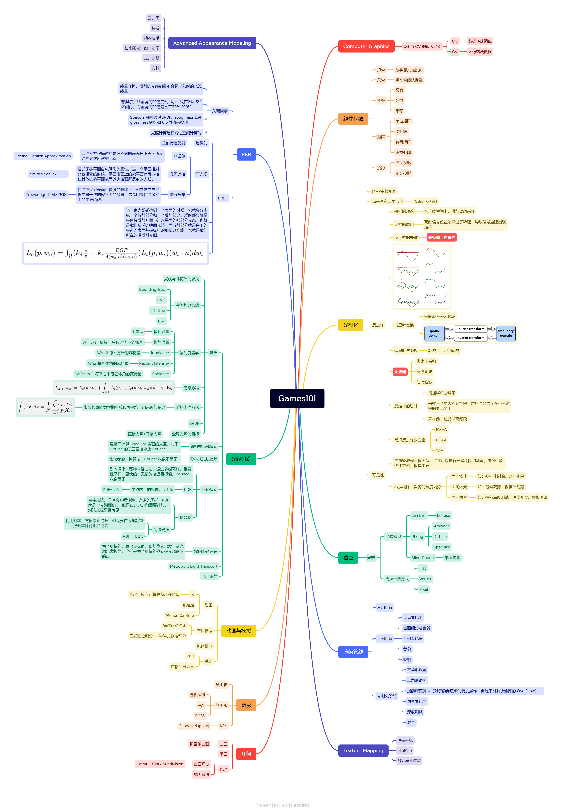
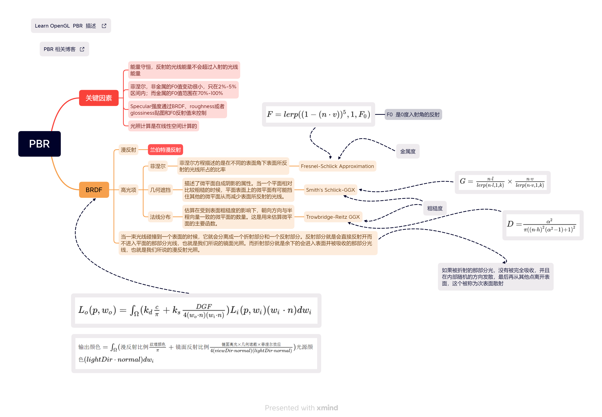
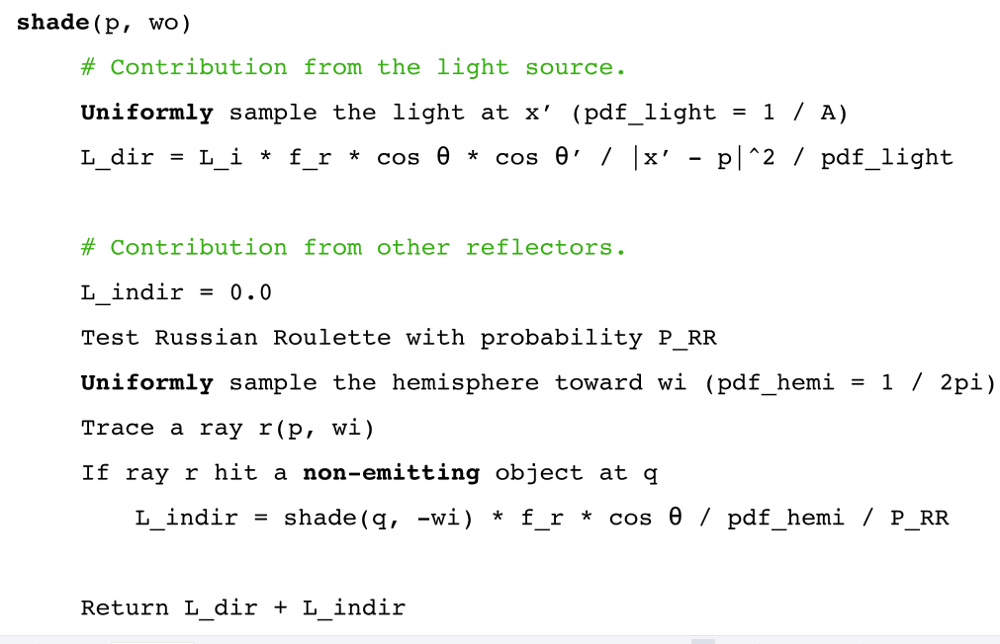

梳理所学，永久更新

---

- [0. RoadMap](#0-roadmap)
- [1.计算机科学](#1计算机科学)
  - [1.1.算法与数据结构](#11算法与数据结构)
    - [1.1.1.LeetCode](#111leetcode)
    - [1.1.2.十大排序](#112十大排序)
    - [1.1.3.动态规划](#113动态规划)
    - [分治算法](#分治算法)
    - [回溯](#回溯)
    - [贪心算法](#贪心算法)
    - [寻路算法](#寻路算法)
      - [A星](#a星)
      - [跳点寻路](#跳点寻路)
      - [漏斗算法](#漏斗算法)
  - [GPU 架构](#gpu-架构)
    - [GPU 硬件设计](#gpu-硬件设计)
  - [CPU 架构](#cpu-架构)
    - [CPU 硬件设计](#cpu-硬件设计)
      - [指令流水线](#指令流水线)
  - [计算机组成原理](#计算机组成原理)
    - [冯-诺伊曼体系](#冯-诺伊曼体系)
  - [操作系统](#操作系统)
    - [虚拟化](#虚拟化)
    - [并发](#并发)
    - [持久化](#持久化)
- [编程语言](#编程语言)
  - [.NET](#net)
    - [CIL 与 CLR](#cil-与-clr)
  - [Java](#java)
    - [Java 字节码 与 JVM](#java-字节码-与-jvm)
- [软件开发](#软件开发)
  - [设计模式](#设计模式)
- [计算机数学](#计算机数学)
  - [微积分](#微积分)
  - [线性代数](#线性代数)
  - [概率统计](#概率统计)
  - [博弈论](#博弈论)
  - [信号与系统](#信号与系统)
- [游戏编程](#游戏编程)
  - [性能优化](#性能优化)
  - [ECS](#ecs)
  - [可靠UDP](#可靠udp)
  - [状态同步](#状态同步)
  - [帧同步](#帧同步)
  - [动作游戏设计](#动作游戏设计)
- [游戏引擎](#游戏引擎)
  - [渲染向](#渲染向)
    - [抗锯齿](#抗锯齿)
    - [剔除算法](#剔除算法)
    - [G-Buff](#g-buff)
  - [物理与动画](#物理与动画)
    - [布娃娃](#布娃娃)
- [计算机图形学](#计算机图形学)
  - [辐射度量学](#辐射度量学)
  - [基于物理渲染](#基于物理渲染)
    - [BRDF](#brdf)
    - [菲涅尔](#菲涅尔)
    - [微面元理论](#微面元理论)
    - [渲染方程](#渲染方程)
  - [着色路径](#着色路径)
  - [渲染管线](#渲染管线)
  - [光栅化](#光栅化)
  - [光线追踪](#光线追踪)
    - [Ray Tracing 流程](#ray-tracing-流程)
- [游戏音效](#游戏音效)
- [游戏物理与动画](#游戏物理与动画)
- [人工智能](#人工智能)
- [网络](#网络)
  - [七层结构](#七层结构)
  - [网络安全](#网络安全)
- [硬件](#硬件)
- [日常开发问题](#日常开发问题)
- [杂项](#杂项)
- [书单推荐](#书单推荐)

---
# 0. RoadMap

持续更新中......

  

# 1.计算机科学

## 1.1.算法与数据结构

### 1.1.1.LeetCode

[Leet刷题记录](/01.计算机科学/算法/LeetCodeAll.cs)

### 1.1.2.十大排序

[十大排序](/01.计算机科学/算法/十大排序.md)

### 1.1.3.动态规划

[动态规划](/01.计算机科学/算法/动态规划/动态规划.md)

### 分治算法

[分治](/01.计算机科学/算法/分治算法/分治.md)

### 回溯

[回溯](/01.计算机科学/算法/回溯算法/回溯.md)

### 贪心算法

[贪心](/01.计算机科学/算法/贪心算法/贪心算法.md)

### 寻路算法

主流的寻路算法：A星、B星（Branch 分支）、D 星（Dynamic A 星）、跳点寻路（JPS）、漏斗算法

#### A星

F = G + H

启发式寻路，不一定能够最优，最优的前提是：启发式的选择恰到好处。

#### 跳点寻路

简化查找点，使得更快的搜索路径。

#### 漏斗算法

这个在Unity 内的 Nav 寻路的应用。主要场景是 三角形构成的地图，通过三角形共有边，来描述三角形的连通关系。所以共有边是 漏斗算法的第一步 要做的。然后逐步收敛夹角，这是描述可走区域的一种方式，当逐步收敛到无法收敛时，那么说明局部的可走已经确定了，最后连贯起来就是路径了。

这里还有个冷知识，关于场景中的 Mesh 生成 NavMesh 的过程，包含体素的知识。

## GPU 架构

主流的GPU架构发展了很久。

当前以其中一种来描述，

  

先描述一下架构，SM是GPU下的 Stream Process 簇，是一个集合体，再细分下去就是 Stream Process 最小单位，它们拥有共享的内存，这和CPU有很大差别，这意味着共享的读写，再加上大量的寄存器，读写速度更加快，另外数量庞大的寄存器，意味着线程上下文切换的代价更加小。

### GPU 硬件设计

图灵架构、SM、GPU 内的多级缓存、共享缓存...

## CPU 架构

SoC、ARM 嵌入式、精简指令程序集、复合指令程序集

### CPU 硬件设计

主要包含：逻辑运算+少部分存储器（寄存器+部分缓存器）

#### 指令流水线

取指->译码->访存->执行->写回

这种描述其实和渲染管线的理念差不多，这也是计算机思想的精妙所在：分工是为了各个环节单一职责，流水线是为了减少等待和阻塞。现实社会的工厂车间流水线也是这样，工人执行各个环节的事情，流水线因此产生。

整个流水线也有很多硬件优化手段：
- 分支预测
- 数据前递
- 寄存器重命名（这个很模糊，我也没找到相关介绍的文献描述）

## 计算机组成原理

### 冯-诺伊曼体系

整个体系架构，是极简的硬件分工，将各个硬件的主要职责划分开来。这样是对人的参考，让电子设备具备：记忆与运算能力。记忆能力是存储器（包括硬盘、内存、缓存、寄存器。硬盘属于长期记忆，可持久化。内存、缓存、寄存器是短期记忆。存储能力相当于人的右脑）。运算能力是逻辑推理、数值计算等（相当于人的左脑）。

## 操作系统

虚拟化、并发、持久化

### 虚拟化

源于进程与线程的资源分配问题，从单核的CPU发展到如今的多核CPU，当计算机运行多个进程时，多个进程之间必定会有抢占关系，主要抢占两方面的资源：CPU时间片、内存空间。

在时间片问题上，我们给每个进程运行一小段时间片，这种轮流分配的方式，尽量做到了多个进程都有机会运行，另外也避免了恶意进行持续占用CPU时间片，导致其他进程无法运行的问题。这种分配时间片的算法也有很多细节 。

在内存问题上，我们约束每个进程，不允许进程直接可以跨内存空间读写，也就是说每个进程只允许读写各自的内存空间。再者，进程所属的线程，线程之间可以共享所在进程的内存空间，但是也同样管控CPU时间片。

### 并发

宏观上的并行，微观上的串行。在单核CPU上，可以很明显的凸显这个观点。

### 持久化

文件系统、序列化与反序列化

# 编程语言

## .NET

### CIL 与 CLR

- C#、VB、F# 等语言都是可以编译成CIL，然后运行在CLR上
- 在Unity的项目中，C#编译后，属于托管代码，运行在Mono虚拟机上，这里的Mono类似于CLR

## Java

### Java 字节码 与 JVM

Java 编译，会得到Java字节码，然后运行在JVM上，才能跨平台。

# 软件开发

## 设计模式

如图：

# 计算机数学

## 微积分

这个在图形学中，光线追踪，渲染方程的积分项，需要了解到，另外还有蒙特卡洛方法求积分。

## 线性代数

在图形学、以及空间运算，用的特别频繁。

## 概率统计

## 博弈论

AI开发会提及，比如棋类的极小极大值剪支算法。

## 信号与系统

傅里叶变换与傅里叶逆变换。

# 游戏编程

## 性能优化

[性能优化总览](/05.游戏编程/性能优化/优化总览.md)

## ECS

- 缓冲命中率
- 组合模式的优势
- 数据快照缓存、快速恢复数据很便利

## 可靠UDP

- 丢失重传
- 编号，保持有序
- UDP包头更小

## 状态同步

- 服务器权威
- 客户端部分可预测
- 客户端错误的恢复
- 状态包体进行压缩，采取增量更新，AOI

## 帧同步

- 指令同步、时间同步
- 客户端的预测+回滚
- 服务器检验HashCode,防止作弊
- 客户端的快照
- 服务器的缓存快照，断线重连可以快速恢复

## 动作游戏设计

- 工具向：
  - 可视化技能编辑工具
  - 原子化拆分，做多种组合
- 表现连贯与流程，动画衔接
- 动画的打击感
- 网络延迟的处理

# 游戏引擎

## 渲染向

- 光线追踪
- 路径追踪
- 双向路径追踪
- 光子映射

### 抗锯齿

先模糊再采样

### 剔除算法

- 视锥体剔除
- 遮挡剔除
- 三角面剔除
- 三角面裁剪
- 背面剔除

### G-Buff

- 深度信息
- Albedo 
- 金属度
- 粗糙度

## 物理与动画

- IK 算法，CCD
- MotionMatching，BVH文件的用途？
- PuppetMaster 

### 布娃娃

# 计算机图形学

## 辐射度量学

- 辐射能量，单位 J
- 辐射通量，单位 W （J/t）,可以理解为单位时间的辐射能量
- 辐射亮度，单位 W/(m^2*sr)，可以理解为观察方向上单位面积中的辐射通量。
- 辐射强度，单位 W/m^2，表示单位面积中的辐射通量
- 辐射照度，单位 W/sr , 表示观察方向上的辐射通量

## 基于物理渲染

- 能量守恒
- 微表面原理

### BRDF

- BRDF 是什么？
- PBR 展开 BRDF 公式：
- 渲染方程的理解

### 菲涅尔

### 微面元理论

### 渲染方程

## 着色路径

- 前向渲染
- 延迟渲染

## 渲染管线

- 几何阶段
- 光栅化阶段

## 光栅化

## 光线追踪

- 算法流程；
- Ray Matching 
- 为何 SDF 可以加速光线求交？

### Ray Tracing 流程

大致流程如下：

- 从屏幕出发，打出一条观察线。
- 观察线捕捉到模型的表面所在的点
- 通过俄罗斯轮盘赌概率，随机得到投射情况
- PDF作为求能量公式的其中一项
- 递归反射情况
- 最后累计间接光照能量
- 间接光照+直接光照

# 游戏音效

# 游戏物理与动画

# 人工智能

极小极大值-剪支算法：

有限穷举，提前预测对方的决策，

# 网络

- Socket
- RPC
  - gRPC

## 七层结构

## 网络安全

# 硬件

- ARM 开发板

# 日常开发问题

# 杂项

- Mind

# 书单推荐

---

since 2019