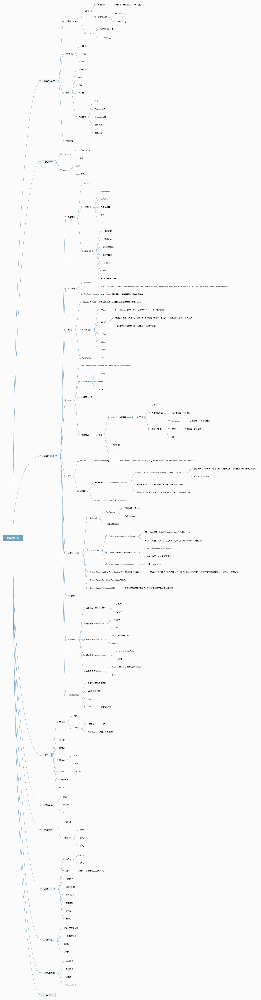
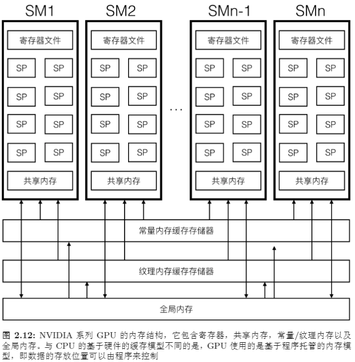

梳理所学，永久更新

---

- [RoadMap](#roadmap)
- [计算机科学](#计算机科学)
  - [算法与数据结构](#算法与数据结构)
    - [LeetCode](#leetcode)
    - [十大排序](#十大排序)
    - [动态规划](#动态规划)
    - [分治算法](#分治算法)
    - [回溯](#回溯)
    - [贪心算法](#贪心算法)
    - [寻路算法](#寻路算法)
      - [A星](#a星)
      - [跳点寻路](#跳点寻路)
      - [漏斗算法](#漏斗算法)
  - [GPU 架构](#gpu-架构)
    - [GPU 硬件设计](#gpu-硬件设计)
  - [CPU 架构](#cpu-架构)
    - [CPU 硬件设计](#cpu-硬件设计)
  - [计算机组成原理](#计算机组成原理)
  - [操作系统](#操作系统)
    - [虚拟化](#虚拟化)
    - [并发](#并发)
    - [持久化](#持久化)
- [编程语言](#编程语言)
- [软件开发](#软件开发)
- [计算机数学](#计算机数学)
- [游戏编程](#游戏编程)
  - [ECS](#ecs)
  - [可靠UDP](#可靠udp)
  - [状态同步](#状态同步)
  - [帧同步](#帧同步)
  - [动作游戏设计](#动作游戏设计)
- [游戏引擎](#游戏引擎)
  - [渲染向](#渲染向)
    - [抗锯齿](#抗锯齿)
    - [剔除算法](#剔除算法)
    - [G-Buff](#g-buff)
  - [物理与动画](#物理与动画)
    - [布娃娃](#布娃娃)
- [计算机图形学](#计算机图形学)
  - [辐射度量学](#辐射度量学)
  - [基于物理渲染](#基于物理渲染)
    - [BRDF](#brdf)
    - [菲涅尔](#菲涅尔)
    - [微面元理论](#微面元理论)
    - [渲染方程](#渲染方程)
  - [着色路径](#着色路径)
  - [渲染管线](#渲染管线)
  - [光栅化](#光栅化)
  - [光线追踪](#光线追踪)
- [游戏音效](#游戏音效)
- [游戏物理与动画](#游戏物理与动画)
- [人工智能](#人工智能)
- [网络](#网络)
- [硬件](#硬件)
- [日常开发问题](#日常开发问题)
- [杂项](#杂项)

---
# RoadMap

持续更新中......

  

# 计算机科学

## 算法与数据结构

### LeetCode

[Leet刷题记录](/01.计算机科学/算法/LeetCodeAll.cs)

### 十大排序

[十大排序](/01.计算机科学/算法/十大排序.md)

### 动态规划

[动态规划](/01.计算机科学/算法/动态规划/动态规划.md)

### 分治算法

[分治](/01.计算机科学/算法/分治算法/分治.md)

### 回溯

[回溯](/01.计算机科学/算法/回溯算法/回溯.md)

### 贪心算法

[贪心](/01.计算机科学/算法/贪心算法/贪心算法.md)

### 寻路算法

主流的寻路算法：A星、B星（Branch 分支）、D 星（Dynamic A 星）、跳点寻路（JPS）、漏斗算法

#### A星

F = G + H

启发式寻路，不一定能够最优，最优的前提是：启发式的选择恰到好处。

#### 跳点寻路

简化查找点，使得更快的搜索路径。

#### 漏斗算法

这个在Unity 内的 Nav 寻路的应用。主要场景是 三角形构成的地图，通过三角形共有边，来描述三角形的连通关系。所以共有边是 漏斗算法的第一步 要做的。然后逐步收敛夹角，这是描述可走区域的一种方式，当逐步收敛到无法收敛时，那么说明局部的可走已经确定了，最后连贯起来就是路径了。

这里还有个冷知识，关于场景中的 Mesh 生成 NavMesh 的过程，包含体素的知识。

## GPU 架构

主流的GPU架构发展了很久。

当前以其中一种来描述，

  

先描述一下架构，SM是GPU下的 Stream Process 簇，是一个集合体，再细分下去就是 Stream Process 最小单位，它们拥有共享的内存，这和CPU有很大差别，这意味着共享的读写，再加上大量的寄存器，读写速度更加快，另外数量庞大的寄存器，意味着线程上下文切换的代价更加小。

### GPU 硬件设计

## CPU 架构

### CPU 硬件设计

## 计算机组成原理

## 操作系统

虚拟化、并发、持久化

### 虚拟化

源于进程与线程的资源分配问题，从单核的CPU发展到如今的多核CPU，当计算机运行多个进程时，多个进程之间必定会有抢占关系，主要抢占两方面的资源：CPU时间片、内存空间。

在时间片问题上，我们给每个进程运行一小段时间片，这种轮流分配的方式，尽量做到了多个进程都有机会运行，另外也避免了恶意进行持续占用CPU时间片，导致其他进程无法运行的问题。这种分配时间片的算法也有很多细节 。

在内存问题上，我们约束每个进程，不允许进程直接可以跨内存空间读写，也就是说每个进程只允许读写各自的内存空间。再者，进程所属的线程，线程之间可以共享所在进程的内存空间，但是也同样管控CPU时间片。

### 并发

### 持久化

# 编程语言

# 软件开发

# 计算机数学

# 游戏编程

## ECS

## 可靠UDP

## 状态同步

## 帧同步

## 动作游戏设计

# 游戏引擎

## 渲染向

### 抗锯齿

### 剔除算法

### G-Buff

## 物理与动画

### 布娃娃

# 计算机图形学

## 辐射度量学

- 辐射能量，单位 J
- 辐射通量，单位 W （J/t）,可以理解为单位时间的辐射能量
- 辐射亮度，单位 W/(m^2*sr)，可以理解为观察方向上单位面积中的辐射通量。
- 辐射强度，单位 W/m^2，表示单位面积中的辐射通量
- 辐射照度，单位 W/sr , 表示观察方向上的辐射通量

## 基于物理渲染

### BRDF

### 菲涅尔

### 微面元理论

### 渲染方程

## 着色路径

## 渲染管线

## 光栅化

## 光线追踪

# 游戏音效

# 游戏物理与动画

# 人工智能

# 网络

# 硬件

# 日常开发问题

# 杂项
