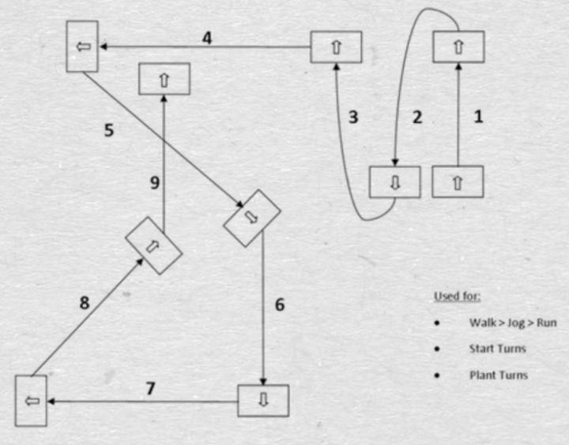

Motion Matching 

  

通过计算 Cost ,找到最低代价，得到目标动画

存在的问题

- 需要的动作数据量较大，导致打包体积和运行时数据量过大，难以应用到手机等设备上。
- 由于真实的动捕动作在转弯、起步、停步时本身存在一定延迟，不是瞬时响应，所以从获取玩家输入到角色转向或速度发生改变的延迟略大于传统的状态机实现，一定程度上会影响手感，对于一些强调操控性的动作游戏可能不适用。
- 有一些动捕数据不能很好覆盖到的情况，会导致角色播放一些意料之外的动作帧，Simon[1]在GDC 2016演讲中也提到了这个问题，除了增加动捕数据，没有很好的解决方法。

---

https://zhuanlan.zhihu.com/p/136971426