# 实测数据
当前机器配置：
- CPU - (英特尔)Intel(R) Core(TM) i7-9700 CPU @ 3.00GHz(3000 MHz)
- 内存 - 32.00 GB (2400 MHz)
- 显卡 - NVIDIA GeForce RTX 2060

实测以下情况，期望 60 FPS以上，有部分情况挑战较高

- 100万 个 Entity 处理纯数据、无实体显示。实测结果保持在200FPS以上

    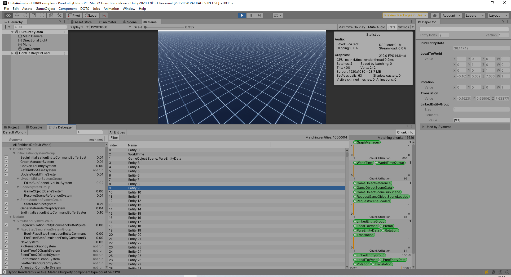

- 同屏 10 万 个 Entity (Unity Cube 模型) 移动旋转
- 同屏 10 万 个 Entity (带 Animator、Mesh)，LOD处理等
- 5 万 个 Entity (带 Animator、Mesh) 及数据处理、LOD处理


---

- Create an entity with no components and then add components to it. (You can add components immediately or when additional components are needed.)


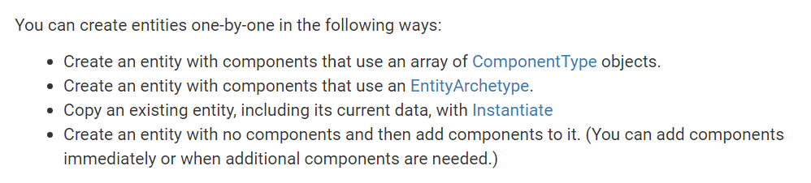

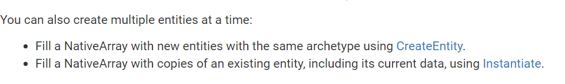

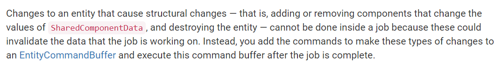

# Entity

## Define Entity Query


```ini
EntityQuery query

    = GetEntityQuery(typeof(RotationQuaternion),

                     ComponentType.ReadOnly<RotationSpeed>());
```


# Components

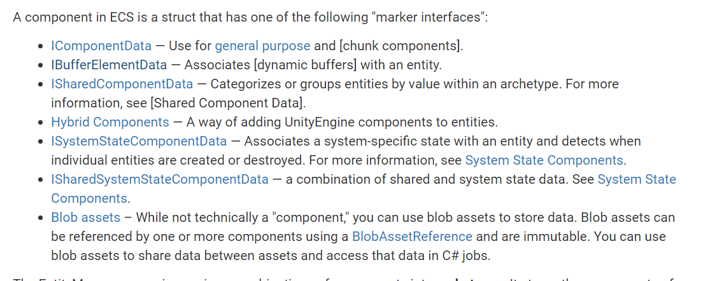


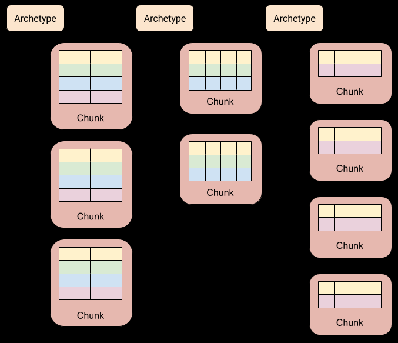

IComponentData structs must not contain references to managed objects. This is because ComponentData lives in simple non-garbage-collected tracked Chunk memory, which has many performance advantages.


## IComponentData

## Managed IComponentData

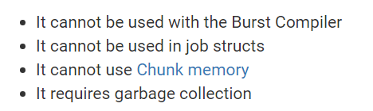


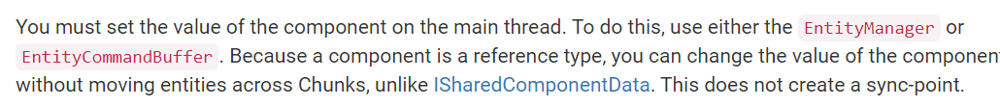


## Hybrid ComponentData

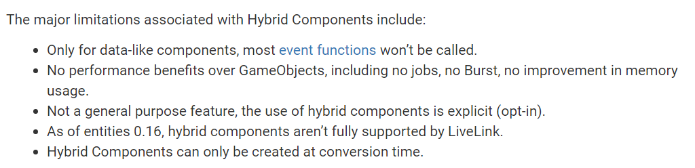


## Shared ComponentData

Shared components allow your systems to process like entities together. For example, the shared component Rendering.RenderMesh, which is part of the Hybrid.rendering package, defines several fields, including mesh, material, and receiveShadows. When your application renders, it is most efficient to process all of the 3D objects that have the same value for those fields together. Because a shared component specifies these properties, the EntityManager places the matching entities together in memory so that the rendering system can efficiently iterate over them.


If you over-use shared components, it might lead to poor chunk utilization. This is because when you use a shared component it involves a combinatorial expansion of the number of memory chunks based on archetype and every unique value of each shared component field. As such, avoid adding any fields that aren't needed to sort entities into a category to a shared component. To view chunk utilization, use the Entity Debugger.


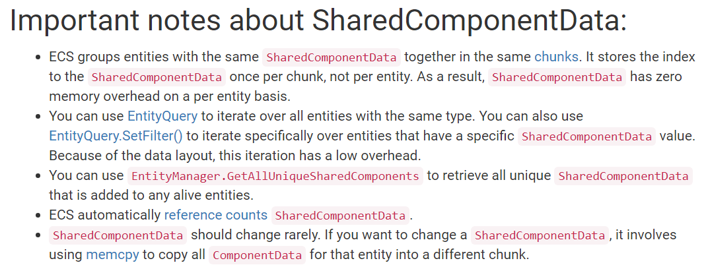

## System State ComponentData


## Dynamic Buffer ComponentData


## Chunk ComponentData


# System

You can view the system configuration using the Entity Debugger window (menu: Window > Analysis > Entity Debugger).


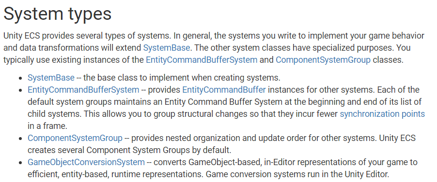


## initializationSystem

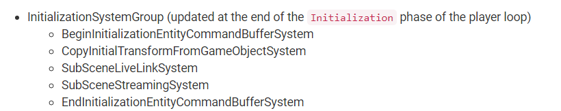

## SimulationSystem

需要确认一下Timeline 的 Update 是否在这个System 之前

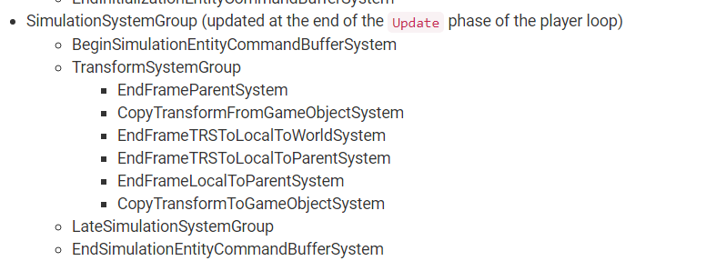

## PresentationSystem

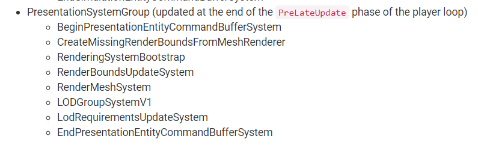


## Job调度的有序控制


## 数据查询

### Query

### Job

## EntityCommandBuffer

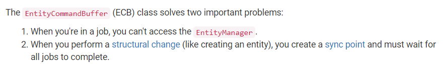


# DOTS + LOD + Hybrid Render V2

1000 个 GameObject 转化为32 万个Entity

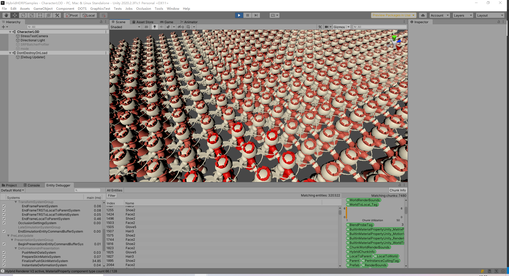


---
- Write Group ：为了标记一些情况，例如方便搜索时过滤一部分携带WriteGroup的数据
- Serializeable Struct :
- GameObjectConversionSystem
- ConverterVersion：
https://docs.unity3d.com/Packages/com.unity.entities@0.17/api/Unity.Entities.ConverterVersionAttribute.-ctor.html

- IConvertGameObjectToEntity  
- Convert 
- BurstCompile  
- IJobParallelFor
- IDeclareReferencedPrefabs  
- NativeArray


---

SubScene 转化 ECS 的基础


# GameObject Convert To ECS

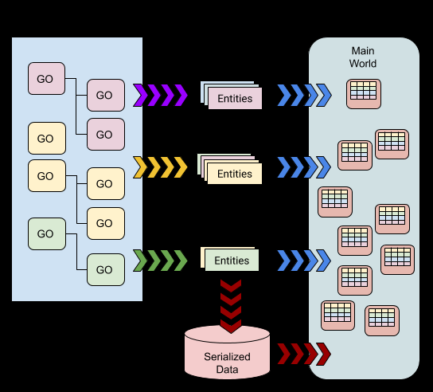


Editor 下也可以用 DOTS

For example, it creates an Editor world for entities and systems that run only in the Editor, not in playmode and also creates conversion worlds for managing the conversion of GameObjects to entities. See WorldFlags for examples of different types of worlds that can be created


Your code is then responsible for creating any needed worlds, as well as instantiating and updating systems. You can use the Unity scriptable PlayerLoop to modify the normal Unity player loop so that your systems are updated when required.


# Blob Asset To Share ComponentData


# Entity Debugger

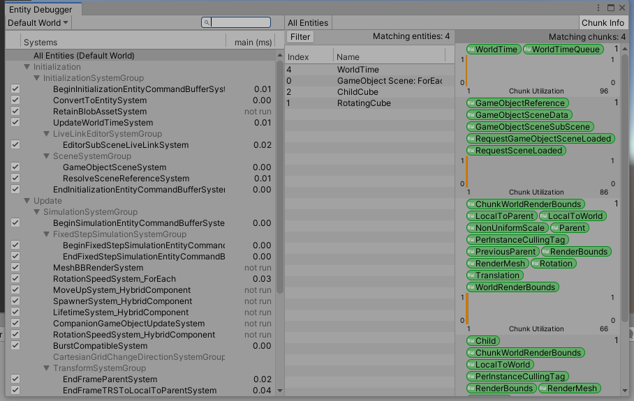

https://docs.unity3d.com/Packages/com.unity.entities@0.9/manual/ecs_debugging.html

https://www.youtube.com/watch?v=0y05nw5zET0


https://docs.unity3d.com/2020.1/Documentation/ScriptReference/LowLevel.PlayerLoop.html

# SubScene 加载大场景的方案

To Create a Sub Scene
- In the Unity Hierarchy window, right-click on empty space, or on a GameObject that you want to create the Sub Scene next to.

- Select New Sub Scene > Empty Scene... in the context menu. Unity then creates an empty Sub Scene and creates a corresponding Scene Asset file in your project.

---

# DOTS 与 传统方式对比

10000 个 Prefab 创建


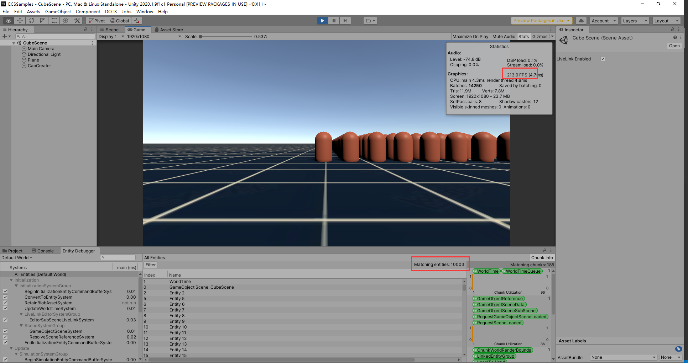


10000 个 带 SkinMeshRender Prefab 


下图 转化出了66 万个 Entity

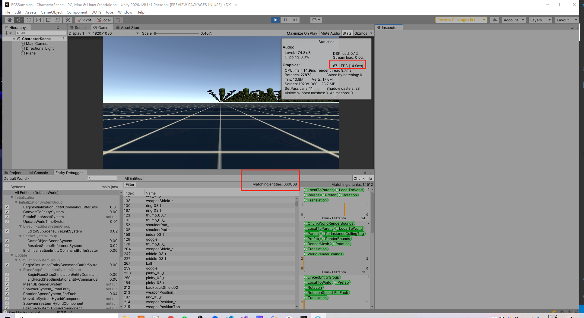


计算压力主要集中在MeshRender上，也就是DOTS 内 最后一个System Group 内，和渲染相关性很大，加上LOD估计可以减缓

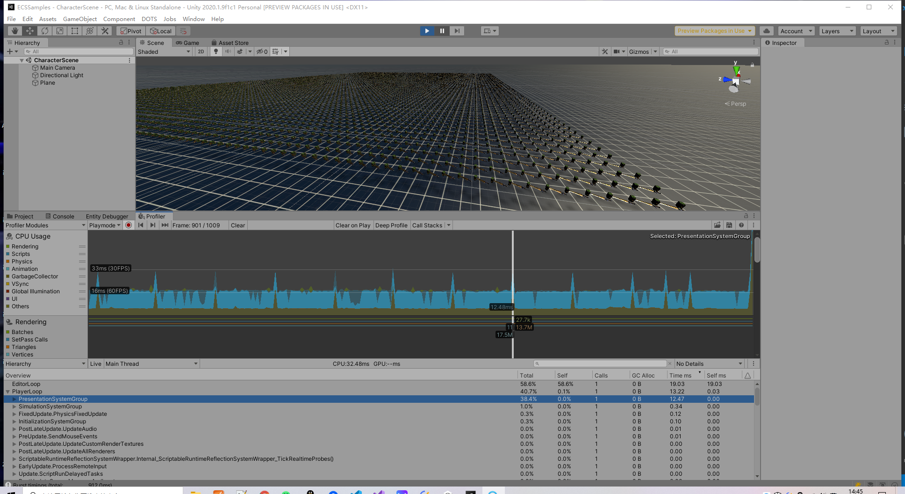

---

- GameObject To Entity:
    https://docs.unity3d.com/Packages/com.unity.entities@0.17/api/Unity.Entities.IConvertGameObjectToEntity.html

- Attr GenerateAuthoringComponent : 将ComponentData 暴露在 Inspector 上,即使是Editor下也可行
- 

---

# DOTS 案例


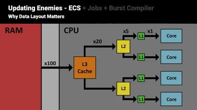


https://developer.unity.cn/projects/5e607e06edbc2a2000accf83

---


https://docs.unity3d.com/Packages/com.unity.entities@0.17/manual/ecs_components.html


https://docs.unity3d.com/Packages/com.unity.entities@0.17/manual/index.html