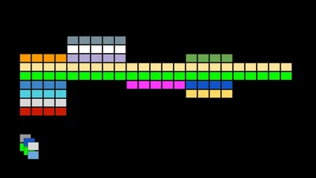
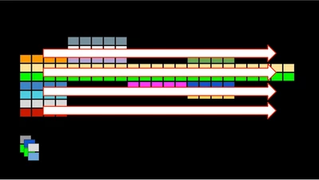
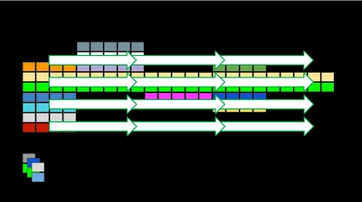
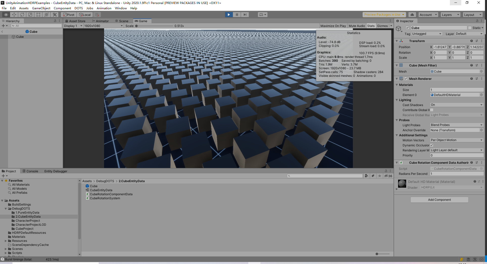

# 当前的问题

当前项目的ECS实现是通过Entitas框架实现的，大量NPC的模拟是当前比较明显的性能问题。期望通过DOTS化一部分目前项目的框架、系统去一步步提高性能。

AC 的问题：

- 对 Entity 的使用不够纯粹，是以GameObject为载体，没用上真正的ECS思想，另外Client 是 LogicEntity + ViewEntity，可以说是 Server 的两倍 GameObject;
- Timeline Execute 与 System Execute 目前没有确定一个执行顺序;
- 游戏内的数据不支持可重入，无法掉线重连后完整恢复游戏;
- Entity 的 Disable下，依然可以被遍历到，引发一些空指针问题，需要排查一下 Entity;
- 业务上的 EntityType 有一小部分 Type 划分比较模糊，不清晰，需要达成一致;

最理想的状态是，通过 DOTS + Hybrid Renderer V2 配合，Hybrid Renderer 是为了解决在ECS下渲染物体。
整个接入大致分为两部分，数据层面和渲染层面。

## 数据层面

- 真正意义上的 Entity，解决当前Entitas框架下，Entity挂载于GameObject 下的问题；
- 大量NPC的 Component 是相似的，很适合 Archetype 的划分，生成Chunk Memory；
- 可以协助解决 Timeline Execute 与 System Execute 的确定性顺序，保障掉线重连的底层支持；
- ...

## 渲染层面

- Hybrid Render V2;
- DOTS 下的LOD;
- DOTS 下的 SubScene，有助于解决大场景资源加卸载的问题;
- ...

---

# 第一阶段需要解的问题

期望第一阶段先解以下模块：
CharacterController、StateMsg 配合 Entities 下的Chunk Memory、Timeline等

- CharacterController ：在现世中，大量的NPC模拟采用的移动是基于Unity 下的CharacterController,印象中600左右的NPC就有很明显的卡顿问题，单纯从CharacterController的使用角度来说，CharacterController 是代价比较高的，在不降CharacterController 数量的前提下，需要一个兜底的解决办法。好在 DOTS 下有实现了 CharacterController 的方式，具备了原有的CharacterController 的基础功能，包括重力、碰撞范围等等。
该视频就是 1000 Character 在DOTS 下的实测结果 https://www.bilibili.com/video/BV1wa411875p?spm_id_from=333.999.0.0

- 在业务上，Entitas 与 DOTS 下的 Entities 代码上差别较大，需要时间整理，Entities代码要求严谨，需要描述搜索 Entity 或 ComponentData 的条件，需要描述对 ComponentData 的读写情况，在多线程下同样要保证逻辑的顺序等等情况都需要更加严谨；
- DOTS 下需要 Struct 才能充分发挥Chunk Memory，StateMsg 是当前最大的数据块，而当前AC 下 Pb 内的 Message 导出的数据是 C# class。
这一点需要注意以下问题：
  - Pb 是否直接导出 Struct，一个 Message 对应一个 Struct, 引用类型特殊处理；
  - 转化为 Struct 后，是否干扰增量更新方案，这个有待验证；
  - 无法直接导出 Struct 的类型，是否有适合的方法来实现需求，如 string 等数据类型；
- 战斗中大量的Timeline 是 通过 PlayableDirector 载体播放的，而PlayableDirector 是挂载在GameObject 上的，所以干掉 GameObject 是否可行。
- 有部分 Unity 下的 Component 需要转化为 Hybrid ComponentData, 因为在 ECS 下，大量 GameObject 被 Entity 化，Unity 下的 Component 就没有了载体，需要把这些 Component 转化支持到位；
---

# 第二阶段需要解的问题

- 大场景的ECS化，SubScene 内的美术资源也作为 Entity + ComponentData 的模式；
- 大量的Animator;
- SkinMeshRender;
- ...

---

# DOTS 高性能的原因

DOTS 是一个组合，ECS + Job System + Burst Compiler

ECS 构建下，ChunkMemory 的分配整齐，将同种类型的ComponentData组合数据放到对应的Chunk下，如下图：



虽然说System 本身是在主线程执行，但是我们可以在System下启动多个子线程，多个子线程可以分别处理数据，传统多线程开发下，需要程序员对数据加锁保护，好在Unity 实现了一套方案，不用谢加锁解锁的操作，通过 OnlyRead 、 OnlyWrite 等设置来保障。如下图：



Burst 编译器，更高效的执行Job中的代码，如下图：



---


# Entity


## 如何创建 Entity


## 搜索Entity

```ini
EntityQuery query

    = GetEntityQuery(typeof(RotationQuaternion),

                     ComponentType.ReadOnly<RotationSpeed>());
```

# ComponentData

已知的 ComponentData 的类型，如下图：


IComponentData structs must not contain references to managed objects. This is because ComponentData lives in simple non-garbage-collected tracked Chunk memory, which has many performance advantages.

## IComponentData

常用的 ComponentData

## Managed IComponentData

注意，如下描述，无法使用上 Chunk Memory。


## Hybrid ComponentData

原本一些挂载在GameObject 的部分 Component 也可以转变为这种形式。


## Shared ComponentData

例如一些 Mesh、Material 等可被共享的 ComponentData

Shared components allow your systems to process like entities together. For example, the shared component Rendering.RenderMesh, which is part of the Hybrid.rendering package, defines several fields, including mesh, material, and receiveShadows. When your application renders, it is most efficient to process all of the 3D objects that have the same value for those fields together. Because a shared component specifies these properties, the EntityManager places the matching entities together in memory so that the rendering system can efficiently iterate over them.

If you over-use shared components, it might lead to poor chunk utilization. This is because when you use a shared component it involves a combinatorial expansion of the number of memory chunks based on archetype and every unique value of each shared component field. As such, avoid adding any fields that aren't needed to sort entities into a category to a shared component. To view chunk utilization, use the Entity Debugger.


...

# System


## InitializationSystem


## SimulationSystem

游戏内的战斗更新，几乎就是这里更新


## PresentationSystem

渲染相关的更新，如Mesh、动画等等


---

# Editor 下GameObject to ECS

Editor 下GameObject to ECS，如果这个方式适用于AC，那么对我们的大场景管理估计有不小的帮助

GameObject to ECS 如下图：


Editor 下也可以用 DOTS

For example, it creates an Editor world for entities and systems that run only in the Editor, not in playmode and also creates conversion worlds for managing the conversion of GameObjects to entities. See WorldFlags for examples of different types of worlds that can be created

Your code is then responsible for creating any needed worlds, as well as instantiating and updating systems. You can use the Unity scriptable PlayerLoop to modify the normal Unity player loop so that your systems are updated when required.

---

# Entity Debugger

You can view the system configuration using the Entity Debugger window (menu: Window > Analysis > Entity Debugger).


<https://docs.unity3d.com/2020.1/Documentation/ScriptReference/LowLevel.PlayerLoop.html>

# SubScene 加载大场景

To Create a Sub Scene

- In the Unity Hierarchy window, right-click on empty space, or on a GameObject that you want to create the Sub Scene next to.

- Select New Sub Scene > Empty Scene... in the context menu. Unity then creates an empty Sub Scene and creates a corresponding Scene Asset file in your project.

---

# 实测数据

当前机器配置：

- CPU - (英特尔)Intel(R) Core(TM) i7-9700 CPU @ 3.00GHz(3000 MHz)
- 内存 - 32.00 GB (2400 MHz)
- 显卡 - NVIDIA GeForce RTX 2060

10000 个 Prefab 创建


10000 个 带 SkinMeshRender Prefab

下图 转化出了66 万个 Entity


计算压力主要集中在MeshRender上，也就是DOTS 内 最后一个System Group 内，和渲染相关性很大，加上LOD估计可以减缓


- 100万 个 Entity 处理纯数据、无实体显示。

    实测结果保持在 200FPS 以上

    

- 同屏 10 万 个 Entity (Unity Cube 模型) 移动旋转。

    实测结果，维持在 100FPS 左右 

    

- 1000 个 GameObject 转化为32 万个Entity


---

# DOTS 案例


<https://developer.unity.cn/projects/5e607e06edbc2a2000accf83>

---

<https://docs.unity3d.com/Packages/com.unity.entities@0.17/manual/ecs_components.html>

<https://docs.unity3d.com/Packages/com.unity.entities@0.17/manual/index.html>


---

https://zhuanlan.zhihu.com/p/110802975

https://www.jianshu.com/p/39e76364c60a

Entitas Git：<https://github.com/sschmid/Entitas-CSharp>
Entitas Doc: <http://sschmid.github.io/Entitas-CSharp/>
Entitas 使用规则
<https://github.com/mzaks/EntitasCookBook>

<https://www.youtube.com/watch?v=0y05nw5zET0>

<https://docs.unity3d.com/Packages/com.unity.entities@0.9/manual/ecs_debugging.html>


- Write Group ：为了标记一些情况，例如方便搜索时过滤一部分携带WriteGroup的数据
- Serializeable Struct :
- GameObjectConversionSystem
- ConverterVersion：
<https://docs.unity3d.com/Packages/com.unity.entities@0.17/api/Unity.Entities.ConverterVersionAttribute.-ctor.html>

- IConvertGameObjectToEntity  
- Convert
- BurstCompile  
- IJobParallelFor
- IDeclareReferencedPrefabs  
- NativeArray