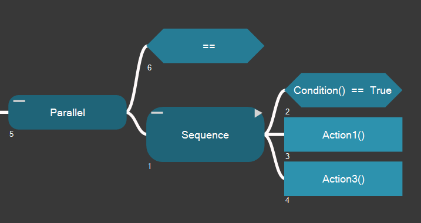
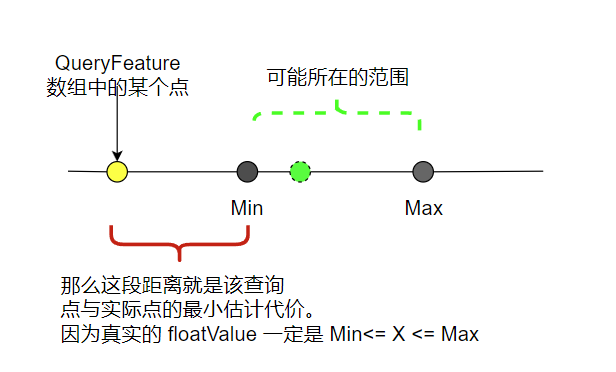


- [BTree 内 Running 实现方式](#btree-内-running-实现方式)
  - [Running 状态下的持续阻塞要怎么处理](#running-状态下的持续阻塞要怎么处理)
- [Motion Matching 内的 Min、Max 的计算与搜索原理](#motion-matching-内的-minmax-的计算与搜索原理)
- [传球技能筛选的流程，应该怎么做](#传球技能筛选的流程应该怎么做)
- [二维世界下，圆与矩形的物理碰撞模拟](#二维世界下圆与矩形的物理碰撞模拟)


## BTree 内 Running 实现方式

大概的思路如下代码：

```C#

//- curIndex 需要在外部声明好，并且 while 内修改的结果需要同步回去，所以用 ref
//- SubNodeList 是当前序列内有多少个节点
BTState ExecuteSequence(List<BTNode> SubNodeList, ref int curIndex)
{
    //！ 这里的 state 待定，可能需要来自函数外部
    BTState state = BTState.Running;

    //外部用简单的死循环，内部通过 Success、Fail 的状态去中断循环。这样 Running 就是一种持续保持的状态
    while(true)
    {
        if(state == BTState.Running)
        {
            var curNode = SubNodeList[curIndex];
            //运行并返回一个状态（running、fail、success等）
            state = curNode.Execute();

            //！ 这里的 state 如果一直是 Running ， 那么会持续中断阻塞其他后续节点的运行。后面查证了 Behaviac 源码找到一些思路。下文说明
        }

        if(state == BTState.Fail)
        {
            //失败了，中断 Sequence
            return state;
        }

        if(state == BTState.Running)
        {
            //运行中的结果
            return state;
        }

        //成功了，所以要继续累计索引，推进到下一个节点
        curIndex++;

        //防止越界
        if(curIndex >= SubNodeList.Count)
        {
            return BTState.Success;
        }

        //继续下一个节点
        state = BTState.Running;
    }
}


var state = executeBT();

//这里的 trigger 是为了
while(state == BTState.Running  && trigger == true)
{
    trigger = false;
    state = executeBT();
}


```

### Running 状态下的持续阻塞要怎么处理

在查看了 Behaviac 官方文档后，发现可以通过使用一些“约束”规则，相当于一种前置条件。

如下图，Action3 是一个返回 Running 状态的节点 




## Motion Matching 内的 Min、Max 的计算与搜索原理

Min、Max 依然是如之前所说，是指对应帧号下的 Feature 数组内的最小与最大值。
这样就得到了任何 float 下的上下边界。

有了上下边界，那么我们可以用这种的上下边界去截取 QueryFeature 的数值。
超出上下边界，那么就会产生一个差值，为了好计算，我们用平方来运算。

如图所示。



有了这个对比代价之后，用来和最小差异代价（因为FeatureDB（PoseFeature + 轨迹Feature） 中，就 PoseFeature 而言，当前帧查询到的最小差异一定是当前帧，就像是说全世界最像自己的人一定是自己。所以认为剩下的差异是来自于 轨迹Feature差异 ）。所以初始传入到 Job 中做对比的就是 轨迹Feature的差异值。

然后用这个差异值去比较，并实时更新他的值。如果提前判断到BVH中的差异值大于，那就直接跳帧查询。

这个就是加速查询的原理。


## 传球技能筛选的流程，应该怎么做


## 二维世界下，圆与矩形的物理碰撞模拟