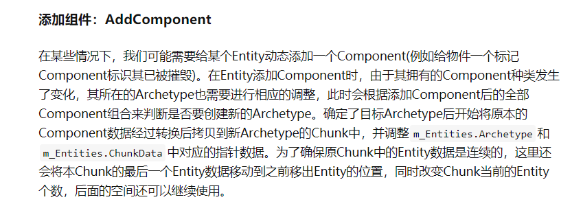

# ECS

ECS 是面向数据的架构。主要解决的问题是如何建立一个模型来处理游戏对象的更新操作。
相比于传统的面向对象编程，面向数据的ECS也是有优势的，面向对象容易因为继承的原因，产生非必要的属性和方法，而导致维护成本特别高。
而ECS采取的是组合的方式，这更加灵活。

# Entity

Entity的意义是ID，它是身份表示，它本身不是一个数据，而是看成一个数据集合的"指针"，我们可以在ECS中通过这个EntityID来获取任何一个Entity。

# ComponentData

ComponentData 是数据集合，它作为组合，存在于Entity上，它是对Entity的"描述"，Entity因为ComponentData才变得有意义。

# System

System 是逻辑执行的主要区域，System是根据不同的ComponentData来划分的，这使得持有特定类型ComponentData的Entity在一起执行对应逻辑，也就是说System运行的是某个类型ComponentData的方法。

# 为什么ECS值得推崇

- 命中率更高，Chunk管理，同类型Data在同一个Chunk内申请。这使得System进行同type逻辑时，内存紧凑，使得缓存命中率极高。
- 组合更优于继承。
- 适合做网络同步，数据的回滚其实就是直接回滚ComponentData

  

  

## 在ECS中进行逻辑与表现分离

客户端和服务端同源代码，客户端只做输入和显示，服务器做逻辑计算与判定

---

### 参考

https://developer.aliyun.com/article/248256

https://zhuanlan.zhihu.com/p/64378775

https://blog.codingnow.com/2017/06/overwatch_ecs.html#more

https://zhuanlan.zhihu.com/p/79454315

