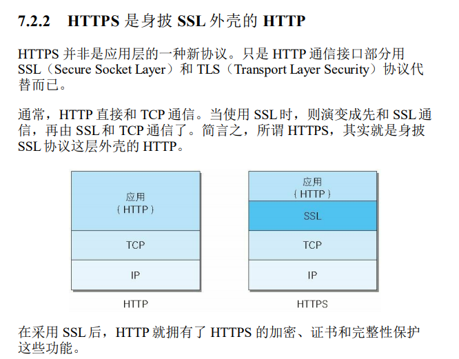

## xMind梳理全部

## 数据结构与算法

- 链表
- 队列
- 堆栈
- 二叉树
- 图
- 十大排序算法
  - 冒泡排序
  - 选择排序
  - 插入排序
  - 希尔排序
  - 归并排序
  - 快速排序
  - 堆排序
  - 计数排序
  - 桶排序
  - 基数排序
- 贪心算法
- 分治算法
- 动态规划
- 回溯算法
- 极小极大值剪枝算法
- 寻路算法
- A*算法

## 网络工程

- Http
  - HTTPS技术

- TCP
- UDP
- KCP
- 相关网络问题
- ProtolBuf

## OpenGL

- 渲染管线
    - 应用阶段
    - 几何阶段
    - 光栅化阶段

## 图形学

- 2D 碰撞检测
  - 点与多边形的关系：射线法，若奇数个交点则点在多边形范围内。
  - 圆形与矩形判断：分三种情况：
    - 圆心到矩形顶点的向量（x,y都大于0）那么就判断圆心到顶点的距离与半径的大小关系。
    - 圆心到矩形顶点的向量（x<0）那么就判断圆心到矩形最近边的投影点的距离与半径的关系
    - 圆心到矩形顶点的向量（y<0）那么就判断圆心到矩形最近边的投影点的距离与半径的关系
    - 同上情况，若（x<0,且y<0）那么就意味着圆心在矩形内
- BOX2D
- 三维碰撞

https://blog.csdn.net/noahzuo/article/details/52037151

## 游戏开发

- 同步问题：
  - 物理上的不一致，这是因为设备上的计算差异，浮点计算导致物理表现的不一致，简单的2D物理可以单独写一个碰撞计算规则来模拟碰撞，同步位置（pos、方向、速度标量）
  - 预表现
  - 线性插值补偿
  - 
- 网络收发包时序引起的动画错乱，用的是Js Promise规则，做到的是函数完成后callBack给函数链，使得函数有序完成；
- 构建多个串行函数链，部分数据深拷贝
- A星算法寻路，规划区域，编辑路点，在导航的上层有一个更高层来控制行走规则，行走路径的规划是路点系统计算得出。以查找路径提前存储，防止二次搜索。
- Pb的增量更新，难点在于list中的增量更新，做到删除
- 行为树编辑
- BUFF系统
- PlayMaker
- 人物的规避碰撞
- 图片压缩算法
- 噪声生成无限大世界

## Unity方面

## 项目优化

---

https://www.cnblogs.com/tianzhiliang/archive/2010/08/31/1813629.html

https://www.cnblogs.com/wyy1234/p/9172467.html

battle - 3
2020/11/1
- 30 lc
- 算法。listNode treeNode
- MonoBahavior
- Unity的AssetBundle管理
- NavMesh从体素到导航的过程
- KCP
- 同步
- 增量更新
- Texture
- 相机管理

增量更新
大量Bt
Buff系统设计
导出UI工具