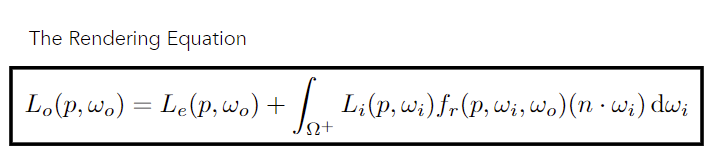

# 渲染方程

  

在计算机内，如果要计算完整的渲染方程，他的递归几乎是无限的，所以往往通过数学方法去简化，近似这个渲染方程。

# 管线步骤

前向渲染（传统渲染管线）

## 应用阶段

内容比较少，也许可见性算法和这个相关比较多，希望剔除在更早，但是CPU运算又会有压力

## 几何阶段

这里和3D数学运算相关性高

## 光栅化阶段

这里和锯齿问题相关性高

## 延迟渲染与前向渲染

- 光照计算
- OverDraw

# 光照模拟

## BRDF 

## 经验模型

高罗德、Phong、Bling-Phong

# 纹理采样

## 摩尔纹

## 各项异性过滤

# 锯齿问题

## 傅里叶变换

