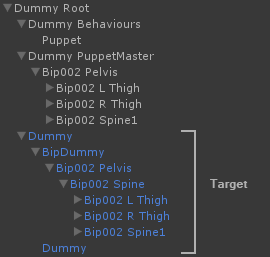

PuppetMaster 0.9

整体结构是 PuppetMaster 下包含多个 Muscle，Muscle 包含肌肉的状态，也可以包含 Prop，Prop可以做手持道具或者被击中的武器等等。

Puppet Master 下的 Muscle 并不是在 动画 Bone 下的节点，而是和骨骼同级的对象。
通常情况下 Puppet 会读取 Bone 的Transform 信息，并且让 Muscle 遵循这个 Transform。

  

The Target can be thought of as the normal animated character that you would see in any game, it usually has a character controller and any other gameplay components attached. Each frame, PuppetMaster will read the pose of the Target and feed it to the Muscles of the Puppet for following. After physics has solved, the Target will be mapped to the pose of the Puppet based on the mapping settings and stay there until animation overwrites it the next frame.

Pin 的结果是用非自然的物理力，使得 Muscle 去表现动画的下的Bone Transform

UnPin 是用自然的物理模拟，Muscle 在物理的表现下，Muscle 的 Transform 覆盖 动画下 Bone 的 Transform.

Puppet Master 的三种模式

- Active : 开启 Muscle 的 物理模拟
- Kinematic : Muscle 受物理表现，但是不影响 动画 Bone
- Disable : 关闭 Muscle 

https://www.youtube.com/watch?v=LYusqeqHAUc&list=PLVxSIA1OaTOuE2SB9NUbckQ9r2hTg4mvL&index=3

https://www.youtube.com/watch?v=LNidsMesxSE&t=1348s

https://zhuanlan.zhihu.com/p/64416755

http://web.cs.ucla.edu/~dt/papers/siggraph01/siggraph01.pdf

http://www.cs.um.edu.mt/~sspi3/Physics-BasedAnimation.pdf

PropMuscle

BehaviourBase

http://root-motion.com/puppetmasterdox/html/class_root_motion_1_1_dynamics_1_1_puppet_master.html

OnPreSimulate

Simulate

OnPostSimulate

BehaviourPuppet  

Muscle  计算   刚体  速度，进行旋转位移

死亡过程

Muscle 因重力，表现出倒地，Joint相互影响关节

PuppetMaster

-

JointDrive

https://docs.unity3d.com/Manual/class-ConfigurableJoint.html

确定性物理碰撞

------

Dynamic Bone

- Particle 链

https://juejin.cn/post/7008876388606296077

